### day01

*道诡异仙*

#### 回顾网页划分

​	1、结构   理解为毛坯     html

​	2、表现  理解装修          css

​	3、行为  功能                  Javascript

#### javascript

​	1、作者 布兰登.艾奇


2、 javascript   vs  java

​	  徐克清      vs    徐克 

3、定义

​	一个运行在js解释器中/引擎中的脚本语言

4、执行环境

​	1、可以在独立的js解释器中去执行 (node.js)

​	2、直接在浏览器就可以执行js代码 自带了js解释器

5、发展史

​	网页希望用户通过浏览器和服务器交互一个提升，网景公司下的**艾奇**就开发了 花了十来天完成了初级版本

​	95年   网景开发  客户端语言 解决用户交互问题

​	96年发布     那时候java很火了   livescript->javascript

​	96年  微软一看 确实很好用    也退出了 jscript

​	  由于没有统一的 规范    程序员写代码 写2遍 

​        97 网景 提交给了  ECMA(欧洲计算机制造商协会) 来定义标准

#### js的组成

​	1、核心代码:  ECMAScript

​			作用: 定义的语法的规范，数据结构的定义  逻辑的等于 API的使用等

​	2、DOM  (document Object  model)  文档对象模型操作

​			作用:   一套允许操作页面中元素结构的函数和方法	

​	3、BOM  (browser Object  model)  浏览器对象模型

​			作用:处理浏览器的内容、分辨率、宽高、鼠标的位置..

​		

#### 语法特征

​	1、类似java 编程语法   底层都是数据结构+算法

​	2、区别    不需要编译  浏览器自带js解释器  自动的去执行

​	3、 区别   弱类型的语言(不严谨)  ex:少个分号，没有声明变量也可以执行..

​			 自己预编译一行 再去执行一行，如果代码错了，后面的代码是不会执行

​	4、 是一门 面向对象的编程语法	

​	5、 跨平台性 ，可以在任何的操作系统中执行 

#### 基本语法

​	1、可以直接写在元素中

```
<input type="button"  value="点我试试?" onclick="alert('孙子，让你点你就点？')">
```

​	2、写在对应的script标签中

```js
<script>
    // <!-- 控制台 打印输出  做测试的-->
    console.log("大家好 我是隔壁老徐")
</script>
```

​	3、 写在单独js文件中 引入

```
<script src="js/out.js"></script>
```

注意:

​	1、可以写多个script标签、 可以写在body  也可以写在head，如果上一行代码报错了  则下一行就不再执行了（在同一个script标签中）

​	2、script是用来引入js文件的  则不能写js代码

​	3、 // 单行注释    /**/ 多行注释

#### 变量(重要)

​	定义： 在内存中开辟一个空间 ，用来存放不确定值的一个数据

​		     理解为数学中的 x  

​       声明

​	    1、   var   变量名   ;    声明了一个变量

```js
 //   声明1
    var uname;
    // 后赋值
    uname="隔壁老徐";  //赋值操作 不是等于
```

​	  2、声明的同时直接赋值

```js
  //  声明了一个变量 num 里面装的值是88
    var  num=88;
```

​	  3、可以同时声明多个变量

```js
 var a,b,c=12;//一次性声明了3个变量 其中 c直接赋值12
```

注意问题

​	1 .变量命名:  不能使用关键字命名 一般可以采用驼峰式命名(第二个单词大写)

​	2 . js 如果没有声明变量 可以直接使用   原因是 会自动声明

​	3 .如果声明了变量 但是没有给值  直接输出 报undefined

​	4 . js 单双引号没有关系

```js
  var uname;  // js引擎 自动声明 如果没有声明的变量的话
    //1.命名注意 不能使用关键字命名 一般可以采用驼峰式命名(第二个单词大写)
    // userName  helloWorld
    var varrr="123";  //报错 因为var已经被js使用了

    // js 如果没有声明变量 可以直接使用   原有是 会自动声明
    uname='隔壁老徐';//  单双引号没有关系
    console.log(uname); //

    // 如果声明了变量 但是没有给值  直接输出 报undefined
    var pwd;
    console.log(pwd);//undefined
```

#### 常量

​	声明之后 不会去修改的量 用const 声明

```
 const  pi=3.1415926;  //不会去修改的量
```

#### 基本数据类型

##### 	1、定义: 

​	 用于存储在内存中  以不同的数据结构存储形式。(占据内存的空间大小是不一样的).

​	 整数: 占四个字节  小数就占据8个字节

​		   一个字节对应的是8位二进制的数  0000    0000 

​	    bit 位  

​	  byte :字节    1byte=8bit;

​	   kb       1kb=1024byte;      文本 

​	   mb      1mb=1024kb;        图像  音乐  小视频

​	   G B       1gb=1024mb       内存  u盘     硬盘

​	    T B       ...

#### 	2、具体的数据类型(原始类型)		

##### 		1、number   数字类型

​		作用: 用来存储 数据  可以是整数(4字节) 可以是小数(8字节)

```js
 //
    var a=10;
    var  b=12.4;
    var c=019;	//8进制的数据
    var d=0x10;  //16进制的数据
    console.log(a)
    console.log(b)
    console.log(c)
    console.log(d)

    var x=0.1;y=0.2;
    console.log(x+y); //小数计算会有误差

    //  判断当前的数据类型是不是数据
    console.log(isNaN(a)); // is  not  a number   不是一个数字 是数字返回的是false

    console.log(isNaN("隔壁老徐"))//  不是数字 返回的是 true
```

###### 		isNaN()	判断是不是数字类型

##### 2、string(字符串)

​	用来存储  姓名 地址  字符 性别 ....

​	js中通过Unicode编码去存储。	

​	Unicode:每个字符 都是在计算机中 具备唯一标识的编码 。由16进制的数表示的

```js
var str="徐";
    console.log(str)
    console.log(str.charCodeAt());//24464 10进制的unicode 编码
        // 进行 数据的转换  转为16进制
    console.log(str.charCodeAt().toString(16)); //  5f90 -> "徐"

    //如果直到 unicode编码 直接\u+xxxx  可以直接输出对应的文本
    console.log("\u5f90");//徐
```

###### 	计算

```js
//字符串的计算问题 
var  a="10";
var  b="20";
var c=30;
console.log(a+b); //加法 字符串拼接
console.log(a-b); //减法自动的隐式转换   -10
```

​	获取字符串的长度

```js
  var str1=" are you ok?";
    console.log(str1.length) ;// 获取字符串的长度个数 12 空格也算一个字符
```

##### 3、boolean

```
true(真)|false(假) 

  //
    console.log(4>5); //false

    console.log(true+true); //隐式转为 1 + 1
    console.log(false+0); //  计算才有隐式转换 为0 
```

##### 4、undefined

​	没有其他的值 就是undefined   不存在/没有定义

​	ex:声明一个变量 没有赋值   一个银行卡没有钱

##### 5、null

​	没有其他的值   就是null ;

​	如果不想要内存中 继续存储  可以手动的清除掉对应的变量 

​	  把对应的变量设置为null 

##### 6.symbol  后面再说

##### 判断数据类型   typeof

```
//
var a="123";
console.log(typeof a); //string
var b=123;
console.log(typeof b); //number

var c=true;
console.log(typeof c); // boolean
var d;
console.log(typeof  d);// undefined

var e=null;
console.log( typeof  e); //object 不是null
```

​	问题: null判断数据类型的时候 不是null 而是 object

```
 95年 第一个版本的时候 艾奇设计的时候32位操作系统。
使用的是 32 位系统，为了性能考虑使用低位存储了变量的类型信息，000 开头代表是对象，然而 null 表示为全零，所以将它错误的判断为 object 。虽然现在的内部类型判断代码已经改变了，但是对于这个 Bug 却是一直流传下来。
```

#### 隐式转换

​	定义:   js  在计算中 自动进行数据的转换 不是人为的操作的

```
//数字+ 字符串  = 字符串
    console.log(10+"10"); //1010
    //数字+布尔  =数字
    console.log(10+true); //11
    //字符串 +布尔
    console.log("10"+true); //10true
    //布尔+布尔
    console.log(true+true);//2
    
    // 测试  减法 除法  乘法  都是会转为number
    console.log(10/"10");
    console.log(10*"10");
    console.log(10-"10");
```

#### 强制转换

##### 	1、强制转为string类型

​		xxx.toString()   不可以转   null和undefined

​		String(xxx)   	可以转所有的  包括  null和undefined		

```
 // .toString()

 var  num=10;
 console.log(typeof  num) ;//number
 //            值               类型
 console.log(num.toString(),typeof num.toString()); //10 string

 // 问题  不能够强转 null和undefined
 var abc;
  // console.log(abc,abc.toString());  //报错
 abc=null;
// console.log(abc,abc.toString()); //报错

 //  升级   String(xxx) 可以转所有的类型的值 
 console.log(String(abc),typeof String(abc)); //null string
```

##### 	2、强转为number

​	  parseInt（str） 转整数

​	  parseFloat(str)  转小数 可以转不是纯数字的以数字开头的字符串 	

​	  Number(str)   只能转纯数字的字符串   

```js
// 转整数  parseInt()
var str="123.abc";
var str1="abc.123"
//强转为number
var num=parseInt(str);
console.log(num,typeof  num); //123 number
var num1=parseInt(str1);
console.log(num1,typeof  num1); //NaN   number
// NaN   not  a number 不是一个数字

// 转小数   parseFloat   如果遇到转不了的 直接显示为NaN
var strr="123.456abc";
var strr1="abc.123";
console.log(parseFloat(strr));// 123.456
console.log(parseFloat(strr1));// NaN

// Number()  比较严格 只能转纯的数字的字符串 "123"
console.log(Number(str))  // NaN
```

#### 运算符表达式

​	+            -            * (乘)    / (除) 

  	% (取余)   	

```js
 //
    var num=5/3;
    console.log(num);//1.6666666666666667
    console.log(num.toFixed(2));//保留2位

    // 取余   除不尽的余数
    var num2 =17%3;
    console.log(num2);  //2
```

##### 模拟用户输入的方法

​	prompt("提示文本")

```
 var str=Number(prompt("请输入一个数字"));
    var  str2=parseInt(prompt("请再输入一个数字"));
    //方法2
    var all=parseInt(str)+parseInt(str2);
    alert("您输入的2个数字的和是:"+all);
```

注意: 用户输入的哪怕是 数字  但是接受到的  string字符串类型

##### 自增/自减写法

   ++   /  --

​	a++   vs   ++a  

​        a++/a--    ++/-- 在后    先进行表达式运算   再自己自增/自减

​	 ++a/--a   ++/-- 在前    先自增/自减     再进行表达式的计算

```js
  var  a=10;
     var num =a++;  //  a=a+1;
     console.log(a); // 11    输出的是变量
     console.log(num); // 10  输出的是表达式
     console.log(a);//11

    var  b=10;
    var num1 =++b;
    console.log(b); //11     //输出的是变量
    console.log(num1); //11 输出的是表达式
    console.log(b); //11
```

复杂计算

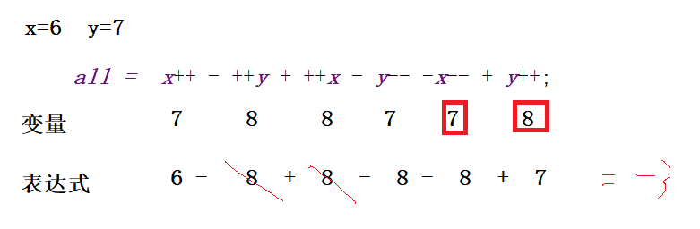

#### 关系运算

	>  <  =(赋值)  ==(等于)  ===(全等:值一样 数据类型也要一样) 
	>
	>   	!=    !==   >=      <=    ... 

```js
//
var a=5;
var b="10";
console.log(a>b); //false
var c="8";
console.log(b>c); //false  原因是 下面的
// 字符串比较 比的是unicode编码  其实比的是   1 VS 8
console.log("".charCodeAt());//49
console.log(c.charCodeAt()); //56

//   如果第一个相等 自动比较第二个
var str="隔壁老徐";
var str1="隔壁小王";
console.log(str1>str); //false
console.log("老".charCodeAt())//32769
console.log("小".charCodeAt()) //23567

//  注意   隐式转换过程中 转为NaN的话  NaN和任何值比 永远都是false
var x="1a";var y=10;
console.log(x<y);


var n="10";
var m=10;
console.log(n==m);// true   n会隐式转为number
console.log(n===m);// false  不会隐式转换  值一样并且类型也要一样
```

1、 提示用户输入姓名、年龄、班级、籍贯。 

​	弹出显示  : 大家好 我叫xxx我今年xxx我来自xxx我的家乡是xxx

2、用户输入一个任意的4位数	请分别告诉用户对于的 个十百千对于的值是多少

​	ex:   1234           个位是4     十位是3  百位是2   千位是1  


### day02

####  1、转义字符

```js
/*
    * js中的转义字符
    *    \n   换行
    *     \t  空格
    *     \\  ->    \
    *      \"  ->   "
    * */
    console.log("\\");  //输出的是  \
```

#### 2、逻辑运算(重点)

​	&&(与)        ||(或)    ! 非

​	1 . &&   :     前后的表达式 都必须为true的情况  则整体表达式结果为 true

​	2 .  ||   ：   前后的表达式  只要有一个为 true    则整体的表达式为   true

​	3  .  !       :      取反    如果表达式是true   则！结果就是false

总结:  如果整体的表达式中  返回的表达式是一个bool值 则 整体的表达式结果是bool值

​	   如果表达式中存在计算 不是bool值   则返回的是 对应的计算的值。

```js
 //   &&  表达式都必须为真
    var bool= 6>7 && 5>2; // 假  真
    console.log(bool);//false

    //    ||  只要一个是真的 那么 整体就是真的
    var bool2= 6>7 || 5>2;//
    console.log(bool2); //true
    // 取反
    var bool3=!bool2;   
    console.log(bool3);//false

	// 逻辑&&的特征     如果前面的表达式不成立  则程序直接跳过不再去执行后面的代码
    var a=100,b=100;
    var c=a>b||++a;  // 把 && 切换为 || 得到的2个不同的答案
    // var c=a>b||a++>b;  //   自己按照 c再测试 值又不一样
    console.log(a,b,c);// 100 100 false    101 100 101

    //逻辑 或 的特征    如果前面的表达式成立， 则程序直接跳过不再去执行后面的代码
    var c1=a==b||++a;
    console.log(a,b,c1); // 100  100 true   102 100  102
```

##### 运算符优先级

​	

| 运算符               | 描述                                         |
| -------------------- | -------------------------------------------- |
| . [] ()              | 字段访问、数组下标、函数调用以及表达式分组   |
| ++    --     !       | 一元运算符、返回数据类型、对象创建、未定义值 |
| *     /     %        | 乘法、除法、取模                             |
| +     -      +       | 加法、减法、字符串连接                       |
| < <= > >= instanceof | 小于、小于等于、大于、大于等于、instanceof   |
| == != === !==        | 等于、不等于、严格相等、非严格相等           |
| &&                   | 逻辑与                                       |
| \|\|                 | 逻辑或                                       |
| ?:                   | 条件                                         |
| = oP=                | 赋值、运算赋值                               |
| ,                    | 多重求值                                     |

#### 流程控制语句

​	程序在执行过程中， 每行代码都会按照顺序执行，对结果有直接影响，很多时候需要对代码的执行顺序 进行管控，从而达到不同的目的。

​	简单理解:   控制代码的结构上的执行。

##### 1、分支结构

​	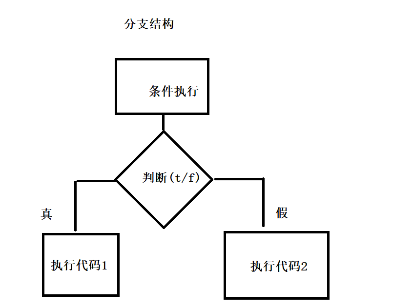

##### 1、if(如果)判断(重点)

​	语法:     if(判断条件){

​				只有条件为 true  才会执行 。条件为false 不会执行

​		}

```js
  //  if   条件为真 
    if(6>15){
        // 才会执行
        alert("哇哦 你好厉害");
    }
```

##### 2、if-else (如果xxx 否则xxx)

```js
if(score>60){ 
        //条件满足
        console.log("合格");
    }else{
        // 条件不满足执行
        console.log("不合格");
    }
```

##### 3.复杂的嵌套

​	if->else if -else

```js
 // if-else if
   /* if(score>80){
        console.log("优秀")
    }else if(score>60){
        console.log("合格")
    }else{
        console.log("不合格")
    }*/

    if(score>60){
        if(score>80){
            console.log("优秀");
        }else{
            console.log("合格")
        }
    }else{
        console.log("不合格");
    }
```

##### 三目/三元运算(掌握)

​	 是if-else的简写

  语法:   条件表达式   **?**    代码1     **:**   代码2;

  分析:  ? 理解为如果   : 理解为 否则

​	  如果表达式成立 执行代码1模块  否则执行代码2模块

```js
var score=prompt("请输入成绩");
    //            如果    否则
    alert(score>60?"及格":"不及格");
```

复杂

​	条件表达式 ? 代码1: 条件表达式2  ?代码2:代码3;

```js
 //复杂写法    ?=> 如果   : 理解为否则
    alert(score>80?"优秀":score>60?"及格":"不及格");
```

问题:  

​	如果{ }中只有一行代码 可以省略  {}

```js
   if(5>3) {console.log("123");}
    // 如果 {}中只有一行代码 可以省略  {}
    if(5<3)
        console.log("123");
```

#### switch-case

​    也是属于多分支语句， 基于不同的条件值 去执行不同的代码。针对一些特定的值选项 可以使用switch		

​	ex: 自动售卖     手机客服...

语法:

​	switch(表达式){

​		case 值1: 执行对应的代码1 ;  break;(执行完当前行停止代码的执行)

​		case 值2 : 执行对应的代码2;

​		.....

​		default：如果以上都不符合 则执行这行代码

}

```js
var num=Number(prompt("请输入数字"));
switch (num){
    case 1 : alert("话费查询"); break;
    case 2 :  alert("流量查询"); break;
    case 3 :  alert("宽带业务办理"); break;
    case 4 :  alert("人工服务"); break;
    default: alert("不符合要求 感谢 再见");
}
```

### day03

#### 循环

##### 	1、定义

​		让程序反复的执行一段代码。

##### 	2、特点

​		a .  循环的条件 : 反复执行的条件  没有条件 (则是死循环)

​		b .  循环变量 :  每一次 往循环终止的方向趋势发展 （没有循环变量 则也是死循环）

​		c .   循环体   :  反复执行的内容

####  while循环(掌握)

​	语法:

```
var  xxx;//初始化循环变量
while(满足循环的条件){
    循环体;
    修改循环变量的值;
}
```

```js
//
var num=10;// 初始化
//
while (num<100){// 循环的条件
    console.log("我在执行循环"); //才会执行   循环体
    
    num++; // 修改循环变量    每次都会朝着终止循环的方向前进
}
```

#### do-while循环

​	语法:

```
do{
    循环体 ;
    修改循环变量;
}while(循环条件)
```

区别:  do-while  不管条件是否成立 都会去执行一次循环体	

```js
   var num=10;
    do{
        console.log("我执行了do-while语句"); //执行  先走do语句  再去判断条件是否满足
        num++;
    }while (num>20)
```

#### for循环(重点)

​	定义:  如果直到循环的次数，就可以使用for循环。while循环的简化版。

```
语法:
   for(声明循环变量的初始化;循环条件;修改循环变量的值){
   			1				2         4
            
       循环体;
         3
   }
```

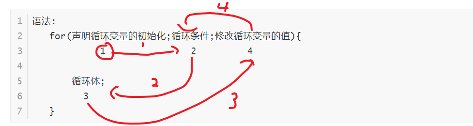

```js
//     改为for循环版本
    for (var num=10;        num<100;         num++){
   // 1(初始化循环变量)   2(判断条件是否满足)  4(修改循环变量)
        //  3循环体
        console.log("我在执行for循环")
    }
```

特殊:  for可以简写

```
在for循环、while、if判断中 {}都可以省略。下一行就表示执行在{}中的代码

for (var i=0,sum=0;i<101;sum+=i,i++)
    console.log(sum);
```

#### 双重循环

​	循环里面套循环 在手写排序，手写最大值，最小值，去重算法题;

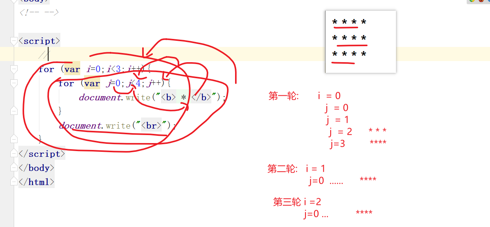 

##### 断点调试

​	让浏览器一步一步的去断开程序，执行程序

具体步骤: 1

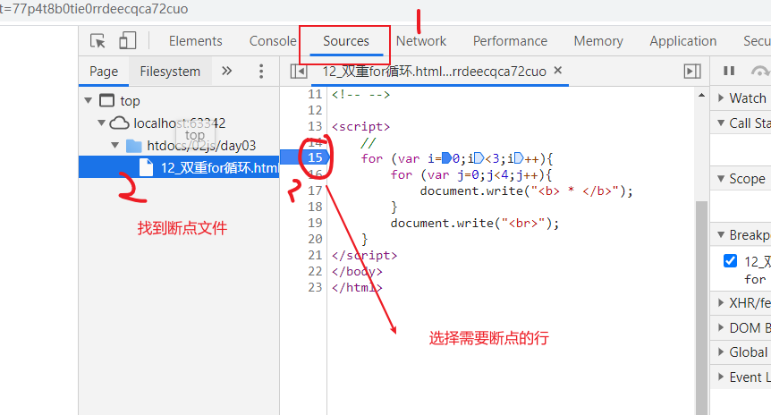

步骤2: 刷新页面 效果如下 表示断点成功

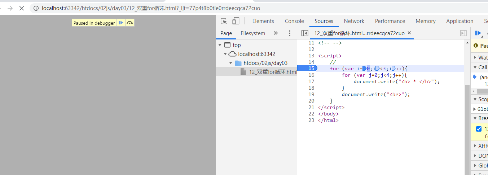

步骤3: 添加想要知道的变量的执行的 变化过程

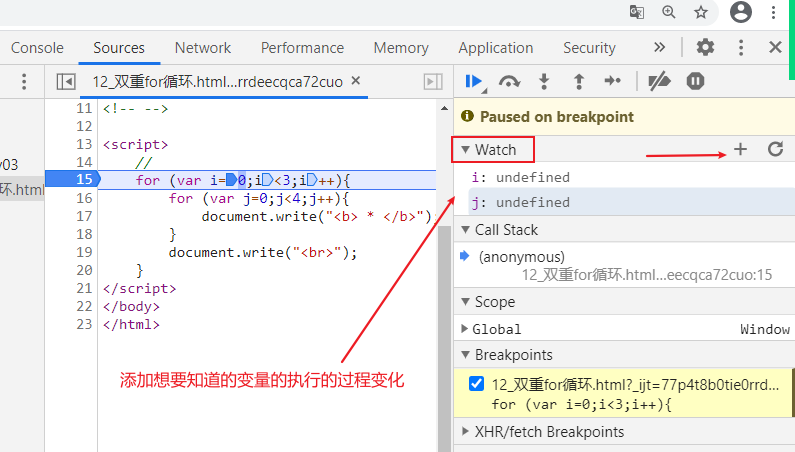

步骤4: 断点执行

​	 如下图 点击  下一步执行断点调试

​          或者快捷键 f11,ctrl+;

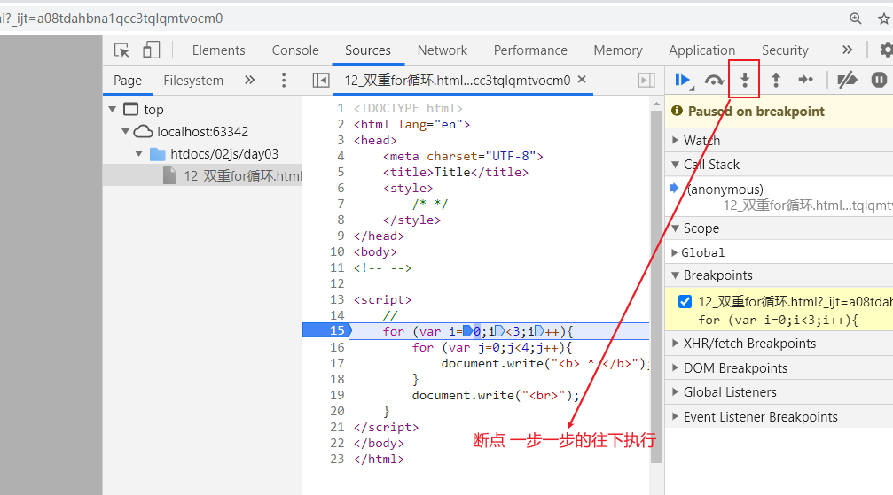

##### 总结:

​	外围的循环控制的是行数

​        里面的循环控制的 列数

##### 补充

​	continue   和  break  之间的区别

```
//    需求 0-5 进行相加 但是不要三
var sum=0;
for (var i=0;i<=5;i++){  //      1 2 3 4 5
    if(i==3){
        // break;//  当前的循环结束了
        continue;// 跳出 当前的这个循环状态
    }
    sum+=i;
}
console.log(sum);
```

1、 实现倒三角

```
 *******
  *****
   ***
    *
```

2、0-100之间 输出 除了能被3整数的所有的值

### day04

####  1、函数(重点)

​	定义:   一段写好的程序， 可以被反复执行使用的。

​	特点:  如果不用它 就不会执行。


#####         使用:

​		步骤1: 先定义好**功能**，	

​		1、  **function** 函数名 () {

​				函数里面执行的代码

​		}

​		步骤2： 执行调用     函数名(); 

​				 如果函数是直接定义在script标签中的 

​				是可以在任何的script标签中去调用的

​	Number();console.log(); alert();....

```js
 //1、 定义一个函数
 // function 函数名(){函数体}
 function sayHellow() { //函数名
     // 函数体  可以被反复执行的
     console.log("大家好我是 隔壁老徐，我来自波赛尔星球");
 }
 // 特点  不调用 不会执行
//  调用
 sayHellow();
 sayHellow();
```

##### 带参函数的声明和使用

​	function 函数名(  形参 ){函数体}

​	函数名(实参);

​        形参:  形式上的参数，可以自定义给的 ，因为函数是先声明再调用。我们不知道调用者给的具体的参数，先声明变量用于装调用者实际调用时 给的数据。

​	实参: 调用者调用函数的同时 传给函数实际的参数

​	两者直接的关系:  理解 赋值操作 实参给到形参，再去参与计算

```js
 //     a  b是形参
   function add(a,b) {
       console.log(a+b);
   }
    //  任意2个值都可以
   add(12,34); // 12   34 对应的是实参
   add(112,234);
```

带返回值的函数

```js
 // 1、声明函数  
    function max(x,y) {
        var maxNum=x>y?x:y;
        
        // 通过关键词 return 返回
       return maxNum;
    }

    // 拿一个变量 用于接收 函数返回的值
    var maxNum1=max(12,29);
    console.log( maxNum1);
```

//  计算3三个参数的 平均值  需要返回值

### day05

#### 1、作用域

​	定义: 函数或者是变量，在程序中  可以被访问的空间范围。

​	分类:

​	     局部/函数作用域;   在函数中被访问的空间

​			如果在局部作用域中声明的变量=>局部的变量(外面的人是无法直接使用的)

​	     全局/作用域: 任何地方 都可以被访问

​		        在全局中声明的变量 =>全局的变量(谁都可以用)

```
注意: 如果全局和局部作用域中都有变量，且名字相同， 优先使用的是 局部的变量
     理解:就近原则
```

注意2：

```js
js中   ()中声明的变量 也是全局变量 ，在{ }也不是所有的情况都是局部作用域
  // 只有在函数中 的{}才是局部的作用域
  // 如下代码可以得出结论
```

```js
for (var x=1,y=0;x<10;x++){
    console.log(x);
    var z=12;
}
console.log(y); // 0
console.log(z); //12
```

#### 声明提前

```
 js在执行前会 进行预加载/预解析,将var 声明的变量名及 function 后面的函数 都会提到当前作用域的最上面，只是声明提前，   不提升赋值和不调用函数
```

解决:

```
1、声明变量 尽量放在当前作用域的最顶部声明
2、针对函数中的声明 可以通过var 函数名=function(){} 避免声明提前
3、es6以后 可以通过let 代替 var 去声明变量
4、"use strict" 严格模式下 没有声明的变量名是不可以直接被使用的。
```

#### 原始类型的值传递问题

原始类型 值传递    只是把值复制一个副本进行传递， 副本之间的修改不会影响原有的值

```js
     var  a=5;
     var   b=a; //值传递
     b++;
     console.log(a,b);//5,6
```

####  数组（非常重要）

 定义:   声明一个变量。 可以存储多个数据(不限制数据的类型)；

 声明: (索引数组)

​	 索引数组: 下标是数字的的数组

1、var  数组名=[];  声明一个空数组;

```js
  //   1、声明空数组
    var arr=[];  // 下标从0开始计数
    arr[0]="徐全龙";
    arr[1]="程振东";
    arr[2]="邵鑫";
    console.log(arr);
    console.log(arr[1]); // 程振东
    //获取 数组的个数   个数 从1 开始
    console.log(arr.length); // 3

```

2、声明的同时赋值	

```js
 //方式2  声明的同时直接赋值
    var arr2=[12,23,34,45,67];
    console.log(arr2.length); //5
    console.log(arr2[12]); // undefined;  越界查找不报错

```

3. 通过new 声明

   ```js
    // 方式3 采用new
       var arr3= new Array(5); //声明一个具有5个子元素的空数据
       arr3[0]=12;
       arr3[1]=22;
       console.log(arr3);
       console.log(arr3.toString()); // 12,22,,,
   ```

  4、通过new声明的同时赋值

```js
  //4 采用new 的同时赋值
    var arr4=new Array(12,23,34,54);
    console.log(arr4);
```

5、同一个数组中 可以存放不同类型的值

```
 // 
    var arr5=[12,"隔壁老徐",true,null,undefined];
    console.log(arr5);
    console.log(String(arr5));
```

6、遍历数组

```js
 //遍历数组 
    for (var i=0;i<arr4.length;i++){
        console.log(arr4[i])
    }
```

#### 数组的值传递

​    会直接修改原数组的值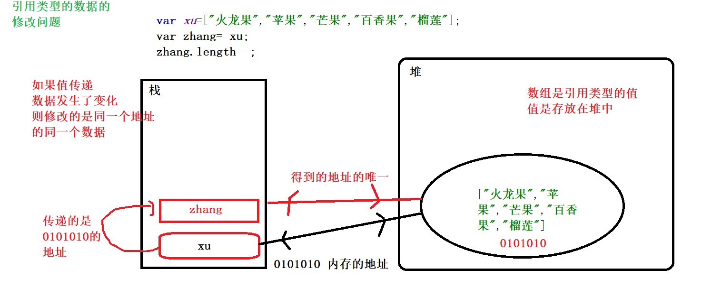

#### 关联数组

特点:  下标是字符串，需要单独的添加每一个元素，下标具备了实际的意义了

ex:   姓名: 隔壁老徐

```js
//
//var ly=[90,46,88];
//       0   1  2
//关联数组
var ly=[];
ly["语文"]=90;
ly["数学"]=46;
ly["英语"]=88;
console.log(ly);
console.log(ly.length);//0   关联数组没有length
ly['name']="柳岩";

// 关联数组和索引数组 可以混着写
var arr=["张飞","关羽","赵云","刘备"]; // 索引数组
arr['name']='隔壁老徐';  //关联数组
console.log(arr);    //能够正常输出
```

##### 关联数组的遍历

```js
//  遍历  即可以遍历关联数组 也可以遍历索引数据
for (var key  in ly){
    // key=>下标
   //   console.log(key);  下标
    console.log("你的"+key+":"+ly[key]);  // 下标对应的值。
}

var  arr2=[12,23,34,45,6];
for (var key in arr2){
    console.log(arr2[key]);
}
```

作业1: 让页面随机颜色 需要 用数组的形式

d1.style.background="rgb(arr[0],arr[1],arr[2])";

2、 手写数组反序  [8, 40, 31, 82, 44, 11] =》[11,44,82,31,40,8]

### day06

##### 数组API

: 已经默认有的方法，直接使用

##### 	1、concat 拼接  

​	返回的是数组

```js
 //拼接
    var arr=[12,2,34];
    var arr1=[22,3,45];  
    // 生成的是一个新的数组,不会改变原数组
    var newArr=arr1.concat(arr);
    console.log(newArr);
    console.log(arr,arr1);
        //       前面       后面拼接的
    console.log(arr.concat(arr1));

 //可以直接添加值
    var newArr2=arr.concat(11,22,33,44);
    console.log(newArr2);

    // 变量
    var num=66;
    var newArr3=arr.concat(num);
    console.log(newArr3);
```

#####  2、arr.join("连接符号")  

数组中的元素 按照拼接符  进行拼接

​	 返回的是字符串

​	如果不给任何参数 则是直接转为了字符串

```js
// 拼接为 字符串
var  arr=['h','e','l','l','o'];
var str= arr.join("-");
console.log(arr);// 不会修改原数组
console.log(str,typeof str);

//写法 如果连接符 什么都不加 则是空的拼接

console.log(arr.join("")); // hello
```

##### 3、arr.slice(start,end) : 

​	选取arr数组中指定的元素

​	 复制原数组中的元素，也不会修改原数组 

​	参数 :  含头不含尾 包含start参数 不包含end结束的参数的位置的元素

​	注意:

​		1、省略第二个参数，表示一直取到最后一个元素

​		2、两个参数都省略，表示复制一份原数组

​		3、支持负数参数，负数表示从右往左

```js
 var  arr=[12,23,3,45,56,7];
    //  包含0 不包含1
    var newArr=arr.slice(0,1); // 0表示 起始的下标 1表示结束的的下标
    console.log(newArr);  // 返回的依然是数组
    console.log(arr);  //原数组不会改变

    console.log(arr.slice());// 如果不给参数、相当于复制一份数组
    // 支持负数
    console.log(arr.slice(-2)); // 如果只有一个参数 则表示起始参数 从-2开始截取所有的值
    //  2个负数           含头不含尾
    console.log(arr.slice(-5,-1)); //
```

#### 4.splice() 可以 添加，删除等操作

​	特点:  **直接修改原数组**

#####  1、删除功能。

​	arr.splice(start,n);  

​		start: 删除的 起始下标	     n:删除的个数

​		n省略 表示删除所有元素

​		start支持负数  n不支持负数

​	如果用  var  newArr=arr.splice(s,n);

​		newArr表示删除的元素组成的新的数组

​		1、一个参数 表示下标。从当前参数开始一直删除到最后一个

​	        2、 0个参数  无法删除 啥也没干

```js
//   1.删除功能   2个参数
 var arr=[1,2,3,4,5,6];
 var newArr= arr.splice(2,4); //从下标2开始删除  4表示删除的个数

 console.log(arr); //[1,2]   直接修改的是圆数组
 console.log(newArr); // 删除的元素 组成的新的 数组
 // 1个参数
 var arr=[1,2,3,4,5,6];
 arr.splice(2);  //1个参数 表示从当前下标开始删除 所有的元素
 console.log(arr);
 // 给负数

 var arr=[1,2,3,4,5,6];
 arr.splice(1,-2);
 console.log(arr); // 第二个参数给负值 无效的 因为 表示的是个数
 arr.splice(-2);
 console.log(arr); // 第一个参数表示的是起始的下标 可以给负数
// 不给参数的情况
 var arr=[1,2,3,4,5,6];
var newArr2= arr.splice();
 console.log(newArr2);// []
 console.log(arr);    //原数组不变
```

##### 插入数据

   arr.splice(start,0,新值，新值....)

​	0表示只插入，不删除

```
 // 插入数据
var  arr=[1,2,3,4,5,6];

arr.splice(2,0,66,88); //在下标2的位置就直接插入 66和88的新数据
console.log(arr);
// 如果直接插入的是一个数组  默认会以整个数组的形式插入
var arr1=[12,33];
arr.splice(2,0,arr1); //
console.log(arr);
```

##### 删除的同时  插入数据

arr.splice(start,n,新值，新值2...

```js
//删除的同时插入
    var arr=[1,2,3,4,5,6];
    //        下标 删除个数 插入的数据2 插入的数据2
    arr.splice(2,2,2,2);
    console.log(arr); // 1 2 2 2 5 6
```

##### 5、反序 reverse

​	会直接修改原数组

```js
// reverse 反转
var arr=[12,23,342,34,44];
// 链式编程
var newArr=arr.slice().reverse();  
console.log(newArr); //说明修改的是 原数组
console.log(arr);   //为了防止修改原数组 可以先进行复制一份再进行反转
```

##### 6、排序

sort排序  

​	不能直接写，底层会转为string然后比较的unicode编码，不能进行正常的比较排序

​       需要加工一下。

修改原数组

```js
问题: 比的的unicode编码
升级  
   //   因为按照的是unicode进行
    var arr1=[5,8,2,4,7,11];
    function com(a,b) {
        // return a-b;  //升序    //减法会隐式转换为number
        return b-a; //降序
    }
    //将 函数整体作为参数进行执行  不能加();
    var newArr2=arr1.sort(com);
    console.log(newArr2); // [11, 8, 7, 5, 4, 2]
```

##### 手写排序

```
 var  arr=[5,3,1,4,0];
    arr=[12,2332,43,54,45,45,343,4,555,];
    for (var i=1;i<arr.length;i++){// 控制的是 比较的次数
        //每轮中比较的次数  逐渐减少 length-i
        for(var j=0;j<arr.length-i;j++){
             //进行换位
           if(arr[j]>arr[j+1]){ //前面的值 大于后面的值 就换位置
               var max=arr[j];
               arr[j]=arr[j+1];
               arr[j+1]=max;
           }

        }
    }
    console.log(arr);
```

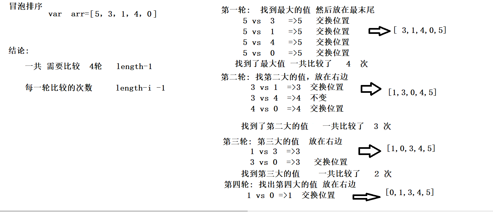

**7、获取数组元素索引**

```js
// 返回数组元素索引号方法 indexOf(数组元素) 作用就是返回该数组元素的索引号
//它只返回第一个满足条件的索引号
// 它如果在该数组里面找不到元素，则返回的是 -1
// lastIndexOf()  从后面开始查找(索引号还是不变)
```


#### 数组的出入问题

##### 	1、先进后出的问题(手枪)

​	 进:   push()   数组的末尾进

​	出:    pop()     数组的末尾出

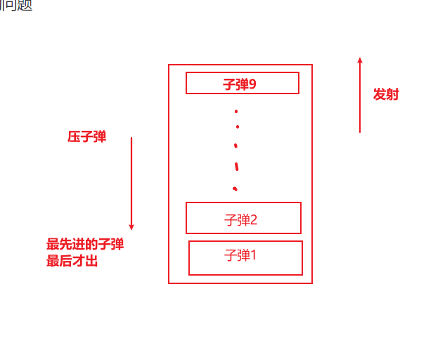

```js
var  arr=[];
arr.push("弹1");// 先进 压入从 末尾压入
arr.push("弹2");
arr.push("弹3");
arr.push(12,23,35,5)  ;    //  push  一次性可以压入多个值
console.log(arr); //["弹1", "弹2", "弹3"]

var newArr= arr.pop(); //发射   后进来的先出  一次只能射出一个值
console.log(arr);  // ["弹1", "弹2"]
console.log(newArr);
```

##### 2、先进先出的问题(排队)

   进: arr.push()		数组的末尾进

  出: shift() ;  		   数组的开头出

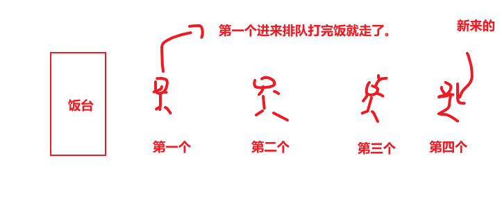

```js
var arr=["隔壁老徐","隔壁老王","隔壁老李"];
arr.push("隔壁老张"); //进入一个值
console.log(arr);  //  ["隔壁老徐", "隔壁老王", "隔壁老李", "隔壁老张"]

arr.shift();// 开头的 先出
console.log(arr);  // ["隔壁老王", "隔壁老李", "隔壁老张"]
```

##### 3、后进先出(vip服务)

​    进:   在开头插入    unshift()       数组的开头进

   出:   shift();   				数组的开头出

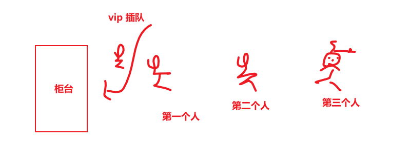

```
// 后进 先出
var arr=[12,23,45];
arr.unshift(66);
console.log(arr); //[66, 12, 23, 45]

//出
arr.shift(); // [ 12, 23, 45]
console.log(arr);
```

今天作业:  手写 去重

​	arr=[12,23,12,3,4,5,3]  =>   [12,23,3,4,5]

### day07

####   1、二维数组(掌握)

   	数组中每个元素都是一个数组 组成的二维数组

```js
// 一维数组
var arr=[];
arr[0]="隔壁老徐";
arr[1]="隔壁老王";
console.log(arr);

// 二维数组 声明方式一
var arr2=[];
arr2[0]=[12,22,33,44];
arr2[1]=[33,44,55,66];
arr2[2]=[77,88,99];
console.log(arr2);
//获取指定的数组中的值   下标都是从0开始
console.log(arr2[0][3]); //第一个表示的行数 第二个表示的是列数
console.log(arr2[0]);
// 声明方式2  声明的同时赋值
var arr3=[
    [12,22,33,44],
    [33,44,55,66],
    [77,88,99],
]
console.log(arr3);
```

二维数组遍历

```js
 // 遍历出每一个数组中的元素 2重遍历

    for (var i=0;i<arr3.length;i++){
        for (var j=0;j<arr3[i].length;j++){
            console.log(arr3[i][j]);
        }
    }
```

#### 字符串API

 1、 区分 原始类型的字符串和引用类型的字符串

```js
 // 一个普通普通的字符串
    var str="hello";
    console.log(str);
    str.yy="world"; //自己添加功能 
    console.log(str.yy);  //无效 只能用人家写好的属性和方法 无法自定义去
    console.log(str.length); 


    // 引用类型的数据  具备功能(有方法可以操作的)
    var str2=new String("隔壁老徐");
    console.log(str2);
    str2.yy="颜值真的可以"; // 自定义的属性
```

##### 2、大小写转换

var  str="aAsa";
console.log(str.toLocaleLowerCase()); //转小写
console.log(str.toLocaleUpperCase()); //转大写

```js
 do {
        var user=prompt("请输入验证码"+str);
        //  同意大小写转换
        if(user.toLocaleLowerCase()==str.toLocaleLowerCase()){
            alert("验证通过"); break;
        }else {
            alert("密码错误")

        }
    }while (true)
```

##### 3、unicode编码和解码

​	     str.charCodeAt(i)    下标对应的字符串的unicode编码

​		String.fromCharCode(编码)=>  转为字符串

```js
var  str="abc锄禾日当午666";
// 通过字符串 获取Unicode编码
console.log(str.charCodeAt(1));// 下标对应的字符串的unicode编码
console.log(str.charAt(1));//下标对应的字符串

// 通过unicode编码 转为字符串
console.log(String.fromCharCode(98));//b

 var myLove="我稀罕你xl"; //委婉的 ？
    var all="";
    for (var i=0;i<myLove.length;i++){
        all+=myLove.charCodeAt(i);
    }
    console.log(all);
```

##### 4、字符串截取

​	不会改变原字符串。

​	substring(start,end);// 起始下标和结束下标

​	substr(start,n) ;/. 起始下标 和个数

​	start: 如果给的是一个负数或者是NAN  直接改为0 

​	注意:  截取之前会比较两个参数的大小，并根据大小调整位置

```js
 // substring
    var  str="床前明月光";
    var newStr=str.substring(1,3); //起始下标，结束下标含头不含尾
    console.log(newStr);
    // 测试负数
    console.log(str); // 不会改变原字符串
    //  如果参数数负数
    console.log(str.substring(1,-1)); // 

    console.log(str.slice(1, -1)); // 可以使用

    // substr
    console.log(str.substr(2, 2));//起始下标，个数
    // 起始下标可以给负数   个数不能给负数
    console.log(str.substr(-2, 2));//
```

5、indexOf()  查关键词下标

​	 每次只能查第一个关键词的下标  如果找不到 返回-1

```js
  //  返回的是下标  每次只能查第一个关键词的下标
    var  str="u can u up , no can  no  bi bi";
    var  i=str.indexOf("up");
    console.log(i);  // 返回下标
    //
    var ii=str.indexOf("xu");
    console.log(ii); //  -1  如果字符串中没有查询的字符串  则返回-1 
```

6、lastIndexOf(" ");

```js
// 只找最后一个字符
var  str="http://www.baidu.com/img/login.png";
// 是什么类型的图片  .png  .jpg .gif

var i=str.lastIndexOf("."); //最后一个.对应的下标
console.log(i); 
  // var  t=str.slice(i);   //
    var  t=str.substring(i);   //
console.log(t);//. png
```

##### 7、search（/支持正则/）

​	查找关键词下标(支持正则，后面再讲)

​	var  i=str.search('xxx');

​	返回关键词的下标，如果没有找到 返回    -1;

​	下面  正则中  i 表示忽略大小写查找

​	特点: 也是只能找到位置 不能返回内容

```js
// search 返回的也是下标
var str="刚把裤子脱了，你吗的就回家吃饭，真n吗的扫兴，下次不带你一起出来游泳了";
var code=str.search("尼玛");
console.log(code); //
//支持正则
var code2=str.search(/[你n尼呢][吗妈码麻]/);//稍后再讲正则
// 你吗 你妈  你码 你麻，n吗，n码.... 都能匹配的到
console.log(code2); //


var  str="U can u up ,no can no bibi";
console.log(str.indexOf("u"));// 6
console.log(str.search(/[u]/i)); // 0    i 忽略大小写去查找
```

##### 8、match() 

​	检索内容， 可以查多个，支持正则的

​	 默认返回的是一个检索内容组成的数组，默认也是找一个

​	   g:  global   表示支持全部的查找

   特点: 只能找内容，不能找下标

```
  //查找关键词的内容 可以支持多个 支持正则
    var str="dao produce one, one produce two , two produce three, three produce all things";
    // 查找所有的  produce;
    // var arr=str.match("produce");
    // 正则 支持 多个  g 表示只是全部查找
    var arr=str.match(/produce/ig);
    console.log(arr);// 查多个  g ["produce", "produce", "produce", "produce"]
```

##### 9、替换

​		支持正则

 		str.replace("检索的词","需要替换的内容");  

```
//
var str=prompt("请输入你想吐槽的");
// 参数1:需要检索的内容/支持正则，   参数2:替换的内容
var newstr=str.replace(/[草操曹艹糙c大爷][a][o]/,"*");
alert(newstr);
```

10、连接

​	concat(str1,str2,str3,....)

​	concat()方法用于连接两个或多个字符串。拼接字符串，等效于+,+更是常用

11、转换为数组

split('分隔符')  和join类似

```
var str = 'red,pink,blue';
console.log(str.split(','));
// ['red','pink','blue']
```


#### 正则表达式

  定义:  正义的规则，为了规定一段字符串的书写规范(和js没有直接的关系)

​	应用: 和用户有数据 交互时候的验证 比如表单中

#### 语法:

##### 	1、字符集 :规定一个字符的集合

​		[艹操曹]  表示 三者中取其一，只要有一个出现了就符合条件

​		特点: 每一个字符集匹配的是一个字符

​		常见的写法

​		 [0-9]   == 0123456789 

​		 [a-z]    ==  26个小写字母

​		 [A-Z]    ==  26个大小字母

​		 [0-9a-zA-Z]  ==一个数字或字母

​	 	[\u4e00-\u9fa5]  ==常见的中文汉字

```js
    var str="1221";
    var newArr=str.match(/[0-9]/ig);
    console.log(newArr);
    var str1="hello WORLD 隔壁老徐,123";
    //只要中文
    console.log(str1.match(/[\u4e00-\u9fa5]/ig));
    //只要数字
    console.log(str1.match(/[0-9]/ig));
    //只要字母
    console.log(str1.match(/[a-zA-Z]/g));
```

##### 	2、预定义字符集

​	  \d   表示一个数字    ==   [0-9]

​	 \w    表示任意一个字母+数字+_

​	 \s     空字符

​	  .       任意的字符

```
[^xxx] 除了xxx  ==   
\D 表示除了一个数字
\W 除了一个任字母数字下划线
\S  除了空格
\b   单词的边界
```

```js
//预定义字符集
var str="hello 我是 隔壁老徐 a 886_@ c";
//匹配一个数字
console.log(str.match(/\d/ig)) // ["8", "8", "6"]
// 匹配2个字符
console.log(str.match(/\w\w/ig)) // 匹配数字字母_
console.log(str.match(/\s/ig)) // 空格
console.log(str.match(/./ig)) //  一个任意的字符

// 除了字母之外的 任意的字符  写法1
console.log(str.match(/[^a-z]/ig))
//除了数字之外的 任意字符
console.log(str.match(/\D/ig))
console.log(str.match(/\W/ig))//除了数字字母下划线之外
//  \b 表示单词的边距
console.log(str.match(/\b[a-z]\b/ig));
console.log(str.match(/\b[a-z]/ig));//左边必须是a-z  一个字母
```

1、 用户随机输入一个身份证号码，判断是男是女的。身份证倒数第二位偶数是女的 奇数的男的

2、 用户输入邮箱有@表示输入合法，否则不合法

3、	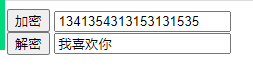

​	参考案例15

### day08

#### 1、数量词

​	1、明确了具体的次数的量词

​		{n}   限制了n次

```js
// 1、表示6个数字  {n} 明确 具体的数量个数
    var kw=arr.match(/\d{6}/ig);
    console.log(kw);

```

​	2、  {n,m}   在n-m之间的数量

```js
  //2、  {n,m}   在n-m之间的数量
    var kw2=arr.match(/\d{6,8}/ig); //6-8之间的密码
    console.log(kw2);
```

​	3、{n,}  最少n次 多了不限制

```js
 var kw3=arr.match(/\d{6,}/ig); //6-8之间的密码
    console.log(kw3);
```

#### 2、匹配位置

​	^ :开头    注意不要和除了混淆

​	$: 结尾


```js
 var arr=prompt("请输入6位数字密码");
    // 6位密码
    // 1、表示6个数字  {n} 明确 具体的数量个数
    // 限制开头和结尾 全部的内容 ^:开始  $:结束
    var kw=arr.match(/^\d{6}$/ig); //从开头到结尾只能是6个数字  
    console.log(kw);
```

#### 3、不限制个数量词

​	1、  ?         表示 可有可无， 最多只能出现一次

​	2、  *         表示 可有可无，多了不做限制

​	3、  +          最少需要出现一次  多了不限制

```js
  var arr=prompt("请输入6位数字密码");
    // 6位密码
    // ? :  表示 可有可无， 最多只能出现一次
    //*         表示 可有可无，多了不做限制
    // +          最少需要出现一次  多了不限制
    var kw=arr.match(/^\s+\d{6}$/ig); //从开头到结尾只能是6个数字
    console.log(kw);
```

​	（）    用于提高优先级、或者是用于分组

​	   |       表示  或  的意思

```js
 //
 var arr=prompt("请输入6位数字密码");
 // 6位密码
//  | 或者的意思   () 分组
 var kw=arr.match(/^(a|b)*\d{6}$/ig); //从开头到结尾只能是6个数字
 console.log(kw);
```

####     高级替换

​	 str.repalce(/正则/,function(e){})

​		e:正则匹配的每一个子元素

```js
var str="one world go jiajiajiajia";//
var kws=str.match(/\b[a-z]/ig); // o w g j
console.log(kws);
// 高级替换   参数1:正则   参数2:不是写死的值 而是一个回调函数callback
// e ：形参 用于接收正则匹配到的首字母
str=str.replace(/\b[a-z]/ig,function (e) {//遍历出的每个首字母
    return e.toUpperCase();// 返回大写的字符
})
console.log(str);
//
var s="   hello world   ";
console.log(s);
// 1.去掉 左边的空格
console.log(s.replace(/^\s*/ig,""))
//2 . 去掉右边的空格
console.log(s.replace(/\s*$/ig,""))
//3. 左右两边同时去掉空格
console.log(s.replace(/(^\s*)|(\s*$)/ig,""),s.replace(/^\s*|\s*$/ig,"").length);
```

#### trim()  去掉2边的空格

```js
  var s="   hello world   "; 
 // trim() 去掉2边的空格
    console.log(s.trim(),s.trim().length)
    // 去掉 左边的空格
    console.log(s.trimLeft());
    console.log(s.trimRight());
```

#### split()切割  ***

```js
  // 打散
    var  str="hello world";
    var kw=str.split(" ");
    console.log(kw);   //返回的是 打散后组成的 一个 新的数组
    console.log(str);  // 不会改变源字符串

    var kws=str.split("");//单词打散为字母
    console.log(kws);

    var bai="baidu.com/?uname=xu&pwd=123456";
    var kk=bai.split("?")[1];
    console.log(kk); //核心   // uname=xu&pwd=123456
    var kk2=kk.split('&')
    console.log(kk2); //  ["uname=xu", "pwd=123456"]
    var kk3=kk2[0].split("=");// [uname,xu]
    console.log(kk3);
    //获取下标及名字
    console.log(kk3[0]+":"+kk3[1]); uname:xu
```

### 内置对象

​        js自己内部封装的一些方法，可有直接拿到用的，不需要额外定义

 ex:  String()  Number()  Boolean()  Array()  

​	Math()    Object()    RegExp()正则对象，Date()  Global()全局   Function()

​        Error() ....

#### 正则内置对象RegExp

​	1.定义: 封装了一个对象用于处理正则相关的功能的。

​	2、创建正则

​		1、var  reg=/正则表达式/ig;

​		2、var   reg= new RegExp("正则表达式",'ig');

```js
// 声明 正则的方式1
var str=prompt("输入密码")
var  reg=/^\d{6}$/ig;

console.log(str.match(reg));
//方式2
var reg2=new RegExp("^\\d{6}$","ig");  // \\转义 => \
console.log(str.match(reg2));
```

##### test()

​	 正则提供的方法用于判断当前正则下 字符串是否匹配

```js
 var str=prompt("输入密码")
    var  reg=/^\d{6}$/ig;
    console.log(reg.test(str)); // 返回的是一个bool的值
    //如果输入的文本是 符合正则要求的 则返回true 否则返回false
```

##### exec()重要

​	即可以查找到关键词的位置，又可以查到关键词。

```js
 // exec() 正则的方法  可以找到下标和关键词
    var str="明明很喜欢我，却不告诉我，我想静静，明明是谁？静静又是谁？";
    var reg=/明明|静静/ig;
   /* var kw=reg.exec(str);
    console.log(kw);// 返回的是一个数组
    console.log(kw[0]); // 关键词
    console.log(kw["index"]);  //关键词的下标 默认是第一个

    var kw2=reg.exec(str);  //第二次执行 不再从0开始检索
    console.log(kw2[0]); //静静*/

   var str2="helo";
    console.log(reg.exec(str2)); // 如果没有检索出来 返回的是null
   // 遍历出所有的 关键词和下标
    while (true){
        var arr=reg.exec(str);
       //什么情况终止循环
        if(arr!=null){
            // console.log(arr);
            console.log("在"+arr["index"]+"找到了关键词:"+arr[0]);
        }else{
            break;
        }
    }
```

1、var str=" heLLo  WoRlD " ; // 首字母一律大写，其他都是小写

​	最好用替换replace

2、 身份证号码：正则

​	简单版:	  有可能是15位 有可能是18位，最后一位有可能是Xx或者是数字

​        复杂版     前6位 中第一位不能是0 剩余5位随意

​		        年:   18xxx 19xxx 20xx      4位

​			月:    01-12   没有13以上数字     2位

​			日:   01-31	 					2位

​			最后4位的最后一位有可能是xX数字

### day09

#### 1、内置对象之Math()

​	定义: 处理数学计算的方法

```js
var num=123.45678;
var num1="123.abc";
console.log(Math.ceil(num));//上取整   有小数点就+1
console.log(Math.floor(num));//下取整  直接忽略小数
console.log(parseInt(num)); // 取整  不会管小数

console.log(Math.round(num)); // 四舍五入
console.log(Math.pow(5,3));//  // 5:底数  3:指数   5的3之方
console.log(Math.sqrt(81));//  // 开根号  9

console.log(Math.max(12, 23, 4, 56, 2)); //输出最大值
console.log(Math.min(12, 23, 4, 56, 2)); //输出最大值
// 数组可以直接打散去 最大最小值
var arr=[12,23,5,33,2,55];
console.log(Math.max(...arr)); //  ...自动打散数组的元素 然后继续比较
console.log(Math.min(...arr)); //  ...自动打散数组的元素 然后继续比较

console.log(Math.random());  //   生成0-1的随机数
```

随机生成L   (n,m)之间的随机数    **Math.ceil(Math.random()*(m-n)+n)**

##### 注意:

​	js中 数据底层都是2进制计算， 一些小数转为2进制会是一个死循环，再转换为10进制过程就会出现误差

​	ex: 0.1+0.2=0.30000000000004;

​	解决办法  .tofixed(n)  保留n为小数

​	办法2:

```js
 //部分 小数是转为2进制有误差   
    //     先按指数进行变为整数
    var  wc=function (a,b) { //参数1 表示的是 进行计算的值，参数2表示指数
        var m=Math.pow(10,b);
        return parseInt(a*m,10)/m;
    }
    var num1=0.01;
    var num2=0.02;
    console.log(wc(num1 + num2, 1));
```

​	办法:   下载一个插件  math.js;  

​	  	自己百度下载

```js
https://cdnjs.cloudflare.com/ajax/libs/mathjs/8.1.0/math.js
```

​	2531  有数学+字母  随机生成验证码 用户猜3次  包含数字和字母

var arr=["a","b"...[c]]

### day10

#### 	内置对象之Date()

| 方法                                                         | 描述                                                         |
| ------------------------------------------------------------ | ------------------------------------------------------------ |
| [getDate()](https://www.runoob.com/jsref/jsref-getdate.html) | 从 Date 对象返回一个月中的某一天 (1 ~ 31)。                  |
| [getDay()](https://www.runoob.com/jsref/jsref-getday.html)   | 从 Date 对象返回一周中的某一天 (0 ~ 6)。                     |
| [getFullYear()](https://www.runoob.com/jsref/jsref-getfullyear.html) | 从 Date 对象以四位数字返回年份。                             |
| [getHours()](https://www.runoob.com/jsref/jsref-gethours.html) | 返回 Date 对象的小时 (0 ~ 23)。                              |
| [getMilliseconds()](https://www.runoob.com/jsref/jsref-getmilliseconds.html) | 返回 Date 对象的毫秒(0 ~ 999)。                              |
| [getMinutes()](https://www.runoob.com/jsref/jsref-getminutes.html) | 返回 Date 对象的分钟 (0 ~ 59)。                              |
| [getMonth()](https://www.runoob.com/jsref/jsref-getmonth.html) | 从 Date 对象返回月份 (0 ~ 11)。                              |
| [getSeconds()](https://www.runoob.com/jsref/jsref-getseconds.html) | 返回 Date 对象的秒数 (0 ~ 59)。                              |
| [getTime()](https://www.runoob.com/jsref/jsref-gettime.html) | 返回 1970 年 1 月 1 日至今的毫秒数。                         |
| [getTimezoneOffset()](https://www.runoob.com/jsref/jsref-gettimezoneoffset.html) | 返回本地时间与格林威治标准时间 (GMT) 的分钟差。              |
| [getUTCDate()](https://www.runoob.com/jsref/jsref-getutcdate.html) | 根据世界时从 Date 对象返回月中的一天 (1 ~ 31)。              |
| [getUTCDay()](https://www.runoob.com/jsref/jsref-getutcday.html) | 根据世界时从 Date 对象返回周中的一天 (0 ~ 6)。               |
| [getUTCFullYear()](https://www.runoob.com/jsref/jsref-getutcfullyear.html) | 根据世界时从 Date 对象返回四位数的年份。                     |
| [getUTCHours()](https://www.runoob.com/jsref/jsref-getutchours.html) | 根据世界时返回 Date 对象的小时 (0 ~ 23)。                    |
| [getUTCMilliseconds()](https://www.runoob.com/jsref/jsref-getutcmilliseconds.html) | 根据世界时返回 Date 对象的毫秒(0 ~ 999)。                    |
| [getUTCMinutes()](https://www.runoob.com/jsref/jsref-getutcminutes.html) | 根据世界时返回 Date 对象的分钟 (0 ~ 59)。                    |
| [getUTCMonth()](https://www.runoob.com/jsref/jsref-getutcmonth.html) | 根据世界时从 Date 对象返回月份 (0 ~ 11)。                    |
| [getUTCSeconds()](https://www.runoob.com/jsref/jsref-getutcseconds.html) | 根据世界时返回 Date 对象的秒钟 (0 ~ 59)。                    |
| [parse()](https://www.runoob.com/jsref/jsref-parse.html)     | 返回1970年1月1日午夜到指定日期（字符串）的毫秒数。           |
| [setDate()](https://www.runoob.com/jsref/jsref-setdate.html) | 设置 Date 对象中月的某一天 (1 ~ 31)。                        |
| [setFullYear()](https://www.runoob.com/jsref/jsref-setfullyear.html) | 设置 Date 对象中的年份（四位数字）。                         |
| [setHours()](https://www.runoob.com/jsref/jsref-sethours.html) | 设置 Date 对象中的小时 (0 ~ 23)。                            |
| [setMilliseconds()](https://www.runoob.com/jsref/jsref-setmilliseconds.html) | 设置 Date 对象中的毫秒 (0 ~ 999)。                           |
| [setMinutes()](https://www.runoob.com/jsref/jsref-setminutes.html) | 设置 Date 对象中的分钟 (0 ~ 59)。                            |
| [setMonth()](https://www.runoob.com/jsref/jsref-setmonth.html) | 设置 Date 对象中月份 (0 ~ 11)。                              |
| [setSeconds()](https://www.runoob.com/jsref/jsref-setseconds.html) | 设置 Date 对象中的秒钟 (0 ~ 59)。                            |
| [setTime()](https://www.runoob.com/jsref/jsref-settime.html) | setTime() 方法以毫秒设置 Date 对象。                         |
| [setUTCDate()](https://www.runoob.com/jsref/jsref-setutcdate.html) | 根据世界时设置 Date 对象中月份的一天 (1 ~ 31)。              |
| [setUTCFullYear()](https://www.runoob.com/jsref/jsref-setutcfullyear.html) | 根据世界时设置 Date 对象中的年份（四位数字）。               |
| [setUTCHours()](https://www.runoob.com/jsref/jsref-setutchours.html) | 根据世界时设置 Date 对象中的小时 (0 ~ 23)。                  |
| [setUTCMilliseconds()](https://www.runoob.com/jsref/jsref-setutcmilliseconds.html) | 根据世界时设置 Date 对象中的毫秒 (0 ~ 999)。                 |
| [setUTCMinutes()](https://www.runoob.com/jsref/jsref-setutcminutes.html) | 根据世界时设置 Date 对象中的分钟 (0 ~ 59)。                  |
| [setUTCMonth()](https://www.runoob.com/jsref/jsref-setutcmonth.html) | 根据世界时设置 Date 对象中的月份 (0 ~ 11)。                  |
| [setUTCSeconds()](https://www.runoob.com/jsref/jsref-setutcseconds.html) | setUTCSeconds() 方法用于根据世界时 (UTC) 设置指定时间的秒字段。 |
| setYear()                                                    | 已废弃。请使用 setFullYear() 方法代替。                      |
| [toDateString()](https://www.runoob.com/jsref/jsref-todatestring.html) | 把 Date 对象的日期部分转换为字符串。                         |
| toGMTString()                                                | 已废弃。请使用 toUTCString() 方法代替。                      |
| [toISOString()](https://www.runoob.com/jsref/jsref-toisostring.html) | 使用 ISO 标准返回字符串的日期格式。                          |
| [toJSON()](https://www.runoob.com/jsref/jsref-tojson.html)   | 以 JSON 数据格式返回日期字符串。                             |
| [toLocaleDateString()](https://www.runoob.com/jsref/jsref-tolocaledatestring.html) | 根据本地时间格式，把 Date 对象的日期部分转换为字符串。       |
| [toLocaleTimeString()](https://www.runoob.com/jsref/jsref-tolocaletimestring.html) | 根据本地时间格式，把 Date 对象的时间部分转换为字符串。       |
| [toLocaleString()](https://www.runoob.com/jsref/jsref-tolocalestring.html) | 根据本地时间格式，把 Date 对象转换为字符串。                 |
| [toString()](https://www.runoob.com/jsref/jsref-tostring-date.html) | 把 Date 对象转换为字符串。                                   |
| [toTimeString()](https://www.runoob.com/jsref/jsref-totimestring.html) | 把 Date 对象的时间部分转换为字符串。                         |
| [toUTCString()](https://www.runoob.com/jsref/jsref-toutcstring.html) | 根据世界时，把 Date 对象转换为字符串。实例：`var today = new Date(); var UTCstring = today.toUTCString();` |
| [UTC()](https://www.runoob.com/jsref/jsref-utc.html)         | 根据世界时返回 1970 年 1 月 1 日 到指定日期的毫秒数。        |
| [valueOf()](https://www.runoob.com/jsref/jsref-valueof-date.html) | 返回 Date 对象的原始值。                                     |

```js
//获取当前时间
    var  now=new Date();
    console.log(now); // Mon Dec 14 2020 14:59:33 GMT+0800 (中国标准时间)
    //2. 设置指定的时间 指定的格式
    var now1=new Date("2020-12-12 15:00:00")
   // console.log(now1); //  Sat Dec 12 2020 15:00:00 GMT+0800 (中国标准时间)

  // 计算机元年:  1970-01-01 0:0:0
    // 获取毫秒数  当前的时间到元年之间的毫秒数
    console.log(now.getTime());  //  1607929493328
    console.log(now.toString()); // 转为字符串
    console.log(now.toLocaleString()) //年月日时分秒  2020/12/14 下午3:07:27
    console.log(now.toLocaleDateString()); //  年月日   2020/12/14
    console.log(now.toLocaleTimeString());  // 时分秒


    console.log(now.getFullYear()); //年
    console.log(now.getMonth()); //月份     0-11   具体的月份要加1
    console.log(now.getDate()); //日期      1234560  0:星期天
    console.log(now.getDay());  //星期一
    console.log(now.getHours());  //时
    console.log(now.getMinutes()); //分
    console.log(now.getSeconds()); //秒
```

#### 内置对象之错误处理

​	1、语法错误（**SyntaxError**）  ，中文相关，不存在的内容, 后续代码就不再执行

​	2、引用错误（**ReferenceError**） ，未声明的变量， 后续代码就不再执行

​	3、类型错误（**TypeError**）	使用了错误的数据类型  比如属性和方法搞混了，或者字符串和数组方法搞混了  后续代码就不再执行

​	4、范围错误( **RangeError**)   使用的数组个数为负，二维数组的下标不能越界. 后续代码就不再执行

```js
 //   1、语法错误 SyntaxError
  // console.log(）；
  //  2、 引用错误 :ReferenceError
//  console.log(a);
     //   fn();  引用不存在变量或者是 函数

  //3.类型错误   TypeError
   //  var arr=[];
   // arr.substring(1,2);
    //arr.length() // 报类型错误

  //4.范围错误  RangeError
 //  var arr=new Array(-2); //个数没有负数
```

5、自定义错误

```
  var num="as";
    if(isNaN(num)){
        throw "必须是一个纯数字";
    }
```

##### 6、错误处理

​	try{

​		可能会出错的代码

}catch(err){

​	err: 自动捕获的错误，可以显示错误。

​	或者可以自定义错误文本

 	throw  new Error("自定义的文本")

}

```js
/*var age=9;
    try {
        if(age>65||age<18){
            // 在控制台输出
            throw  "年龄错误";
        }
    }catch (err) {
        console.log(err);
        //自定义任何形式的输出
        alert("请输入18-65之间的数字")
    }
    console.log(age); // 继续执行的*/

    // console.aaa("123")
  try {
      // console.log("123")
      console.aaa("123")
  }catch (err) {
      // console.log(err);
    //  alert("亲，你的语法有问题奥");
    //   console.log(String(err));
       throw  new Error("孙子，js会不会?");  //执行报错  红色的报错
  }finally { //不管代码是否错误 都会被执行
      console.log(123456);
  }
 // console.log(123);
```

### DOM(Document Object  Model ) 

#### 	1、定义:  

​	用来操作页面中的元素的(增、删、改、查)，由W3c统一制定的，几乎兼容所有的浏览器。

#### 	2、js怎么继续查找元素的

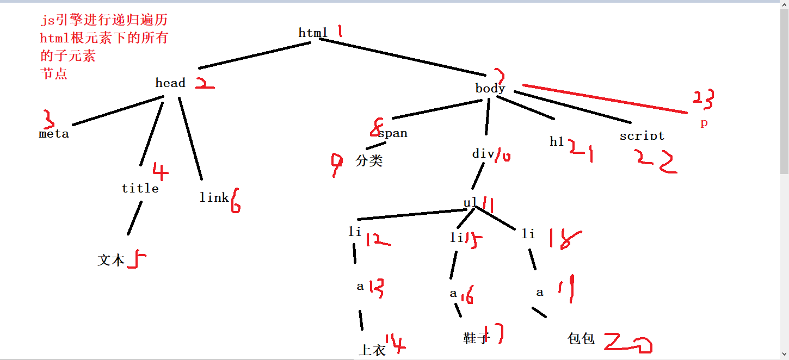

总结: 在网页中，结构是以 "树"的形式进行存储的，每一个元素(空格，换行)都是一个节点对象。

根节点:document,包含了所有的内容

#### 3、节点

##### 	1、节点的属性nodeType

​		文本 :                 3

​		标签 :                 1 

​		属性  :                2

​		document :      9

```js
  //1.节点类型
    function nodeType() {
        for (var i=0;i<arr.length;i++){
            console.log(arr[i].nodeType);//
        }
    }
    nodeType() ; // 31313131
    //span中的 title属性的节点类型 
    console.log(arr[1].attributes.title.nodeType); //
    //  3: 文本(包含空格)
    //  1:  标签
    //  2 ：   属性
```

​	用处:  用来判断节点的类型

##### 	2、节点名称nodeName (等着)

​	特点:   如果是标签的画 标签的节点名称是大写的

​		#text  ：普通的文本(包含空格)

​		SPAN   :  span标签

​		DIV      :   div标签

​		H2	:  h2标签

```js
 // 2  节点名称
    function nodeName() {
        for (var i=0;i<arr.length;i++){
            console.log(arr[i].nodeName);//
        }
    }
    nodeName();
```

  用处: 判断是什么标签

#####  3、节点值nodeValue 

```js
// 3 节点值
function nodeValue() {
    for (var i=0;i<arr.length;i++){
        console.log(arr[i].nodeValue);//
    }
}
nodeValue();
//   空格  : null
//    标签   : null
//attributes   ： 属性值
// text       :  文本值
console.log(arr[1].attributes.title.nodeValue); //输出属性值
```

用处: 获取节点属性的值

##### 4、复制节点

```js
node.cloneNode()
```

node.cloneNode() 方法返回调用该方法的节点的一个副本。也称为克隆节点/拷贝节点

**注意：**

1. 如果括号参数为  **空或者false**  ，则是 **浅拷贝** ，即只克隆复制节点本身，不可龙里面的子节点。
2. 如果括号参数为  **true** ，则是  **深度拷贝**  ，会复制节点本身以及里面所有的子节点。

#### 2、查找

##### 	1、按照节点的形式查找

​	**特点:包含空格**

​	    1、父子类  

​		ele.childNodes    子节点		可以多个

​		ele.children	 子节点		 多个（只查找标签）

​		ele.parentNode   父节点                就一个

​	     2、兄弟类

​		ele.nextSibling             下一个兄弟 

​		ele.previousSibling     上一个兄弟   	

```js
<div>
    <div>son1<span>sonson1</span></div>
    <div>son2</div>
</div>
<script>
    //
    console.log(document.body.childNodes);// 节点包含空格
    console.log(document.body.childNodes.length);// 节点包含空格
    // 大div
    console.log(document.body.childNodes[1]);
     //son1
    console.log(document.body.childNodes[1].childNodes[1]);
    //下一个兄弟  注意空格
    console.log(document.body.childNodes[1].childNodes[1].nextSibling.nextSibling);
    
</script>
```

1、放假时间: 2.4号  

​	倒计时:  多少天 多少分钟 多少秒

2、升序和降序

### day11

#### 	1、按元素查找

​	特点: 忽略空格

##### 	父子类:

​		ele.firstElementChild 	第一个孩子

​		ele.lastElementChild	  最后一个孩子

​		ele.parentElement 	    父元素

​		ele.children			所有的子元素 

```js
 //获取 父节点
    console.log(document.body.childNodes[1]);
    var p=document.body.childNodes[1];//
    //第一个孩子  忽略空格
    console.log(p.firstElementChild);
    //最后一个孩子
    console.log(p.lastElementChild);
    //老三的父元素  回到原点
    console.log(p.lastElementChild.parentElement);
    //所以的孩子
    console.log(p.children); // 返回的 是一个数组
```

##### 	兄弟类

​		ele.nextElementSibling  下一个兄弟元素

​		ele.previousElementSibling  上一个兄弟元素

```
 //兄弟元素查找
    // 第一个元素的 下一个兄弟
    console.log(p.firstElementChild.nextElementSibling);
    // 上一个兄弟
    console.log(p.lastElementChild.previousElementSibling);

```

遍历每个子元素

```js
 // 遍历 div中所有的元素
    for (var i=0;i<p.children.length;i++){
        //遍历每一个元素
        console.log(p.children[i]);
    }
```

#### 2、按html查找

```js
 //   按 id 属性值查找
    var d1 =document.getElementById("d1");  //返回一个元素
    console.log(d1);

    // 2 按照标签名   返回的是一个数组
    var p1=document.getElementsByTagName("p");
    console.log(p1[0]);

    // 3.按照类名查找    返回的是一个数组
    var d_son=document.getElementsByClassName("son2");
    console.log(d_son[0]); //拿到 当前元素

    // 按照name值查找
    var a=document.getElementsByName("a");
    console.log(a[0]);	1、按照id选择器查找
```

#### 3、按照选择器查找

```js
 // 按照选择器查找
    var p2=document.querySelector("#d1>p");  //找一个
    console.log(p2);

    //找多个
    var p3=document.querySelectorAll("#d1>p");  //找一个
    console.log(p3); //返回的是一个数组组成的所有的元素
    console.log(p3[1]); //某一个元素
```

##### 4.注意

​	 如果需要遍历大量的子元素/子节点

​	  可以先用变量n去接收遍历的个数长度，而不是直接通过.length去判断

​	  这样的话 效率会更高

```js
  //默认情况    遍历所有的  div 123
    var now=new Date();
    // 程序每遍历一次 都会去统计所有的 123的div
    for (var i=0;i<document.querySelectorAll("#d1 div div div div div").length;i++){
        document.querySelectorAll("#d1 div div div div div")[i];
    }
    var end=new Date();
    console.log(end-now);
```

​	优化部分

​	用变量接收元素的个数

```js
//  代码的优化
    //   遍历所有的  div 123
    var now=new Date();
    // 程序每遍历一次 都会去统计所有的 123的div
    for (var i=0,num=document.querySelectorAll("#d1 div div div div div").length;i<num;i++){
        document.querySelectorAll("#d1 div div div div div")[i];
    }
    var end=new Date();
    console.log(end-now);
```

##### 获取特殊元素(body,html)

```js
//获取body元素
document.body; //返回body元素对象
获取html元素
document.documentElement //返回html元素对象
```


#### 4、修改元素内容

​	 **ele.innerHTML**    获取/修改元素的内容    支持html标签解析

​	 ele.innerText        获取/修改元素的内容     不支持 按照普通文本输出

​	 ele.value           获取输入框的值

```js
<!-- -->
<button onclick="add()">添加</button>
<div id="d1">0</div>
<script>
    //
    function add() {
        //1.先找到d1
        var d1=document.getElementById("d1");
        
        //支持解析html标签语法
        //d1.innerHTML="<b>我是新来的</b>";

        // 按文本输出
        // d1.innerText="<b>我是新来的</b>";
       //直接按文本输出
        d1.textContent="<b>我是新来的</b>";
    }
   // 输入框的值 是 value属性  
    console.log(input.value);
    console.log(input.innerHTML);
</script>
```

补充this的使用(后面继续探讨)

```js
<button id="b1" onclick="add()" class="">添加</button>
<button id="b2" onclick="jian()">删除</button>
<button id="b3" >0</button>
<script>
    //
    //  this
    function add() {
        // id选择器  可以直接省略查找的部分
        // var b3=document.getElementById("b3");

        b3.innerHTML++;
    }
    function jian() {
        b3.innerHTML--;
    }

    //当b3单击时  去执行方法
    b3.onclick=function() {
        //b3.innerHTML++;
        //如果说  点击的是自己的可以 可以用  this=>当前点击的对象
        this.innerHTML++;  //   => 谁点击this就指谁
    }


</script>
```

#### 5、属性操作

##### 	1、核心dom属性

​	    ele.attributes    查找所有的属性

​	    **ele.getAttribute("属性名")    获取ele元素的属性值**

​	    **ele.setAttribute("属性名","值")    设置ele元素的属性名对应的值**

​	    ele.hasAttribute("属性名")     判断有没有对应的属性名

​	    ele.removeAttribute("属性名")   删除对应的属性名	

​	**特点: 可以去设置自定义的属性**

```js
 <style>
        /* */
        .bgc{
            background-color: #352bff;
        }
        .bgc1{
            background-color: red;
        }
    </style>
</head>
<body>
<!-- -->
<div id="d1" class="bgc" >隔壁老徐</div>
<button id="btn">移除</button>
<script>
    //获取所有的属性
    console.log(d1.attributes);
    //获取class属性
    console.log(d1.getAttribute("class"));
    //设置class属性值
    d1.setAttribute("class","bgc1");


    btn.onclick=function () {
        //移除d1的类名
        d1.removeAttribute("class");

        // 可以去设置 自定义的属性
        d1.setAttribute("xu","19");
    }
```

##### HTML DOM属性	

​	就是简化核心dom操作，直接用.的形式就可以

​	获取属性      xxx.属性名  

​	设置、修改属性     xxx.属性名="新的值"

​	删除  xxx.属性名=""

​	注意: 获取自定义的属性  不能直接获取自定义的属性

​	处理:	

​		1、定义的时候 需要加前缀  data-

​		2、获取的时候   ele.dataset.xxx去获取和设置 自定义的属性	

```js
<!-- -->
<div id="d1" class="bgc" title="一个男人" style="" data-score="68">隔壁老徐</div>
<script>
    // 找元素
  //   var d1=document.getElementsByTagName("div")[0];
    
    var d1=document.querySelector("[title]");  //选择器

    //获取属性
    console.log(d1.className);
    //设置属性
    d1.className="newBGC";
    //删除属性值
    d1.className="";
    //判断 值存不存在
    console.log(d1.title == "title");

    console.log(d1.className); // 空的


    //获取自定义的属性  不能直接获取自定义的属性
    console.log(d1.score); // undefined
    //通过额外的处理   想要通过htmlDOM 获取自定义的属性时
    //1. 定义的时候 需要加前缀  data-
    //2.  获取的时候   ele.dataset.xxx去获取和设置 自定义的属性
    console.log(d1.dataset.score);//

d1.dataset.score="888" //修改属性值
    d1.dataset.newscore="666" //新增一个自定义的属性
</script>
```

​	实现开关的效果

​	红球:   6个 不重复的红球       1-33的取值范围

​	篮球:    1个				1-16的取值范围

​	

​	显示:     随机生成下面的 格式  

​	      

#### 6、常见的鼠标事件

| 鼠标事件    | 触发条件         |
| ----------- | ---------------- |
| onclick     | 鼠标点击左键触发 |
| onmouseover | 鼠标经过触发     |
| onmouseout  | 鼠标离开触发     |
| onfocus     | 获得鼠标焦点触发 |
| onblur      | 失去鼠标焦点触发 |
| onmousemove | 鼠标移动触发     |
| onmouseup   | 鼠标弹起触发     |
| onmousedown | 鼠标按下触发     |


### day12

#### 1、修改样式

​	ele.style.xxx="xxx"

​	注意: 复合的样式需要 **去掉- 变为驼峰命名**

```
<div id="d1">锄禾日当午</div>
<button id="btn">变</button>
<script>
  btn.onclick=function () {
      // // 去掉- 变为驼峰命名
      d1.style.height="100px";
     
      d1.style.backgroundColor="yellow";
      //
      d1.style.display="none";
  }
</script>
```

#### 2、classList 操作元素类名

classList 是 Element 接口的一个属性，其返回值是一个 DOMTokenList 对象，该对象表示当前元素的类名列表。我们可以通过以下方式来获取一个元素的 classList：

```js
const element = document.getElementById('myElement');
const classList = element.classList;
```

**add方法**

add方法用于元素添加一个或多个类名

```js
element.classList.add('active','visible','highlight')
```

**remove方法**

remove 方法用于从元素中删除一个或多个类名。

```js
element.classList.remove('active','visible','highlight')
```

**[toggle](https://so.csdn.net/so/search?q=toggle&spm=1001.2101.3001.7020)方法**

toggle 方法用于在元素中切换一个类名的状态。如果元素中已经存在该类名，则该类名将被删除；如果元素中不存在该类名，则该类名将被添加。

```js
element.classList.toggle('active');
```

我们还可以在 toggle 方法中传入一个布尔值作为第二个参数，用于指定是否强制添加或删除类名。

```js
element.classList.toggle('active', true);
```

**contains方法**

contains 方法用于检查元素中是否包含指定的类名。存在返回true，否则返回false

```js
const hasActiveClass = element.classList.contains('active');
```

**replace方法**

replace 方法用于替换元素中的一个类名为另一个类名。

```js
element.classList.replace('oldClass', 'newClass');
```

**item方法**

item 方法用于获取元素类名列表中指定索引位置的类名。

```js
const secondClass = element.classList.item(1);
```

**length用法**

length 属性用于获取元素类名列表的长度。

```js
const classListLength = element.classList.length;
```

**forEach方法**

forEach 方法用于遍历元素的类名列表，并对每个类名执行指定的操作。

```js
element.classList.forEach(className => {
  console.log(className);
});
```

#### 3、添加和删除

​		1、创建一个元素 

​			var div=document.createElement("div");

​		2、赋予元素的内容和属性

​			div.innerHTML="xxx";

​			div.style.xxx="xxx";
​			div.className="xxx";

​			element.classList.remove('xxx')

​		3、添加到页面中

​			1、在xx之前插入    parent.insertBefore(新元素,旧元素);

​			2、在末尾追加  parent.appendChild(新元素);

```js
<style>
        /* */
        .bgc{
            background-color: aquamarine;
        }
    </style>
</head>
<body>
<!-- -->
<div id="parent">
    <div>老大</div>
    <div>老二</div>
    <div>老三</div>
</div>
<script>
    //1.js创建一个元素
    var div=document.createElement("div");
    //2.添加内容
    div.innerHTML="我是新来的";
    div.style.color="yellow";
    div.className="bgc";
    //3.添加到页面中
        //1.找到父元素
        var parent=document.getElementById("parent");
        //  在xxx之前插入元素 参数1:新元素   参数2:旧元素
        //parent.insertBefore(div,parent.firstElementChild);
        // 在末尾追加
         parent.appendChild(div);
</script>
```

##### 	删除

​		parent.removeChild(parent.firstElementChild);

​							需要删除的孩子

#####           替换         

​				参数1:新元素   参数2:要被替换的元素
parent.replaceChild(    div,       parent.firstElementChild);

#### 修改内部样式(了解)

​	不是很推荐使用，修改有可能会影响很多人，

​	步骤1   **先去获取样式表**

​		 var sheet=document.styleSheets[0];

​	步骤2	 去拿取 选择器对应的样式 

​		 var h2=sheet.cssRules[1];

​	步骤3   去修改属性

​		h2.style.xxx="xxx"

```js
 <style>
        /* */
        div{
            background-color: red;
        }
        h2{
            color:red;
        }
    </style>
</head>
<body>
<!-- -->
<div id="d1">我是隔壁老徐</div>
<h2>我也是隔壁老徐</h2>
<script>
    //
    d1.className="bgc";
    // 这样不是修改内部样式表 只是在元素中生成了一个内联样式 优先级高于内部样式
   /* d1.style.backgroundColor="yellow";*/
    //步骤1 先去获取样式表
     var sheet=document.styleSheets[0];
    console.log(sheet); //获取到了 内部样式表了

    //2.去拿取 选择器对应的样式  ex:获取 h2中的样式
    //: 一层cssRules 对应的是一个 {}
    var h2=sheet.cssRules[1];  //获取到了  h2对应的样式

    //3.去修改h2在内部样式表中的样式
       h2.style.color="yellow";
</script>
```

注意: 如果有2个层级需要再次获取一遍cssRules

```js
 <style>
        /* */
        /*第一级 {}   */
        @keyframes xu {
            /*第二级 {}*/
            0%{
                background-color: red;
            }
            50%{
                background-color: yellow;
            }
            100%{
                background-color: black;
            }
        }
        div{
            width: 150px;
            height: 250px;
            border:1px solid #aaa;
            animation: xu linear 3s infinite;
        }
    </style>
</head>
<body>
<!-- -->
<div>变</div>
<script>
    //1 获取样式表
    var sheet=document.styleSheets[0];
    //2.获取 动画样式处理
    var dong=sheet.cssRules[0]; //整个的动画样式
    //3. 再找一级  需要再一次 cssRules[xxx]
    var start=dong.cssRules[0];
    start.style.backgroundColor="blue"; //把起始为红色改为了 蓝色
</script>
```

### DOM 重点核心

文档对象模型(DOM)，是W3C组织推荐的处理可扩展标记语言的标准编程接口

W3C已经定义了一系列的DOM接口，通过这些DOM接口可以改变网页的内容、结构和样式。

1. 对于JavaScript，为了能够使JavaScript操作HTML，JavaScript就有了一套自己的dom编程接口。
2. 对于HTML，dom使得html形成一颗dom树，包括文档、元素、节点

关于dom操作，我们主要针对于元素的操作。主要有创建、增、删、改、查、属性操作、事件操作。

1. ##### 创建

   - document.write
   - innerHTML
   - createElement

2. ##### 增

   - appendChild
   - insertBefore

3. 删

   - removeChild

4. 改

   主要修改dom的元素属性，dom元素的内容、属性，表单的值等

   - 修改元素属性：src、href、title等
   - 修改普通元素内容：innerHTML、innerText
   - 修改表单元素：value、type、disabled等
   - 修改元素样式：style、className

5. 查

   主要获取查询dom的元素

   1. DOM提供的API方法：getElementById、个体Elements B有Tag Name 古老用法不太推荐
   2. H5提供的新方法：querySelector、querySelectorAll 提倡
   3. 利用节点操作获取元素：父(parentNode)、子（children）、兄（previousElementSibling、nextElementSibling）提倡、

6. 属性操作

   主要针对于自定义属性

   - setAttribute：设置dom的属性值
   - getAttribute：得到dom的属性值
   - removeAttribute移除属性

### DOM 事件高级

#### 	注册事件（绑定事件）

##### 		注册事件概述

​		给元素添加事件，称为**注册事件**或者**绑定事件**

​		注册事件有两种方式：**传统方式和方法监听注册方式**

​		**传统注册方式**

- 利用on开头的事件onclick

  - btn.onclick=function(){}

    - 特点：注册事件的 **唯一性**
    - 同一个元素同一个事件只能设置一个处理函数，最后注册的处理函数将会覆盖前面注册的处理函数

    **方法监听注册方式**

    - W3C 标准推荐方式
    - addEventListener()它是一个方法
    - IE9之前的ie不支持此方法，可使用attachEvent()代替
    - 特点：同一个元素同一个事件可以注册多个监听器
    - 按注册顺序一次执行

    ##### addEventListener 事件监听方式

```js
eventTarget.addEventListener(type,listener[,useCapture])
```

​		eventTarget.addEventListener()方法将指定的监听器注册到eventTarget(目标对象)上，当该对象触发指定的事件是，就会执行事件处理函数。

​		该方法接受三个参数：

- type：事件类型字符串，比如click、mouseover，注意这里不要带on

- listener：事件处理函数，事件发生时，会调用该监听函数

- useCapture：可选参数，时一个布尔值，默认时false。

  ##### 	attachEvent 事件监听方式

  ​	

  ```js
  eventTarget.attachEvent(eventNameWithOn,callback)
  ```

  eventTarget.attachEvent()方法将指定的监听器注册到eventTarget(目标对象)上，当该对象触发指定的事件时，指定的回调函数就会被执行

  该方法接受两个参数：

  - eventNameWithOn：事件类型字符串，比如onclick、onkouseover，这里要带on
  - callback：事件处理函数，当目标触发事件时回调函数被调用

  ##### 注册事件兼容性解决方案

  ```js
  function addEventListener(element,eventName,fn){
    //判断当前浏览器是否支持 addEventListener方法
    if(element.addEventListener){
        element.addEventListener(eventName,fn); //第三个参数默认时false
    } else if (element.attachEvent) {
        element.attachEvent('on'+eventName,fn);
    } else {
        //相当于 element.onclick=fn;
        element['on'+eventName] = fn;
    }
  }
  ```

#### 删除事件

##### 	删除事件的方式

1. 传统注册方式

   eventTarget.onclick = null;

2. 方法监听注册方式

   - eventTarget.removeEventListener(type,listener[,useCapture]);
   - eventTarget.detachEvent(eventNameWithOn,callback);

#### DOM 事件流

​	事件流描述的是从页面中接收事件的顺序

​	事件发生是会在元素节点之间按照特定的顺序传播，这个传播过程即DOM事件流

​	比如我们给一个div注册了点击事件：

​	DOM事件流分为3个阶段：

- 捕获阶段
- 当前目标阶段
- 冒泡阶段

1. 事件冒泡：IE最早提出，事件开始时由最具体的元素接受，然后逐级向上传播到DOM最顶层节点的过程

2. 事件捕获：网景最早提出，由DOM最顶层节点开始，然后逐级乡下传播到最具体的元素接受的过程

   **注意**

   1. JS代码中只能执行捕获或者冒泡其中的一个阶段
   2. onclick和attachEvent只能得到冒泡阶段
   3. addEventListener(type,listener[,useCapture])第三个参数如果时true，表示在事件捕获阶段调用事件处理程序；如果时false(不写默认就是false)，表示在事件冒泡阶段调用事件处理程序。

#### 事件对象

```js
eventTarget.onclick = function(event){}
eventTarget.addEventListener('click',function(event){})
// 这个event就是事件对象，我们还喜欢的写成e或者evt
```

官方解释：event对象代表事件的状态，比如键盘按键的状态、鼠标的位置、鼠标按钮的状态。

简单理解：事件发生后，跟事件相关的一系列信息数据的集合都放到这个对象李米娜，这个对象就是事件对象event，他又很多属性和方法。

比如：

1. 谁绑定了这个事件
2. 鼠标触发事件的话，会得到鼠标的相关信息，如鼠标位置。
3. 键盘触发事件的话，会得到键盘的相关信息，如按了那个键

##### 使用语法

```js
eventTarget.onclick = function(event){
    // 这个 event 就是事件对象，我们还喜欢的写成e 或者 evt
}
eventTarget.addEventListener('click',function(event){
    // 这个event 就是事件对象，我们还喜欢的写成e或者evt
})

```

这个event是个形参，系统帮我们设定为事件对象，不需要传递实参过去

当我们注册事件时，event第项就会被系统自动创建，并依次传递给事件监听器

##### 常见属性和方法

| 事件对象属性方法    | 说明                                                        |
| ------------------- | ----------------------------------------------------------- |
| e.target            | 返回触发事件的对象      标准                                |
| e.srcElement        | 返回触发事件的对象      非标准ie6-8使用                     |
| e.type              | 返回事件的类型比如click mouseover不带on                     |
| e.cancelBubble      | 该属性阻止冒泡非标准ie6-8使用                               |
| e.returnValue       | 该属性阻止默认事件(默认行为)非标准ie6-8使用比如不让链接跳转 |
| e.preventDefault()  | 该方法阻止默认事件(默认行为)标准比如不让链接跳转            |
| e.stopPropagation() | 阻止冒泡标准                                                |

##### **e.target和this的区别：**  

- e.target 返回的是触发事件的对象(元素)

- this返回的是绑定事件的对象(元素)

  ##### 阻止事件冒泡

  ​	事件冒泡：开始时由最具体的元素接受，然后逐级向上传播到DOM最顶层节点

  ​	事件冒泡本身的特征，会带来的坏处，也会带来的好处，需要我们灵活掌握。

  **阻止事件冒泡**

  - 标准写法：利用事件对象里面的stopPropagation()方法

    ```js
    e.stopPropagation()
    ```

  - 非标准写法：IE 6-8 利用事件对象 cancelBubble 属性

  ##### 事件委托

  事件冒泡本身的特征，会带来的坏处，也会带来的好处，需要我们灵活掌握。

  ```html
  <ul>
  	<li>内容1</li>
      <li>内容1</li>
      <li>内容1</li>
      <li>内容1</li>
      <li>内容1</li>
      <li>内容1</li>
  </ul>
  ```

  点击每个li都会弹出对话框，以前需要给每个li注册事件，是非常辛苦的，而且访问DOM的次数越多，这就会延长整个页面的交互就绪时间。

  

  **事件委托**

  事件委托也称为事件代理，在JQuery里卖弄称为事件委派

  

  **事件委托原理**

  **不是每个子节点单独设置事件监听器，而是事件监听器设置在其父节点上，然后利用冒泡原理影响设置每个子节点**


​	**事件委托的作用**

​	我们之操作了一次DOM，提高了程序的性能

##### 	常用的鼠标事件

​	**常用的鼠标事件**

1. ​	禁止鼠标左键菜单

   contextmenu主要控制应该何时显示上下文菜单，主要用于程序员取消默认的上下文菜单

   ```js
   document.addEventListener('contextmenu',function(e){
       e.preventDefault();
   })
   ```

2. 禁止鼠标选中(selectstart 开始选中)

   ```javascript
   document.addEventListener('selectstart',function(e){
       e.preventDefault();
   })
   ```

   **鼠标事件对象**

   event 对象代表事件的状态，跟事件相关的一系列信息的集合。现阶段我们主要是用鼠标事件对象 MouseEvent 和键盘事件对象 KeyboardEvent

   | 鼠标事件对象 | 说明                                    |
   | ------------ | --------------------------------------- |
   | e.clientX    | 返回鼠标相对于浏览器窗口可视区的X坐标   |
   | e.clientY    | 返回鼠标相对于浏览器窗口可视区的Y坐标   |
   | e.pageX      | 返回鼠标相对于文档页面的X坐标 IE9+ 支持 |
   | e.pageY      | 返回鼠标相对于文档页面的Y坐标 IE9+ 支持 |
   | e.screenX    | 返回鼠标相对于电脑屏幕的X坐标           |
   | e.screenY    | 返回鼠标相对于电脑屏幕的Y坐标           |

   ##### 常用的键盘事件

   事件除了使用鼠标触发，还可以使用键盘触发

   | 键盘事件   | 触发条件                                                     |
   | ---------- | ------------------------------------------------------------ |
   | onkeyup    | 某个键盘按键被松开时触发                                     |
   | onkeydown  | 某个键盘按键按下时触发                                       |
   | onkeypress | 某个键盘按键被按下时 触发 **但是它不能识别功能键 比如 ctrl shift 箭头等** |

   ###### 键盘事件对象

   | 键盘事件对象 属性 | 说明                 |
   | ----------------- | -------------------- |
   | keyCode           | 返回该键的ASC\|\| 值 |

   注意：onkeydown和onkeyup 不区分字母大小写，onkeypress 区分字母大小写。

   在我们实际开发中，我们更多的使用keydownhekeyup，他能识别所有的键

   ###### ASC||码

   

### day13

###  BOM(browser  object model)

​	BOM即浏览器对象模型，它提供了独立于内容而**与浏览器窗口进行交互的对象**，其核心对象时window。

​	特点:  考虑兼容性

##### 	1、定义: 专门用于操作浏览器窗口相关的API;

​		之前学的 alert("xxx")  prompt(" ")   都是在全局的window下的方法

​		window.xxx   可以直接省略window.

##### 	2、获取常见的浏览器的信息

​		浏览器窗口的宽度:   window.innerWidth  

​		浏览器窗口的高度    window.innerHeight

​		或者是  document.documentElement.clientWidth 宽度(考虑兼容)

​			     document.documentElement.clientHeight  高度

```js
//兼容写法
//console.log(window.innerWidth||document.documentElement.clientWidth);

// 监听 window宽度实时变化     resize :监听浏览器变化的事件方法
window.onresize=function () {
    console.log(window.innerWidth||document.documentElement.clientWidth);
    if((window.innerWidth||document.documentElement.clientWidth)<500){
        alert("那啥 你太小了");
    }
}
```

​		**滚动条距离页面顶部的高度 (考虑兼容)**

​		document.documentElement.scrollTop||window.screenTop

```js
  <style>
        /* */
        body{
            height: 2000px;
        }

        a{
            position: fixed;
            bottom:50px;
            right: 50px;
            display: none;
        }
    </style>
</head>
<body>
<!-- -->
<a href=" " id="a">返回页面顶部</a>
<script>
    //
    //console.log(window.scrollTop);
    // 考虑兼容性 火狐想要获取:window.screenTop
    console.log(document.documentElement.scrollTop||window.screenTop);
    //滚动监听函数   scroll()
    window.onscroll=function () {
        //实时的获取 滚动条距离顶部的高度 
        console.log(document.documentElement.scrollTop||window.screenTop);
        if((document.documentElement.scrollTop||window.screenTop)>200){
            a.style.display="block";
        }else{
            a.style.display="none";
        }
    }
</script>
```

##### 3、window常见事件

**窗口加载事件**

1. onload :等页面内容全部加载完毕，包含也米娜dom元素 图片 flash css 等等
2. DOMContentLoaded 是DOM 加载完毕，不包含图片 flash css 等就可以执行 加载速度比load更快

**窗口大小事件**

window.onresize 是调整窗口大小加载事件，当触发时就调用的处理函数

#### 定时器(周期性)

定义:  让程序每间隔一段时间去反复一直执行。反复做一件事

##### 步骤:

​	1、定义要做的事(创建一个函数，封装功能)

​		function test(){}

​	2、启动定时器 跑起来	

​		var timer=setInterval(执行任务函数名,执行函数的间隔毫秒数);

​	3、可选:  停止定时器 

​			clearInterval(timer);

​			timer=null;  释放内存

```js
<!-- -->
 <h1>倒计时:</h1>
<div id="d1">60</div>
<script>
    // 一般使用定时器 都需要等页面加载完成之后再去执行
    window.onload=function () { //页面完全加载完: css样式  img
        //1.定义一个 任务函数
        function test() {
            // 先拿到60
            d1.innerHTML--;
            if(d1.innerHTML<=0){
                // 3.清除定时器
                clearInterval(timer);
                timer=null;
                window.close();//关闭浏览器
            }
        }
        //2.启动定时器
        var timer=setInterval(test,100)
    }

</script>
```

####     一次性定时器

​	定义:   等待一段时间 去执行一次程序

​	语法: 

​		1、 定义任务函数

​			 function test(){你要程序去做的事情}

​		 2、启动一次性定时器

​		var timer=setTimeOut(任务函数,等待时间的毫秒数)

​				等待一段时间再去执行

​		3.可以中途停止定时器

​		 clearTimeOut(timer)

```js
 //1.定义任务函数
    alert("5秒之后弹出信息");
    function test() {
        alert("其实没啥好信息 ");
    }
    //2 执行
    var timer=setTimeout(test,5000);

    //3 :可选  可以终止
    btn.onclick=function () {
        alert("停止交易")
        clearTimeout(timer);
    }
```

作业:

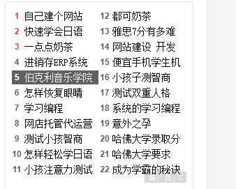

### day14

#### 1.history对象

​	定义:  用来记录 浏览器当前访问过的网页(成功)

​	history.go(1) 	前进一页         history.forword()

​	history.go(-1)        后退一页   ==   history.back()

​	history.go(0)         刷新

#### 2.location对象

​    定义:  保存当前的url的相关的信息

##### Location 对象属性

| 属性                                                         | 描述                                          |
| ------------------------------------------------------------ | --------------------------------------------- |
| [hash](https://www.w3school.com.cn/jsref/prop_loc_hash.asp)  | 设置或返回从井号 (#) 开始的 URL（锚）。       |
| [host](https://www.w3school.com.cn/jsref/prop_loc_host.asp)  | 设置或返回主机名和当前 URL 的端口号。         |
| [hostname](https://www.w3school.com.cn/jsref/prop_loc_hostname.asp) | 设置或返回当前 URL 的主机名。                 |
| [href](https://www.w3school.com.cn/jsref/prop_loc_href.asp)  | 设置或返回完整的 URL。                        |
| [pathname](https://www.w3school.com.cn/jsref/prop_loc_pathname.asp) | 设置或返回当前 URL 的路径部分。               |
| [port](https://www.w3school.com.cn/jsref/prop_loc_port.asp)  | 设置或返回当前 URL 的端口号。                 |
| [protocol](https://www.w3school.com.cn/jsref/prop_loc_protocol.asp) | 设置或返回当前 URL 的协议。                   |
| [search](https://www.w3school.com.cn/jsref/prop_loc_search.asp) | 设置或返回从问号 (?) 开始的 URL（查询部分）。 |

##### Location 对象方法

| 属性                                                         | 描述                     |
| ------------------------------------------------------------ | ------------------------ |
| [assign()](https://www.w3school.com.cn/jsref/met_loc_assign.asp) | 加载新的文档。           |
| [reload()](https://www.w3school.com.cn/jsref/met_loc_reload.asp) | 重新加载当前文档。       |
| [replace()](https://www.w3school.com.cn/jsref/met_loc_replace.asp) | 用新的文档替换当前文档。 |

```js
 //
    console.log(location);
    btn.onclick=function () {
      //  location.reload(); // 刷新
        location.replace("http://www.baidu.com");//当前文档被替换为新的文档
    }
```

#### navigator对象

​	定义: 保存浏览器相关的信息

##### Navigator 对象属性

| 属性                                                         | 描述                                           |
| ------------------------------------------------------------ | ---------------------------------------------- |
| [appCodeName](https://www.w3school.com.cn/jsref/prop_nav_appcodename.asp) | 返回浏览器的代码名。                           |
| [appMinorVersion](https://www.w3school.com.cn/jsref/prop_nav_appminorversion.asp) | 返回浏览器的次级版本。                         |
| [appName](https://www.w3school.com.cn/jsref/prop_nav_appname.asp) | 返回浏览器的名称。                             |
| [appVersion](https://www.w3school.com.cn/jsref/prop_nav_appversion.asp) | 返回浏览器的平台和版本信息。                   |
| [browserLanguage](https://www.w3school.com.cn/jsref/prop_nav_browserlanguage.asp) | 返回当前浏览器的语言。                         |
| [cookieEnabled](https://www.w3school.com.cn/jsref/prop_nav_cookieenabled.asp) | 返回指明浏览器中是否启用 cookie 的布尔值。     |
| [cpuClass](https://www.w3school.com.cn/jsref/prop_nav_cpuclass.asp) | 返回浏览器系统的 CPU 等级。                    |
| [onLine](https://www.w3school.com.cn/jsref/prop_nav_online.asp) | 返回指明系统是否处于脱机模式的布尔值。         |
| [platform](https://www.w3school.com.cn/jsref/prop_nav_platform.asp) | 返回运行浏览器的操作系统平台。                 |
| [systemLanguage](https://www.w3school.com.cn/jsref/prop_nav_systemlanguage.asp) | 返回 OS 使用的默认语言。                       |
| [userAgent](https://www.w3school.com.cn/jsref/prop_nav_useragent.asp) | 返回由客户机发送服务器的 user-agent 头部的值。 |
| [userLanguage](https://www.w3school.com.cn/jsref/prop_nav_userlanguage.asp) | 返回 OS 的自然语言设置。                       |

##### Navigator 对象方法

| 方法                                                         | 描述                                         |
| ------------------------------------------------------------ | -------------------------------------------- |
| [javaEnabled()](https://www.w3school.com.cn/jsref/met_nav_javaenabled.asp) | 规定浏览器是否启用 Java。                    |
| [taintEnabled()](https://www.w3school.com.cn/jsref/met_nav_taintenabled.asp) | 规定浏览器是否启用数据污点 (data tainting)。 |

```js
<script>
    //
    console.log(navigator)
    console.log(navigator.appCodeName);// 浏览器的代码名  "Mozilla"  兼容性考虑
    console.log(navigator.appName); // appName: "Netscape"
    //获取当前的网络的速度  2g ,3G 4G
    console.log(navigator.connection.effectiveType)

</script>
```

#####    **模拟测试  不同的网速**  

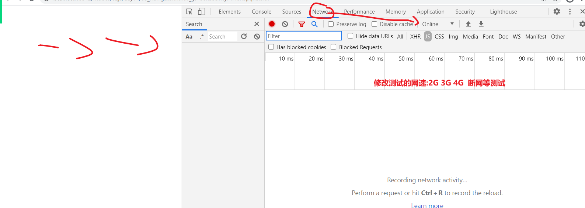

### day15

#### 	1.事件绑定

​	1.可以在html中直接绑定

```
<!-- 直接在html中 绑定事件-->
 <div onclick="abc()"></div>
```

​	2.在js中

​        xxx.onclick=function(){

​			this->当前的元素

​	}

​	移除事件:   xxx.onclick=null;

​	**问题: 不能够   同时绑定2个以上的事件**

​	3.通过addEventListener方法去实现绑定多个事件

​		xx.addEventListener("事件名",方法函数)

​	移除事件: xxx.removeEventListener("事件","事件函数");

```
btn.addEventListener("click",function () {// 参数1:事件名  参数2:函数体
        alert("执行了事件111")
    });
    
obj.removeEventListener("click",khbd);
```

```js
<!-- 直接在html中 绑定事件-->
 <div onclick="abc()">直接在html中 绑定事件</div>
<button id="d1">在Js中绑定</button>
<button id="btn">绑定多个事件</button>
<button id="stu">学习大招</button>
<button id="obj">绑定的对象</button>
<button id="fei">自废武功</button>
<script>
    //事件111
    d1.onclick=function () {
        alert("执行了方法1")
        //this=>当前点击的元素
    }
    //解除绑定
   // d1.onclick=null;
    //事件2
    d1.onclick=function () {
        alert("执行了方法22222")
    }
    //onxxx去绑定事件 不能同时绑定2个事件

    //解决
    btn.addEventListener("click",function () {// 参数1:事件名  参数2:函数体
        alert("执行了事件111")
    });
    btn.addEventListener("click",function () {// 参数1:事件名  参数2:函数体
        alert("执行了事件222")
    });
    // 测试: 给别人绑定事件
    stu.addEventListener("click",function () {// 参数1:事件名  参数2:函数体
        obj.addEventListener("click",function () {
           alert("辟邪剑谱");
       })
        obj.addEventListener("click",khbd);//事件   事件函数
    });
    function khbd() {
        alert("葵花宝典");
    }
    //移除事件绑定
    fei.addEventListener("click",function () {
        //移除指定的 事件函数
        obj.removeEventListener("click",khbd);
    })
</script>
```

#### 事件的三个阶段

​     1.捕获:      从最外层开始往里挨个去找  事件处理函数 并记录下来
​     2.触发执行   直接执行当前点击的目标元素对应的事件函数
​     3.冒泡       从里往外挨个去执行，之前记录的处理函数

**注意:  事件的这3阶段和什么方式绑定事件没有关系**

##### 冒泡的好处:  

​	减少事件监听的个数， 事件绑定越多，越消耗内存，

#####  使用场景: 

​	如果有多个子元素，每个子元素都希望添加相同的事件时，可以直接给父元素绑定一次事件即可

​	利用冒泡的机制，每个子元素都实现事件的触发

##### 事件对象:   e

​	1.事件触发就自动的创建(不需要人为的操作)

​	2要使用得在事件处理函数中以第一个参数传入函数中

​	function(e){

​	e:事件对象 自动获取

}	

##### 阻止冒泡:(默认都会有的)

​	不希望冒泡是 可以处理

```js
e.stopPropagation();
```

#####  利用冒泡的问题:

​	当前触发的子元素 不再是通过this去指向，此时this指向的window(后面再说);

​	通过**e.target**当前触发的元素     去替换掉this  

```js
 <style>
        /* */
        div{
            border:1px solid #ccc;
            padding: 10px;
        }
    </style>
</head>
<body>
<!-- -->
<div id="parent">
    <div>111</div>
    <div>222</div>
    <div>333</div>
    <div>444</div>
    <div>555</div>
    <div>666</div>
</div>
<script>
    //1.找到所有的 子元素div
  /*  var divs=document.querySelectorAll("#parent div")
    //2.遍历所有的div  绑定单击事件
    // 有多少个子元素  就绑定了多少个事件
    for (var i=0;i<divs.length;i++){
        divs[i].onclick=function () {
            alert(this.innerHTML);
        }
    }*/

     // 利用冒泡=>一定会执行最外围的 处理函数

    //给parent 绑定事件
    parent.addEventListener("click",function (e) {
        //console.log(this);//=>window
        // alert(this.innerHTML);
        // e.target 当前的触发的子元素   =>this
        console.log(e.target.innerHTML);
    })
</script>
```

##### 处理a的默认的跳转

​		 **e.preventDefault();**

```
a.addEventListener("click",function (e) {
    e.preventDefault();// 阻止a的默认跳转
    alert("跳转不了了")
    
})
```

### day16

####  1、offset系列

offset翻译过来就是偏移量，我们使用offset系列相关属性可以动态的得到该元素的位置（偏移）、大小等

| offset系列属性       | 作用                                                         |
| -------------------- | ------------------------------------------------------------ |
| element.offsetParent | 返回作为该元素带有定位的父级元素 如果父级都没有定位则返回body |
| element.offsetTop    | 返回元素相对带有定位父元素上方的偏移                         |
| element.offsetLeft   | 返回元素相对带有定位父元素左方的偏移                         |
| element.offsetWidth  | 返回自身包括padding、边框、内容区的宽度，返回数值不带单位    |
| element.offsetHeight | 返回自身包括padding、边框、内容区的高度，返回数值不带单位    |

​	获取元素自己的宽高、元素距离页面左(left)，上(top)的距离

​		d1.offsetWidth  当前元素的宽(内容+border+padding)

​		d1.offsetHeight  高

​		d1.offsetLeft	距离页面左边的距离

​		d1.offsetTop	距离页面顶部的距离

```
 <style>
        /* */
        *{
            margin:0;
            padding: 0;
        }
        #d1{
            width: 100px;
            height: 100px;
            border:10px solid #a043a1;
            margin: 30px;
            padding: 10px;
        }
   
    </style>
</head>
<body>
<!-- -->
<button id="btn">获取</button>
<div id="d1"></div>
<script>
    //
    btn.onclick=function () {
        // 获取的是 总共的宽度:  边框+内容+内边距
        console.log(d1.offsetWidth); //140 :
        console.log(d1.offsetHeight);
        //距离
        console.log(d1.offsetLeft); //距离页面左边的距离
        console.log(d1.offsetTop); //距离页面顶部的距离
    }
```

#### 2、scroll系列

​	获取滚动条的距离（前提是有滚动条）

​		parent.scrollLeft       滚动条左边滚动的距离

​		parent.scrollTop        滚动条顶部滚动的距离

​		parent.scrollWidth     里面元素的宽度	

​		parent.scrollHeight    里面元素的高度

**页面被卷去的头部兼容性解决方案**

需要注意的是，页面被卷去的头部，有兼容性问题，因此被卷去的头部通常有如下几种写法：

1. 声明了DTD(<!DOCTYPE html>语句) ，使用document.documentElement.scrollTop
2. 未声明DTD，使用document.body.scrollTop
3. 新方法window.pageYOffset 和 window.pageXOffset,IE9开始支持

```js
<style>
        /* */
        #parent{
            width: 400px;
            height: 300px;
            overflow: auto;
            border:1px solid #ccc;
        }
        #son{
            width: 600px;
            height: 400px;
        }
    </style>
</head>
<body>
<!-- -->
 <div id="parent">
     <div id="son">
         Lorem ipsum dolor sit amet, consectetur adipisicing elit. Ad amet aut, dolorum inventore iste magni possimus quaerat voluptatum. Aliquam blanditiis consequuntur eveniet id magnam modi nemo nihil officia rem similique!
         Lorem ipsum dolor sit amet, consectetur adipisicing elit. Alias commodi dolorem enim facere similique veritatis? Atque delectus error est et eveniet, ex id libero natus nostrum quas quia quo reiciendis!
         Lorem ipsum dolor sit amet, consectetur adipisicing elit. Accusantium adipisci animi architecto commodi culpa cumque dolorum eligendi illum natus, nemo nostrum omnis placeat quae quam quis tempora tenetur. Perspiciatis, voluptates!
     </div>
 </div>
<script>
    //
    var parent=document.getElementById("parent")
    parent.onscroll=function () {

       // console.log(parent.scrollLeft); //滚动条往右滚动的距离
        //console.log(parent.scrollTop); //滚动条往右滚动的距离
        console.log(parent.scrollWidth); // 里面大的 溢出的元素的 宽度
        console.log(parent.scrollHeight); // 里面大的 溢出的元素的 高度
    }
</script>
```

#### 3、client系列

​	 	d1.clientLeft  :	左边边框的宽度

​		d1.clientTop   ：     上边边框的宽度

​		d1.clientWidth：    宽度:  内容+内边距(不包含边框)

​		d1.clientHeight:      高度: 内容+内边距(不包含边框)	

```js
 <style>
        /* */
        *{
            margin:0;
            padding: 0;
        }
        #d1{
            width: 100px;
            height: 100px;
            border:15px solid #a043a1;
            border-top-width: 20px ;
            margin: 30px;
            padding: 10px;
        }

    </style>
</head>
<body>
<!-- -->
<button id="btn">获取</button>
<div id="d1"></div>
<script>
    //
    btn.onclick=function () {
        //左边边框的宽度
        //console.log(d1.clientLeft);
        //上边边框的高度
        //console.log(d1.clientTop);

        console.log(d1.clientWidth); // 宽度: 内容+内边距(不包含边框)
        console.log(d1.clientHeight); // 高度: 内容+内边距(不包含边框)
        
    }
</script>
```

#### 4、鼠标三对儿

##### 	1、e.screenX,e.screenY  

​	：距离电脑显示屏左上角的距离（x,y）

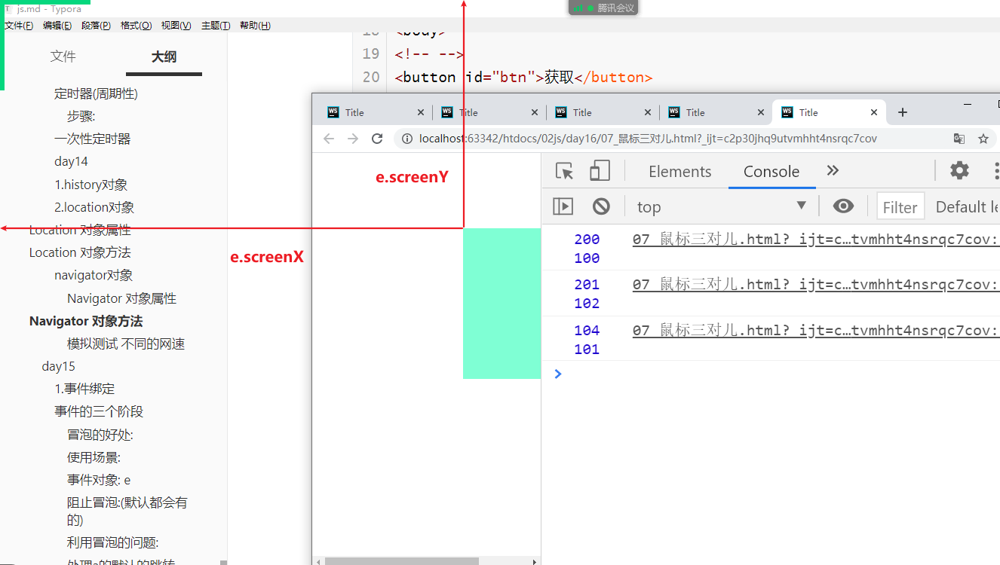

##### 2、e.clientX,e.clientY  

：距离文档窗口左上角的距离

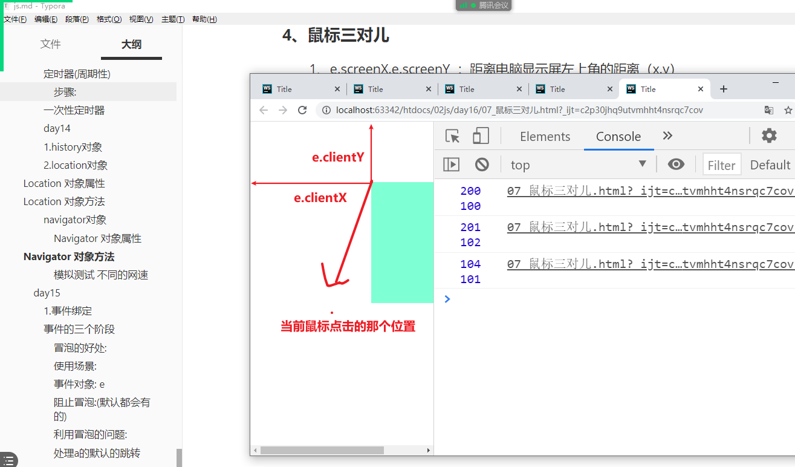

3、e.offsetX,e.offsetY 

​	：距离当前点击的元素的左上角的距离

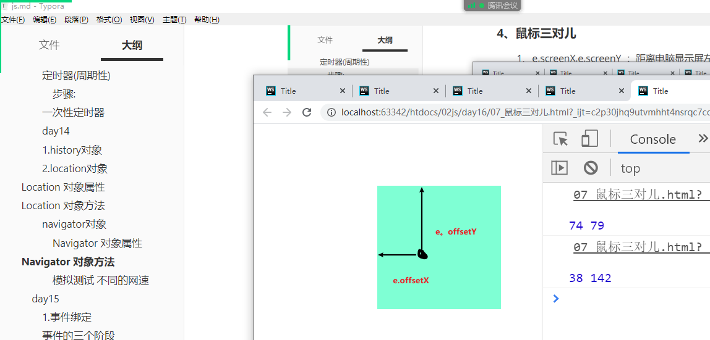

```js
 <style>
        /* */
        *{
            margin:0;
            padding: 0;
        }
        #d1{
            width: 200px;
            height: 200px;
            background-color: aquamarine;
            margin:100px 200px;
            cursor: pointer;
        }
    </style>
</head>
<body>
<!-- -->
<div id="d1"></div>
<script>
    //
    var d1=document.getElementById("d1");
    d1.onclick=function (e) {
        // 鼠标相关的信息 挂载在事件对象 e 中
        //       距离电脑显示屏左上角的距离（x,y）
       // console.log(e.screenX,e.screenY);
       //   距离文档窗口左上角的距离
       //  console.log(e.clientX,e.clientY)

        //距离当前点击的元素的左上角的距离
        console.log(e.offsetX,e.offsetY);
    }
</script>
```

事件:

​	onclick	:单击

​	onmousemove: 鼠标移动

​	onmouseout ：鼠标移出

​	onmousedown：鼠标按下

​	onmouseup ：鼠标弹起

​	鼠标移入/移出

​	onmouseenter/leave   vs   onmouseover/out

```
// 同一级别下 先执行 over/out 再执行enter/leave
    //鼠标移入
    /*   在有父子级的关系时  onmouseenter 包含了子元素(进入子元素没有任何区别)
    *                       onmouseover 会先出当前的父元素在执行一次over进入事件
    *     使用场景:  如果希望子元素也是父元素的一部分 鼠标移入没有任何影响就用 enter
    *               如果子元素和父元素分开   就用over
```

```js
<style>
        /* */
        *{
            padding: 0;margin: 0;
        }
        #d1{
            width: 200px;
            height: 200px;
            border: 10px solid #ccc;
            background-color: aquamarine;

            position: absolute;
            cursor: pointer;
        }
        #d2{
            width: 100px;
            height: 100px;
            border: 10px solid #ccc;
            background-color: #a043a1;

            position: absolute;
            cursor: pointer;
        }
    </style>
</head>
<body>
<!-- -->
<div id="d1">
    <div id="d2"></div>
</div>
<script>
    // 鼠标移入
   /* d1.onmouseenter=function () {
        console.log("我进来了")
    }
    //鼠标移出
    d1.onmouseleave=function(){
        console.log("我出去了")
    }*/

    // 同一级别下 先执行 over/out 再执行enter/leave
    //鼠标移入
    /*   在有父子级的关系时  onmouseenter 包含了子元素(进入子元素没有任何区别)
    *                       onmouseover 会先出当前的父元素在执行一次over进入事件
    *     使用场景:  如果希望子元素也是父元素的一部分 鼠标移入没有任何影响就用 enter
    *               如果子元素和父元素分开   就用over
    * */
    d1.onmouseover=function () {
        console.log("我也进来了");
    }
    //鼠标移出
    d1.onmouseout=function(){
        console.log("我也出去了")
    }
</script>
```

### JS执行机制

#### JS是单线程

JavaScript语言的一大特点就是　**单线程**，也就是说，　**同一时间只能做一件事**。这是因为JavaScript这门脚本语言诞生使命所致——Javascript是为处理页面中用户的交互，以及操作DOM而诞生的。比如我们对某个DOM元素进行添加和删除操作，不能同时进行。应该进行添加，之后再删除。


单线程就意味着，所有的任务需要排队，前一个任务结束，才会执行后一个任务。这样所导致的问题是：如果JS执行时间过长，这样就会造成页面的渲染不连贯，导致页面渲染加载阻塞的感觉。


以下代码执行结果是什么？

```javascript
console.log(1);
setTimeout(function(){
    console.log(3);
},1000)
console.log(2);
```

#### 同步和异步

为了解决这个问题，利用多核CPU的计算功能，HTML5提出Web Worker标准，允许JavaSCript脚本创建多个线程。于是，JS中出现了同步和异步。

##### 同步

程序的执行顺序与任务的排列顺序是一致的。

##### 异步

同时执行多个任务

##### 同步任务

同步任务都在主线程上执行，形成一个**执行栈**。

##### 异步任务

JS的异步是通过回调函数实现的。

一般而言，异步任务有一下三种类型

1. 普通事件，如click、resize等
2. 资源加载事件，如load、error等
3. 定时器，包括setInterval、setTimeout等
4. 异步任务相关 **回调函数** 添加到 **任务队列** 中（任务队列也称为消息队列）

##### JS执行机制

1. 先执行 **执行栈中的同步任务。**
2. 异步任务（回调函数）放入任务队列中。
3. 一旦执行栈中的所有同步任务执行完毕，系统就会按次序读取 **任务队列** 中的异步任务，于是被读取的异步任务结束等待状态，进入执行栈，开始执行


由于主线程不断的重复获得任务、执行任务、再获取任务、再执行，所以这种机制被称为 **事件循环(event loop)**

##### 构造函数

1. 因为我们一次创建一个对象，里面很多的属性和方法是大量相同的 我们只能复制
2. 因此我们可以利用函数的方法 重复这些相同的代码 我们就把这个函数称为 构造函数
3. 又因为这个函数不一样，这里封装的不是普通代码，而是对象
4. 构造函数 就是我们对象里面一些相同的属性和方法抽象出来封装到函数里面

### 移动端的网页特效

#### 1. 触屏事件

##### 1.1 触屏事件概述

​	移动端浏览器兼容性较好，我们不需要考虑X前JS的兼容性问题，可以放心的使用原生JS书写效果，但是移动端也有自己独特的地方。比如触屏事件touch (也称触摸事件) ，Android和IOS都有。

​	touch对象代表一个触摸点。触摸点可能是一根手指，也可能是一根触摸笔。触屏事件可响应用户手指（或触控笔）对屏幕或者触控板操作。

常见的触屏事件如下：

| **触屏touch事件** | **说明**                      |
| ----------------- | ----------------------------- |
| touchstart        | 手指触摸到一个DOM元素时触发   |
| touchmove         | 手指在一个DOM元素上滑动时触发 |
| touchend          | 手指在一个DOM元素上移开时触发 |

##### 1.2 触摸事件对象(TouchEvent)

TouchEvent是一类描述手指在触摸平面(触摸屏、触摸板等）的状态变化的事件。这类事件用于描述一个或多个触点，使开发者可以检测触点的移动，触点的增加和减少，等等

touchstart、touchmove、touchend三个事件都会各自有事件对象。

触摸事件对象重点我们看三个常见对象列表:

| **触摸列表**   | **说明**                                         |
| -------------- | ------------------------------------------------ |
| touches        | 正在触摸屏幕的所有手指的一个列表                 |
| targetTouches  | 正在触摸当前DOM元素的手指的一个列表              |
| changedTouches | 手指状态发生了改变的列表，从无到有，从有到无变化 |


