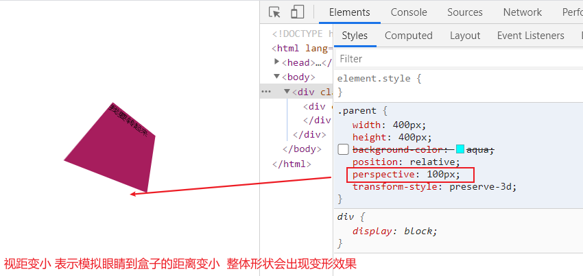

### CSS3

#### 	动画

##### 	过渡效果

​		简写：transition:  all  2s  linear 

​		默认属性的变化都是一瞬间，为了让人眼识别，额外让元素的变化慢慢的呈现出来。

​	transition: 

​		transition-property:过渡的属性  可以给具体值  可以给all 表示所有的过渡属性变化 ;

​		transition-duration: 2s;  过渡的时长

​		transition-timing-function: linear;  过渡的执行过程函数    还有其他值

​		transition-delay: 1s;   	延迟执行的时间  一般不给

​		

```html
 <style>
        /* */
        body{
            padding: 100px;
        }
        div{
            width: 200px;
            height: 200px;
            background-color: aqua;

            /* 过渡的属性  可以给具体值  可以给all 表示所有的过渡属性变化*/
            /*transition-property: all;*/
            /* 过渡的时长*/
            /*transition-duration: 2s;*/
            /*过渡的执行过程函数  自己试试*/
            /*transition-timing-function: linear;*/
            /* 延迟执行的时间  一般不给*/
            /*transition-delay: 1s;*/
            /*简写*/
            transition: all 2s linear ;
        }
        div:hover{
            border-radius: 50%;
            background-color: #a71d5d;
            transform: translateX(500px);
        }
    </style>
</head>
<body>
<!-- -->
<div></div>
```


##### 	动画

​		让元素按照指定的方式时间一直执行

步骤1  首先需要定义一个动画（菜谱）

​		animation:all 3s linear  infinite

```html
/*步骤1 定义一个动画 让程序按照指定的步骤去执行*/
@keyframes xu  {
    /*定义步骤*/
    /*初始的时候的状态*/
    0%{
        background-color: aquamarine;
    }
    /*中间可以再细分*/
    50%{
        background-color: #a71d5d;
        transform: translateX(400px) rotate(7200deg) scale(0.5);

    }
    100%{
        background-color: #000;
        transform: translateX(0px) rotate(-7200deg) scale(2);
    }

}
```

步骤2  去执行定义的动画

通过 animation属性执行

​	animation-name: xu;        执行的动画的名称

​	animation-duration: 5s;    执行时间

​	animation-timing-function: linear;   执行的函数

​	animation-delay: 2s;		执行延迟

​	animation-iteration-count: infinite;  执行的次数 可以给具体的次数 可以给无限次

​	animation-direction: reverse;  

​	 播放的顺序  reverse 从100%开始执行 alternate-reverse 反复执行

可以简写:

​	animation:  xu 5s linear 2s infinite alternate-reverse;

```html
/*完整案例*/
<style>
        /* */
        div{
            width: 200px;
            height: 200px;
            border-radius: 50%;
            border:1px solid #ccc;
            text-align: center;
            line-height: 200px;
            font-size: 30px;
            cursor: pointer;

            /*transition: all linear 5s;*/

            /*步骤2 */
            /*执行的动画的名称*/
            /*animation-name: xu;*/
            /*执行时间*/
            /*animation-duration: 5s;*/
            /*执行的函数*/
            /*animation-timing-function: linear;*/
            /*执行延迟*/
            /*animation-delay: 2s;*/
            /*执行的次数 可以给具体的次数 可以给无限次*/
            /*animation-iteration-count: infinite;*/

            /*播放的顺序  reverse 从100%开始执行 alternate-reverse 反复执行 */
            /*animation-direction: reverse;*/

            /*简写*/
            animation:  xu 5s linear 2s infinite alternate-reverse;
        }
        /*步骤1 定义一个动画 让程序按照指定的步骤去执行*/
        @keyframes xu  {
            /*定义步骤*/
            /*初始的时候的状态*/
            0%{
                background-color: aquamarine;
            }
            /*中间可以再细分*/
            50%{
                background-color: #a71d5d;
                transform: translateX(400px) rotate(7200deg) scale(0.5);

            }
            100%{
                background-color: #000;
                transform: translateX(0px) rotate(-7200deg) scale(2);
            }

        }
    </style>
</head>
<body>
<!-- -->

<div>转</div>
```

简写

如果一动画只有 开始和结束2个过程

```html
 /*如果只要2个过程 from-to实现*/
        @keyframes xu {
            from{
                transform: rotate(0deg);
            }
            to{
                transform: rotate(360deg);
            }
        }
```

暂停动画

animation-play-state: paused;

#### css转换

作用: 用来处理元素的 大小 角度 位置等操作

​        分类: 2D/3D

​	属性:

​	transform: 不同的函数对应的功能不一样

##### 1、translate(x,y)  :  

​		平移    x为水平方向  y为垂直方向  正值移动方向为右下

​	      translateX();      单独的水平方向的移动

​	      translateY();       单独的垂直方向的移动

​		（还有个z轴）

​        特点:   移动不会影响别人(不在一个平面)，并且原有的位置是 保留的。

​	套路:  优化 水平垂直的 写法  通过位移实现 避免计算

```html
 <style>
        .parent{
            width: 400px;
            height: 400px;
            background-color: aqua;
            position: relative;
        }
        .son{
            /*width: 100px;
            height: 100px;*/
            padding: 50px;
            background-color: #a71d5d;
            position: absolute;
            top:50%;
            left: 50%;
            /* 需要准确的知道 当前盒子的宽高*/
            /*margin-left: -50px;
            margin-top: -50px;*/
            /*改进: 通过 位移 解决 计算问题*/
            transform: translate(-50%,-50%);
        }
    </style>
</head>
<body>
  <div class="parent">
      <div class="son"></div>
  </div>
```

##### 2、scale(x,y)    

​		缩放     x为宽度   y为高度

​		scaleX()     只修改宽

​		scaleY()     只修改高

​	套路:

```html
<style>
       .d1{
            /* scale修改的是宽高  行内元素默认不能修改*/
            /* 应用: 比如  缩小 字体 默认浏览器pc端的字体最小是12px*/
            transform: scale(0.5);
        }
    </style>
</head>
<body>
<span>R</span>
<div class="d1">R</div>
```

##### 3、rotate(ndeg)   

​       旋转  n指的是角度    可以给负值   默认是顺时针旋转

```html
<style>
        div{
        /* 右边 */
            width: 100px;
            height: 100px;
            border-right:10px solid #a71d5d;
            border-top:10px solid #a71d5d;
            margin:100px;
            transform: rotate(45deg);
        }
    </style>
</head>
<body>
 <div>

 </div>
```

##### 4.skew(ndeg,mdeg)

​	 倾斜    n  m 表示2个角度

```html
transform: skew(0deg,90deg);
```

注意:    同时写多个  直接空格写  但是又先后顺序之分。

```html
/*测试 同时变化多个值  右移同时放大、旋转、倾斜*/
/* 可以同时操作 但是 有先后顺序*/
transform:skew(20deg,20deg) rotate(200deg) scale(2) translateX(200px)  ;
```

##### 5、 修改轴心

```
/*可以给具体的值，也可以给关键词 left,top..*/
transform-origin: 200px 0;
```

##### 6、分析XYZ 轴

如下案例得出结论

​	    x轴:从左到右的水平轴

​	    y轴:从上往下的垂直轴	

​	    z轴: 从电脑桌面到人眼的距离轴


```html
<style>
        .parent{
            width: 400px;
            height: 400px;
            background-color: aqua;
            position: relative;
        }
        .son{
            width: 100px;
            height: 100px;
            background-color: #a71d5d;
            position: absolute;
            top:50%;
            left: 50%;
            /* 需要准确的知道 当前盒子的宽高*/
            margin-left: -50px;
            margin-top: -50px;
            /*改进: 通过 位移 解决 计算问题*/
            /*transform: translate(-50%,-50%);*/
             transition: all linear 3s;
        }
        .son:hover{
            /*x轴测试: 烤全羊 爆米花  从左到右的水平轴*/
            /*transform: rotateX(360deg);*/
            /*旋转木马、旋转门    从上往下的垂直轴*/
            /*transform: rotateY(360deg);*/
            /* 从电脑到人眼之间的距离 是z轴  摩天轮 风车  */
            transform: rotateZ(360deg);

        }
    </style>
</head>
<body>
  <div class="parent">
      <div class="son">我要转起来</div>
  </div>
```

#### 3D效果

​	1、需要添加一个视距：用来模拟人眼到盒子之间的距离

```html
	perspective: 1000px;
```

​	2、对应3d效果需要给父元素添加一个属性

```html
transform-style: preserve-3d;
```

​	3、测试3d效果

```html
<style>
        /*以旋转为例 测试 3D效果*/
        .parent{
            width: 400px;
            height: 400px;
            /*background-color: aqua;*/
            position: relative;

            /*添加视距  一般给的都是父元素或者是body 通过手动的调节视距 去模拟测试对应的效果 */
            perspective: 1000px;

            /*添加声明 子元素具备了3D效果  必须要加上
                如果不加把上面的bgc 打开 发现不一样的地方
            */
            transform-style: preserve-3d;
        }
        .son{
            width: 100px;
            height: 100px;
            background-color: #a71d5d;
            position: absolute;
            top:50%;
            left: 50%;
            /* 需要准确的知道 当前盒子的宽高*/
            margin-left: -50px;
            margin-top: -50px;
             transition: all linear 0.3s;

            /*  分别对应 x y  z轴   旋转的角度
                如果是0 则表示当前对应的轴不参与旋转
            */
            /*transform: rotate3d(1,1,1,45deg);*/
        /*  测试 修改第三个值 z轴 通过 手动他调节 加大值 结果是越来越大*/
            transform: translate3d(10px,10px,10px);

        }
        .son:hover{

        }
    </style>
</head>
<body>
  <div class="parent">
      <div class="son">我要转起来</div>
  </div>
```



#### Grid布局

##### 概述：

###### 网格布局（Grid）是最强大的 CSS 布局方案。

它将网页划分成一个个网格，可以任意组合不同的网格，做出各种各样的布局。以前，只能通过复杂的 CSS 框架达到的效果，现在浏览器内置了。

##### Grid布局vsflex布局

​	Flex 布局是轴线布局，只能指定"项目"针对轴线的位置，可以看作是**一维布局**。Grid 布局则是将容器划分成"行"和"列"，产生单元格，然后指定"项目所在"的单元格，可以看作是**二维布局**。Grid 布局远比 Flex 布局强大。

##### 基本概念

1、容器和项目

采用网格布局的区域，称为"容器"（container）。容器内部采用网格定位的子元素，称为"项目"（item）。

2、行row 和列column

容器里面的水平区域称为"行"（row），垂直区域称为"列"（column）。

3、单元格

行和列的交叉区域，称为"单元格"（cell）。

正常情况下，`n`行和`m`列会产生`n x m`个单元格。比如，3行3列会产生9个单元格。

4、表格线

划分网格的线，称为"网格线"（grid line）。水平网格线划分出行，垂直网格线划分出列。

正常情况下，`n`行有`n + 1`根水平网格线，`m`列有`m + 1`根垂直网格线，比如三行就有四根水平网格线。


容器属性

display：grid  指定一个容器采用网格布局

```
注意，设为网格布局以后，容器子元素（项目）的float、display: inline-block、display: table-cell、vertical-align和column-*等设置都将失效。
```

##### grid-template-columns 属性， grid-template-rows 属性

：100px 100px 100px    **repeat(3,100px)**

##### fr关键字

为了方便表示比例关系，网格布局提供了`fr`关键字（fraction 的缩写，意为"片段"）。如果两列的宽度分别为`1fr`和`2fr`，就表示后者是前者的两倍。

```html
.container {
  display: grid;
  grid-template-columns: 1fr 1fr;
}
```

**布局实例**

`grid-template-columns`属性对于网页布局非常有用。两栏式布局只需要一行代码。

```html
.wrapper {
  display: grid;
  grid-template-columns: 70% 30%;
}
```

##### grid-row-gap 属性， grid-column-gap 属性， grid-gap 属性

行间距

`grid-row-gap`属性设置行与行的间隔（行间距），`grid-column-gap`属性设置列与列的间隔（列间距）。

```html

.container {
  grid-row-gap: 20px;
  grid-column-gap: 20px;
}
```

#####  grid-template-areas（设置区域）

网格布局允许指定"区域"（area），一个区域由单个或多个单元格组成。`grid-template-areas`属性用于定义区域。

```html
.container {
  display: grid;
  grid-template-columns: 100px 100px 100px;
  grid-template-rows: 100px 100px 100px;
  grid-template-areas: 'a b c'
                       'd e f'
                       'g h i';
}
```

下面是一个布局实例。

```html
grid-template-areas: "header header header"
                     "main main sidebar"
                     "footer footer footer";
```

##### grid-auto-flow 属性

划分网格以后，容器的子元素会按照顺序，自动放置在每一个网格。默认的放置顺序是"先行后列"，即先填满第一行，再开始放入第二行，即下图数字的顺序。


这个顺序由`grid-auto-flow`属性决定，默认值是`row`，即"先行后列"。也可以将它设成`column`，变成"先列后行"。

[上面代码](https://jsbin.com/xutokec/edit?css,output)设置了`column`以后，放置顺序就变成了下图。


`grid-auto-flow`属性除了设置成`row`和`column`，还可以设成`row dense`和`column dense`。这两个值主要用于，某些项目指定位置以后，剩下的项目怎么自动放置。

[下面的例子](https://jsbin.com/wapejok/edit?css,output)让1号项目和2号项目各占据两个单元格，然后在默认的`grid-auto-flow: row`情况下，会产生下面这样的布局。


上图中，1号项目后面的位置是空的，这是因为3号项目默认跟着2号项目，所以会排在2号项目后面。

现在修改设置，设为`row dense`，表示"先行后列"，并且尽可能紧密填满，尽量不出现空格。

##### justify-items 属性， align-items 属性， place-items 属性

`justify-items`属性设置单元格内容的水平位置（左中右），`align-items`属性设置单元格内容的垂直位置（上中下）。

```
.container {
  justify-items: start | end | center | stretch;
  align-items: start | end | center | stretch;
}
```

- start：对齐单元格的起始边缘。

- end：对齐单元格的结束边缘。

- center：单元格内部居中。

- stretch：拉伸，占满单元格的整个宽度（默认值）。

  

##### justify-content 属性， align-content 属性， place-content 属性

`justify-content`属性是整个内容区域在容器里面的水平位置（左中右），`align-content`属性是整个内容区域的垂直位置（上中下）。

```html
.container {
  justify-content: start | end | center | stretch | space-around | space-between | space-evenly;
  align-content: start | end | center | stretch | space-around | space-between | space-evenly;  
}
```

这两个属性的写法完全相同，都可以取下面这些值。（下面的图都以`justify-content`属性为例，`align-content`属性的图完全一样，只是将水平方向改成垂直方向。）

> - start - 对齐容器的起始边框。

