### day01

### 1.浏览器		

​					 内核

​    chrome  		     blink内核(基于webkit)

​     ie		                 trident 

​    firefox			  Gecko 	

​    opera 			  没有独立 研发了  跟随chrome脚步了

​    safari                             webkit

因为不同的浏览器内核解析出来的内容是不一样的。 写一份代码在不同的浏览器中显示的结果是不一样的。 

​	兼容性处理(老的ie6,7,8..)

### 2.web定义

   w3c万维网组织      公益组织 

####    网页的划分

​     1、结构        理解为房子的毛坯            html搭建

​     2、表现        装修的漂亮的东西            css样式实现

​     3、行为        动起来，跳起来                  js实现 

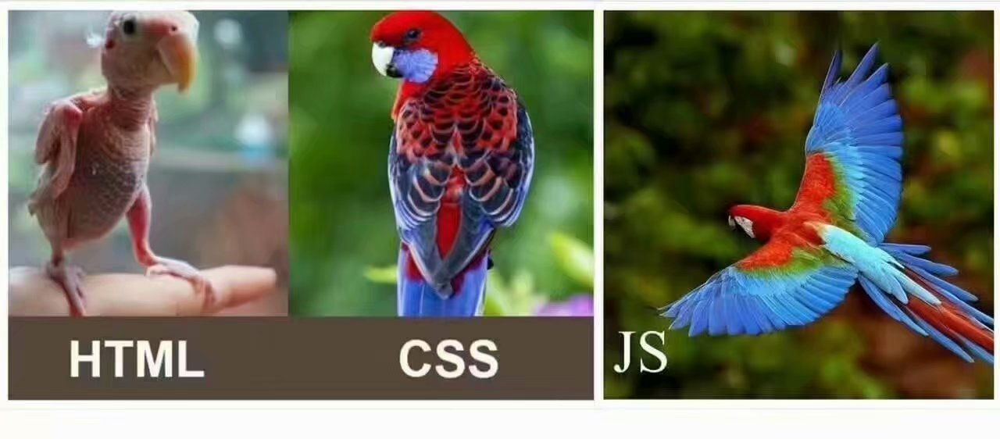

### 3.HTML(Hyper text markup language)

#####   1、全称:

​    超文本标记语言   不是一门编程语言是一个标记语言

#####   2、基本结构（h5版本）

```html
<!DOCTYPE html>    当前的文档类型是html
<html lang="en">   包裹所有的代码
<head>				网页的头部
    <meta charset="UTF-8">   定义网页的编码格式    目的支持中文
    <title>Title</title>   定义标题
</head>
<body>				网页的主体
	  网页的html代码基本都在这里编写
</body>
</html>
```

#####   3、语法

```
 <xxx>   单标签  
 <xxx></xxx>  双标签              结束符 /
 <xxx> 内容随意定义的 </xxx>    
 
 元素= 标签+内容
```

##### 4、常见的基本的标签（重要）  

```
h1-h6               标题  又大又粗         独占一行的
p					段落标签   包裹文本的   独占一行 上下有间距
div                 没有特点最重要的特点     独占一行的 （网页搭建最常见）

i                   斜体       共享一行  
u					下划线     共享一行	
s					删除线     共享一行 
b					加粗       共享一行
span				没有特点    共享一行
sup                 上标    ex:数学表达式 5的平方
sub					下标
hr					 分隔线
br					换行
```

浏览器默认解析的情况

```
1.开发工具中 空格或者是换行 在浏览器默认解析过程中 永远会解析为一个空格
解决:
  1.标签 pre                 按照工具编辑的状态去执行 多个空格和换行
  2.通过转义字符转换
```

##### 5、转义字符

​	默认浏览器会直接解析出来 需要换一种格式

```
<  &lt;   
>  &gt;
©     &copy;
空格   &nbsp;
```

​         

工具webstrom

```
1.   快捷生成标签    标签名+tab键
2.   自动换行
```


```html
<body>
  锄禾日当午 锄禾日当午 锄禾日当午 锄禾日当午 锄禾日当午 锄禾日当午 锄禾日当午 锄禾日当午 锄禾日当午
  <h1>锄禾日当午</h1>
   <h2>锄禾日当午</h2>
   <h6>锄禾日当午</h6>
   <p>床前 明月 光?</p>
   <p>床前 明月 光?</p>
   <p>床前 明月 光?</p>
   <p>床前 明月 光?</p>

<div>离离原上草</div>
<div>离离原上草</div>
<div>离离原上草</div>
<div>离离原上草</div>
<div>离离原上草</div>

<i>我是斜体</i>
<u>我是下划线</u>
<s>我是删除线</s>
<b>我是加粗的</b>
<div>锄禾 <b>日</b>  当午</div>

明明很喜欢

             我

<pre>
    明明很喜欢

             我
</pre>
数学表达式  5 <sup>2</sup> = 25
水的化学方程式 H <sub>2</sub> O
  <hr>
  &lt;hr&gt;标签是一条分隔线
   空   &nbsp;&nbsp;&nbsp;&nbsp;&nbsp;&nbsp;&nbsp;&nbsp;&nbsp;&nbsp;
  &nbsp;&nbsp;&nbsp;&nbsp;&nbsp;&nbsp;&nbsp;&nbsp;&nbsp;&nbsp;
     &copy;
  格
</body>
```

##### 6、文档类型声明标签

​	1.<!DOCTYPE> 文档类型声明，作用就是告诉浏览器使用那种HTML版本来显示网页

```html
<!DOCTYPE html>
```

**这句代码的意思是：当前页面采取的是HTML5版本来显示网页**

**注意：**

1. <!DOCTYPE声明位于文档中的最前面的位置，处于<html标签之前

2. <!DOCTYPE>不是一个HTML标签，他就是文档类型声明标签

   2.lang语言种类

   - ​	en定义语言为英语
   - zh-CH定义语言为中文

   简单来说，定义为en就是英文网页，定义为zh-CN就是中文网页

   起始对于文档显示来说，定义成en的文档也可以显示中文，定位成zh-CN的文档也可以显示英文，这个属性对浏览器和搜索引擎(百度、谷歌等)还是有作用的

   3.字符集

   字符集是多个字符的集合，以便计算机能够识别和存储各种文字。

   在  **head**  标签内，可以通过 **meta** 标签的  **charset**  属性 来规定HTML文档应该使用那种字符编码

   ```html
   <meta charset="UTF-8">
   ```

   **charset**  常用的值有：**GB2312(简体中文)**、**BIG5(繁体中文)**、**GBK**(包括简中和繁中)和**UTF-8**，其中**UTF-8** 也被称为 **万国码**  ，基本包含了全世界所有国家是需要用到的字符

### day02

####    1、分类（） 

​       区别:   是否独占一行、水平排列居中，默认设置宽高，上下的外边距

​        1、块级元素  (独占一行): div p h1-h6    header footer....   table       li

​        2、行内元素（共享一行）:  i  u  s  b   span  a

​                 img是特殊的行内元素自带宽高属性

​        3、后面补充

#### 2、图像

  语法:

```

```

  属性:   对当前标签的修饰 

```
1.src  :   引入图像的地址
2.alt  :   图像没有引入成功 显示提示文本
3.width :   宽
4.height:   高
```

 注意:   如果只设置 宽高中一个值 呈现**等比缩放**。 不要放大图像 会失帧。

​	    html属性值 是可以不加单位的  默认是px

#### 路径问题（重要）

​    适合 所有的资源的引入问题 不仅仅在图像中

```html
<h1>img学习</h1>

<!--绝对路径: 直接从 硬盘的最高级目录开始的 完整目录  一旦电脑换了 图像是出不来的
    不用 绝对路径
-->


<!--1. 相对路径  1 如果图像和网页在一个文件夹中  直接引入名称即可-->


<!--2.  如果图像在子文件夹中       先进入到子文件夹 再引入图像名称-->

<!--3.  如果图像在上一级文件夹中 先返回 ../  再引入-->

```

#### 3、超链接

​    语法: 

```
<a></a>
```

   属性

```
1. href:  引入网页的地址
2.target:  设置跳转页面的方式
               _self 默认  在当前标签页跳转
               _blank  在新的标签页跳转
3.name    : 定义锚点名称               
```

 

```
ctrl+ /  快捷键  注释的快捷键 
注释: 就是写给程序员自己看的代码或者是文本
```

功能:

   1、实现跳转    地址需要全称 http://

   2、返回页面顶部    加#号

   3、下载功能     文件必须是压缩文件.zip   .rar ..

   4、 可以执行js代码  

```html
 <h1>学习 a超链接</h1>
 <!--
     href:  完整的页面的路径
     target:  _self 默认  在当前标签页跳转
              _blank
 -->
 <!--功能1  实现跳转-->
 <a href="http://www.4399.com" target="_blank">你懂的</a>

 <!--功能3： 下载-->
 <a href="img.zip">下载图像</a>
<!--功能4  实现js代码-->
 <a href="javascript:alert('杠杠的')">老徐颜值如何</a>
<!--假设网页很大-->
 <div style="height: 2000px;"></div>

 <!--功能2  : 返回页面顶部-->
 <a href="#">返回页面顶部</a>
```

5.实现锚点

​    步骤1:   定义一个锚点(做标记)

```
方式1:   a的name属性一个值  值就是标记
方式2:   任意标签的id属性的值   做标记 
```

​    步骤2:  触发，实现跳转

​	 在href属性值  #跟标记的值

```html
<!--步骤2: 实现跳转-->
<a href="#red">红色</a>
<a href="#green">绿色</a>
<a href="#blue">蓝色</a>
<a href="#pink">粉色</a>
<a href="#black">黑色</a>
<!--在 其他页面去添加锚点触发-->
<a href="05锚点2.html#af">女朋友</a>

<div  style="height: 600px"></div>
<!--步骤1. 定义锚点  也就是 做标记-->
<!-- 1. name属性值作为标记-->
<a href="" name="red">大红色</a>
<!-- id属性值 作为标记-->
<div id="green" style="background:green; height: 600px"></div>
<div id="blue" style="background:blue; height: 600px"></div>
<div id="pink" style="background:pink; height: 600px"></div>
<div id="black" style="background:black; height: 600px"></div>

<div  style="height: 600px"></div>
```

#### 4、标签的共有的属性

 1. id       理解为 人的身份证号码， 在Html中 是唯一的   js中使用的多

 2. class  类选择器的使用  它的值通常叫类名

 3. title   鼠标悬停的提示文本

 4. style  在html中 修改样式(装修)的属性

    注意    style="属性1:值1;属性2:值2;..." 

```html
<!DOCTYPE html>
<html lang="en">
<head>
    <meta charset="UTF-8">
    <title>Title</title>
    <style>
        /* 测试 类选择器使用 */
        .nan{
            color:yellow;
            font-size: 60px;
            font-weight: bold;
        }
    </style>
</head>
<body>
 <h1>测试标签的公共的属性</h1>
 <!--测试 title 和style-->
  <div title="悯农" style="color:red;background: blue;">锄禾日当午</div>

<!--测试 class-->
  <div class="nan">汗滴禾下土</div>
  <div class="nan">滴滴皆辛苦</div>

<!--测试 id-->
  <span id="box" title="胡床" class="nan" style="border:10px solid #ccc;">床前明月光中的 床指的是什么?</span>
 <script>
     //   显示div中的文本
     alert(box.innerHTML);//自动去html结构中寻找id值是box的元素
 </script>
</body>
</html>
```

#### 5、表格(了解)

          1. 默认情况下 垂直方向是居中显示。

   2、语法

​     table   表格  最外围包裹

​      tr       行

​      td      列

属性

  1.table的属性

​	border :边框
​	width ：宽度
​	height: 高度
​	align:     left center right  水平排列
​	cellspacing :边框和边框之间的距离=》   外边距
​	cellpadding ： 边框和内容之间的距离    内边距
​	bgcolor     :  背景颜色

2.tr  行的属性

​	bgcolor: 上有

​        align:

​        height

​        valign:    垂直方向的排列   top  **middle**  bottom  (上中下)	

3.td 单元格的属性

​     width

​     height

​    bgcolor

​    align     

​    valign  同上

注意:  同一行 或者列中 ，去修改宽和高 则整行/列都会变

```html
<h1>大表格</h1>
<!-- 默认 表格没有边框
     border :边框
     width ：宽度
     height: 高度
     align:  left center right  水平排列
     cellspacing :边框和边框之间的距离=》   外边距
     cellpadding ： 边框和内容之间的距离    内边距
     bgcolor     :  背景颜色
-->
<table border="1" width="900" height="400"  align="center" cellspacing="0" cellpadding="0" bgcolor="#faebd7">
    <!--
        valign ：垂直方向的排列   top  middle  bottom  (上中下)
    -->
    <tr align="center" bgcolor="#7fffd4" valign="top"  height="100">
        <!--
        -->
        <td valign="bottom" bgcolor="aqua" width="400" height="120">编号</td>
        <td>姓名</td>
        <td>密码</td>
    </tr>
    <tr>
        <td>11</td>
        <td>隔壁张</td>
        <td>123456</td>
    </tr>
    <tr>
        <td>12</td>
        <td>隔壁王</td>
        <td>666666</td>
    </tr>
    <tr>
        <td>13</td>
        <td>死胖子</td>
        <td>888888</td>
    </tr>
</table>
```

通过给td添加

   rowspan    跨行合并   行和行之间的合并

   colspan     跨列合并   列和列之间的合并

​	注意: 合并了n个格子 需要删除n-1个格子

```html
<!--
    注意: 合并了n个格子 需要删除n-1个格子
-->
<table width="600" height="400" border="1" cellspacing="0" align="center"

>
    <tr>
        <td>1</td>
        <td>2</td>
        <td>3</td>
        <td>4</td>
    </tr>
    <tr>
        <!--行和行 之间的合并-->
        <td rowspan="2">5</td>
        <td colspan="3">6</td>
       <!-- <td>7</td>
        <td>8</td>-->
    </tr>
    <tr>
        <!--<td>a</td>-->
        <td>b</td>
        <td>c</td>
        <td>d</td>
    </tr>
    <tr>
        <td>e</td>
        <td>f</td>
        <!--列和列合并  -->
        <td colspan="2">g</td>
        <!--<td>h</td>-->
    </tr>
</table>
```

#### 6.引入小图标

```html
<!DOCTYPE html>
<html lang="en">
<head>
    <meta charset="UTF-8">
    <title>酷狗音乐,就是哥多</title>
    <!--小图标的应用 -->
   <!-- <link rel="icon" href="img/kg.ico">-->
    <link href="img/tb.png" rel="icon" >
    <!--跳转到指定的页面  -->
 .
    <meta http-equiv="refresh" content="5,http://www.taobao.com">
</head>
<body>
<!--看上面的代码-->
<h1>即将跳转到淘宝页面</h1>
</body>
</html>
```

#### 7、列表

  页面样式布局中 会用到  用来替代div

 1.有序列表

​      ol>li

  2.无序列表

​	**ul>li**

   记住:  一般不使用有序列表   无序列表一般也不要type

```html
<!--有序 仅做了解-->
<ol type="a">
    <li>孙子</li>
    <li>老子</li>
    <li>孔子</li>
    <li>庄子</li>
    <li>墨子</li>
    <li>儿子</li>
</ol>
<!--2.无序列表
   type 默认是 desc
        circle  空心
        .....
        none    不需要图标显示
 -->
<ul type="">
    <li>孙子</li>
    <li>老子</li>
    <li>孔子</li>
    <li>庄子</li>
    <li>
        墨子
        <!--嵌套-->
         <ul>
             <li>非攻</li>
             <li>兼爱</li>
         </ul>
    </li>
</ul>
```

#### 8、语义化标签

​	h5新概念    为了增强代码的可读性

```html
<!--
        提高代码的可读性
        功能上和div没有区别
-->
 <header>头部的内容</header>
 <nav>导航标签</nav>
  <aside>侧边</aside>
 <section>主体内容</section>
<footer>尾部</footer>
```

#### 9.iframe标签

​      引入其他页面的模块  

​       目的: 代码重用

```
<!--
   默认是 300*150的大小
-->
<iframe style="background-color:antiquewhite;" src="13_头部.html" frameborder="0" width="100%" height="60px"></iframe>
```

### day03

### 表单(重点)

​    用户和产品的服务器之间沟通的一种方式。

#### 语法

  1.form   最外围包裹子元素的的一个整体，打包给服务器

```
属性
  1.action    表单提交给那个服务器地址 如果不写 默认提交给当前页面   
  2.method    提交的方式 方式不同 功能不一样
  			get 提交  从服务器索要数据 
            	特点1 参数的数据大小有限制 Kb级别
            	特点2 参数在url地址栏明文提交   不是很安全  
            post提交	向服务器发送数据
                特点1 参数没有限制大小
                特点2: 不会再url地址栏显示任何的东西  更安全
```

#### 2.子元素

##### 1、input   输入框之类

​	属性:     

​		type    :    不同的值  功能是不一样的

​		name :     作为服务器端识别的 唯一的标志   必须加

 		value :     输入框的值

​		placeholder :   提示文本属性

​                maxlength  :  最大长度

​                disabled :   禁用    不能修改内容 也不能提交给服务器

​                readonly:   只读     不能修改 内容   但是可以提交给服务器

##### 不同的type值

​      1.text       : 普通的文本框

​      2.password      密码框      密文显示输入内容

​      3.radio       单选框

​     4 checkbox   多选框     

​		checked   默认选中的属性

​     5.submit     提交

​     6 reset     重置

​     7 button    普通按钮  没有功能   js实现自定义功能

​     8 hidden  :隐藏框

​     9 file           文件选择框  上传资料

##### label的使用(重要)

   作用:  点击文本如同点击对应绑定的 输入框

```
方式1:    通过for属性 对应匹配 对应的输入框的id值
方式2:    直接用label包裹  需要去掉for属性

```

注意:

默认情况下 url地址栏是不支持中文的 一般继续编码处理  方法如下

```
decodeURI("%E8%A1%A8%E5%8D%95")  解密解码
encodeURI("表单")                 加密编码  
```

##### 下拉选项框

```html
<select name="" id="">
        <option value="" selected="selected">请选择</option>
            <option value="">beijing</option>
            <option value="">shanghai</option>
            <option value="">guangzhou</option>
            <option value="">shenzheng</option>
            <option value="">hangzhou</option>
    </select>
```

文本域

```html
<textarea name="tArea" id="" cols="30" rows="10">

</textarea>
```

### css(Cascading Style Sheets层叠样式表)

developer.mozilla.org

####   作用: 

​	解决html写样式的弊端(代码的**可重用性**和**可维护性差**)

​	从而实现了 内容和样式的分离

####   语法

​     1.完全支持html写法

​     2.写在head中

```
<style>
        
        选择器{
            属性:值;
            多个.......
        }
    </style>
```

   3.新建.css文件 然后通过 link去引入

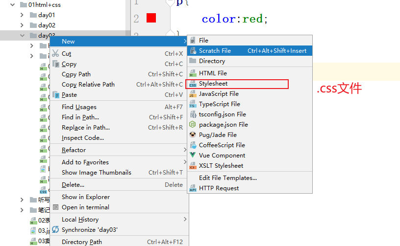

```css
引入在head中
<link rel="stylesheet" href="out.css">
```

注意:  如果代码没有问题 但是效果没出来 有可能是路径没整对。

#### 特征

#####   1.优先级问题

​	!important    最高级别

​	内联样式	高

​        内部样式/外部样式      中等

​		注意: 遵循就近原则  谁离元素近 就听谁的

​         继承过来的样式      低

##### 2.继承性

​	子元素没有的属性  大部分可以通过父元素实现继承

##### 3.层叠性

​	一个元素是 可以设置多个属性的。彼此之间没有冲突的

```
注释:    /* 注释的内容  */
```

#### 选择器

  去页面中查找元素的。

```
语法:
选择器{
    属性:值;
    .....
}
```


##### 选择器之 元素，id class 通配符

```css
	 /*  p:  元素/标签 选择器  匹配页面中所有的p元素  找多个*/
        p{
            color:red;   /*字体变红*/
        }
        /* *: 通配符  查询页面中所有的元素 慎用    找多个*/
        *{
            font-size: 20px;   /*修改字体的大小*/
        }
        /* id选择器:  语法： #id值   匹配指定id值的元素    唯一*/
        #ye{  /*去页面中找到id叫做ye的元素  进行下面的属性修饰*/
            background:yellow; /*背景颜色*/
        }
        /*类选择器:  语法：.类名    匹配的是页面中所有类名对应的元素    多个*/
        .bgc{  /*去页面中找到类名为bgc的所有的元素 进行修饰*/
            background-color: red;
        }
```

##### 特殊

```
1./* 页面中找 所有的 div中的类名为bgc的元素 */
        div.bgc{
            border:5px solid  aqua;  /*设置5px的边框*/
        }
2.<!-- 多类选择器  一个元素可以划分为多类  
    表示  同时去显示bgc 和abc两个类的样式
-->
<span class="bgc abc">低头思故乡</span>        
```

#### 选择器的优先级问题

​     权重  值越大 则优先级越高 

​	        !important                  1000

​	        #id                               100

​		.类（伪类）             10

​		元素选择器    	 1    

​	       通配符     		  0

​		继承过来的样式       空  没有权重

#####     选择器之  群组，后代，子代

```css
/*群组选择器*/
   #ye,.bgc,p{
       color:red;
   }

   /*后代选择器  找当前元素下 所有的后代: 儿子 孙子 曾孙...*/
   .feng p{
       background-color: yellow;
   }
   /*子代选择器  找当前元素下的 下一层级的元素*/
   .feng>p{
       font-size: 32px;
   }
```

##### 伪类选择器

​    鼠标交互

```css
   <style>
        /*没有点击之前的状态*/
        a:link{
                color:green;
        }
        /*鼠标悬停时的样式*/
        a:hover{
            color:yellow;
        }
        /*点击的那一刻 没有放鼠标时的状态*/
        a:active{
            color:red;
        }
        /*已经访问过的页面 的显示 状态*/
        a:visited{
            color:blue;
        }
        /*获取焦点*/
        input:focus{
            border: 5px solid red;
            outline: none;  /*轮廓  边框最外围的东西*/
            
        }
    </style>
</head>
<body>
<a href="http://www.7k7k.com">度娘</a>
<input type="text">
</body>
```

工具:  同时写多行代码

  按住alt不放  点击多行  就可以同时操作


#### 边框（必须掌握）

  语法:

​       border:   size  style color;

​	size:  边框的大小 

​	style:  样式     solid 实线  dashed长点虚线 ....

​	color: 颜色

可以拆分写法如下

```
 <style>
        div{
            width: 200px;
            height: 200px;
            /*       大小  实线   颜色*/
            border: 5px solid #0B0B0B;

            /*整体拆分写法   上边框*/
           /* border-top:10px solid red;
            !*右边框*!
            border-right:20px solid blue;
            !*下边框*!
            border-bottom:30px solid aqua;
            border-left:5px solid #aab0c2;*/

            /*设置右边框宽度为20 其他不变*/
            border-right-width: 20px;

            /*下边框的 样式*/
            border-bottom-style: dashed;
  
            /*左边框的 颜色*/
            border-left-color:red;
        }
    </style>
</head>
<body>
 <div>设置边框</div>
```

##### 边框的本质

​    实现三角形: 不加宽高 只给边框的宽度 给一个边框的颜色  具体如下

```css
/*边框的本质   实现三角形的方式*/
h1{
    width: 0px;height: 0px;
    /*                      透明色 */
    border:200px solid  transparent;

    /* 任意方向的 三角形*/
    border-bottom-color:yellow;
   /* border-top-color:red;
    border-left-color: black;
    border-right-color: aqua;*/
}
```

##### 角度的实现

​	border-radius: 具体的值 或者是百分比

​				50%;是圆的写法

```css
 <style>
        .box{
            width: 90px;
            height: 30px;
            /* 1个像素的边框*/
            border:1px solid #aaa;
            /*css3的属性*/
            border-radius:15px ;
        }
        /* 鼠标移入 修改 边框的颜色*/
        .box:hover{
            border-color: black;
        }
        .box2{
            width: 200px;height: 200px;
            border:1px solid #aaa;
            /*   50%  就是圆的写法 */
            border-radius:50% ;
        }
        .box2:hover{
            width: 400px;
            height: 400px;
        }
    </style>
</head>
<body>
 <div class="box"></div>
  <!--实现 圆-->
<div class="box2"></div>
```

 不同角度的拆分写法

```css
 /*拆分写法 比如 百度的搜索框*/
        .box3{
            width: 200px;height:30px;
            border:1px solid #aaa;
            /* 先上下 再左右*/
            /*修改左上角*/
           border-top-left-radius: 20px;
            border-bottom-left-radius: 20px;
        }
```

##### 轮廓: 元素最外围的内容

​    outline:  和边框同样的属性

​		   size  style color;

   尤其是在按钮中 去掉轮廓的

**补充：**

文本域禁止拖拽

resize:none;

```html
  .box {
            background: antiquewhite;
            border:none;
            /*           宽度  实线  颜色*/
            /*outline: 5px solid red;*/
            /*常见写法  不要轮廓*/
            outline: none;
        }
        input{
            outline: none;
            border: none;
        }
    </style>
</head>
<body>
<input class="box" type="submit" value="注册"> <br>
<input type="" value="">
```

##### 单行溢出文字显示省略号

white-space:nowrap;  强制一行显示

overflow:hidden; 溢出部分隐藏

text-overflow:ellipsis; 文字溢出使用省略号显示

##### 多行文本溢出显示省略号

overflow:hidden; 溢出部分隐藏

text-overflow:ellipsis; 文字溢出使用省略号显示

display:-webkit-box;

-webkit-line-clamp:行数； 限制在一个元素显示的文本的行数

-webkit-box-orient: vertical;

##### 溢出处理

  	属性；  overflow:   

​			   auto;如果没有溢出就不会显示 滚动条 溢出了 自动出来

​			   hidden;   溢出隐藏

​			   scroll  ;  不管有没有溢出 都有滚动条

​	css3  水平溢出和垂直溢出 可以分开写

​        overflow-x:hidden;  /*水平溢出的处理*/
​        overflow-y: auto;   /*垂直溢出的处理*/		

  应用:

​	 1、解决浮动问题，	

​	 2、溢出处理问题

```html
 <style>
        div{
            width: 100px;
            height: 100px;
            border:1px solid #ccc;
            /*overflow:溢出处理 */
            /*overflow: hidden;  !*隐藏*!*/

            /*如果没有溢出就不会显示 滚动条 溢出了 自动出来*/
            /*overflow: auto;*/
            /*不管有没有溢出 都有滚动条*/
                /*overflow: scroll;*/
            /*css3  水平溢出和垂直溢出 可以分开写*/

            overflow-x:hidden;  /*水平溢出的处理*/
            overflow-y: auto;   /*垂直溢出的处理*/

        }
    </style>
</head>
<body>
  <!-- lorem +tab键-->
 <div>Lorem ipsum dolor sit amet, consectetur adipisicing elit. Asperiores enim laboriosam maiores nesciunt non totam voluptas. Cupiditate dolor nostrum quasi sequi totam. Aspernatur mollitia necessitatibus numquam officia quam sed tenetur?</div>

 
</body>
```

### day04

#### 1、边框阴影（css3 ）

   box-shadow:  水平位移    垂直位移  模糊的延伸  模糊的大小(可选)      颜色    内阴影(可选)

   位移默认是 右下为正  左上为负

```css
    input   {
            width: 200px;
            height: 60px;
            border-radius: 10px;
            background-color: aqua;
            border:none;
            outline: none;
        }
        input:hover{
            color:#ffffff;
            /*          水平位移 垂直位移  延伸大小  阴影大小 颜色   内阴影 */
            /*box-shadow:     0px     0px      10px    10px  red     inset;*/
            /*常见写法*/
            box-shadow: 0 0 10px red;
        }
        div{
            background-color: #AA2A0A;
        }
        /*  结论: 阴影不占据页面空间*/
    </style>
</head>
<body>
<input type="button"  value="登录">
<div>测试阴影是否占据页面空间</div>
```


##### 工具调节

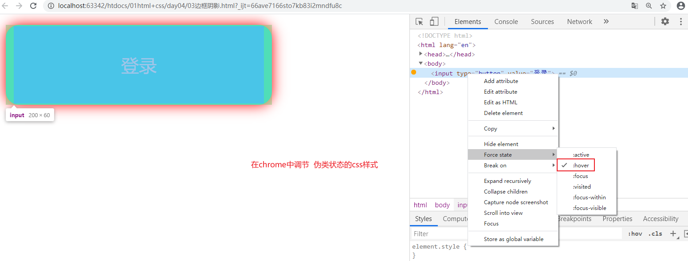

#### margin:外边距

 定义:边框和边框之间的距离

 作用: 将元素隔开 一般用在页面布局中的 位置的微调

  语法:

​	margin: 一个值;     四个方向都给

​			2个值;     一个是上下   一个是左右

​		        3个值 ;   上     左右    下   对应的边距

​		       4个值 ;     上   右     下  左  按照顺时针的顺序进行匹配

   拆分写:

​     ex:   设置上边框的距离     margin-top: npx;  

```css
 <style>
        div{
            width: 200px;
            height: 200px;
            border:1px solid #AA2A0A;
            /*简写*/
            /* 4条变的边框距离 都是50px*/
            /*margin:50px;*/
            /*     上下    左右的   外边距*/
            /*margin:50px  80px;*/

            /*      上     左右    下   对应的边距*/
            /*margin:50px  80px  100px;*/

            /*上   右     下  左  按照顺时针的顺序进行匹配*/
            /*margin:50px  80px  100px 120px;*/

            margin-top: 100px;  /*上边距*/
            margin-left:100px;  /*左边距*/
        }
    </style>
</head>
<body>
 <div>
     我
 </div>
```

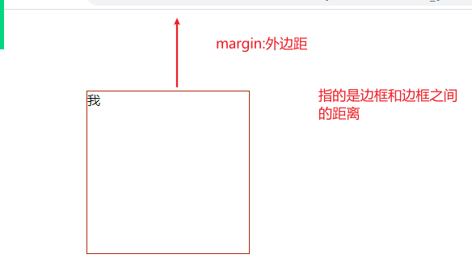

特点:

​	1.上下外边距合并，取 的是  两者之间的最大值   如果是左右的外边距还是累加

​	2、外边距默认情况是 会占据页面的空间的

​	3、如果**父元素没有边框**，则如果给子元素添加上下外边距，会作用到父元素身上。

​		解决:

​			1.给父元素添加边框 		弊端:  父元素会变大。

​			2.用内边距代替外边距             ？

​			3.给父元素添加  overflow:auto;    弊端: 需要对overflow做处理的时候就不适合了

​			4.给添加一个空的table元素在第一个子元素下

​			5.待续。。。(通过**内容生成**实现)

套路:

​	设置了元素的宽高之后，希望水平居中可以这么写

​		margin: auto;/ margin:0 auto;     

#### 内边距

   定义: 内容和边框之间的距离

   作用: 撑起元素的高度	

   语法:

​	 padding:   一个值;     四个方向都给

​			2个值;     一个是上下   一个是左右

​		        3个值 ;   上     左右    下   对应的边距

​		       4个值 ;     上   右     下  左  按照顺时针的顺序进行匹配	

```css
 <style>
        div{
            width: 200px;
            border:1px solid #ccc;
            /*height: 40px;*/
            /*内边距 写法和外边距是一样的*/

            /* 4个方向都变大*/
            /*padding: 20px;*/

            /*         上下   左右 */
            /*padding: 20px 30px;*/

            /*         上    左右   下*/
            /*padding: 20px 30px 40px;*/

            /*按照    上   右    下   左*/
            padding: 20px 30px 40px 50px;

            /*支持拆分写*/
            padding-left: 200px;
        }
    </style>
</head>
<body>
<div>
    我要变高
</div>
```

#### 盒模型(重点)

​    一个元素在页面中所占的空间的大小

​     默认计算方式 

​           总宽度= width(内容)+左右的边框+左右的外边距+左右的内边距、

​		外边距算盒子的地盘但是，不算真正的宽

box-sizing:设置盒模型的计算的方式

​	1、默认:    content-box 		

​		盒子本身宽度=width+border+padding

​                   任意一个值发生变化 都会影响整体的盒子的大小

​	2.border-box 

​		 盒子的宽度就是实际的宽度：不会因为边框和内边距发生变化

​		宽度=(包括整个width+border+padding)

注意:  今后但凡设置边框和内边距怕影响别的元素时  都设置计算方式为border-box

```css
<style>
        div.d1{
            width: 300px;
            height: 300px;
            border:10px solid #aaa;
            padding: 20px;
            margin: 30px;
        }
        div.d2{
            width: 300px;
            height: 300px;
            border:10px solid #aaa;
            padding: 20px;
            margin: 30px;
            /*设置 盒子大小的计算方式*/
            box-sizing: border-box;
        }
        div.d3{
            width: 200px;
            height: 200px;
            background-color: aqua;
            padding: 20px;
            /*设置 盒子大小的计算方式   宽高就是设置的宽高 不会因为边框和内边距发生变化*/
            box-sizing: border-box;
        }
        div.d3:hover{
            border:10px solid #aaa;
        }
    </style>
</head>
<body>
<div class="d1">
    我有多大1
</div>
<div class="d2"> 我有多大2</div>

<div class="d3">测试好处</div>
```

### day05

#### 尺寸

1、px    像素    不管在哪个页面中值都是一样的   定值、

2、%   针对 移动端、响应式页面 不确定屏幕的宽度

3、不确定的尺寸

​      （子元素没有高度时 则默认是最小高度，如果子元素高度变高了，则父元素高度也会变高）

​	min-width  最小宽度

​	max-width  最大宽度	

​	min-height 最小高度

​	max-height 最大高度

4、 相对单位中 

​	em:  参考的是 父元素的字体的大小  1em=1倍的父元素的字体大小

​	rem:参考的是Html根元素的字体大小   1rem=1倍的html给的字体的大小

#### 字体                                                                                                                                                                                                                                                                                                                                                                                                     

 	一些常见的字体的样式属性

​         有简写 但是有顺序之分

```html
 <style>
        div{
            /* 设置字体的大小 可以给关键字或者具体的数值*/
            font-size: 20px;
            /*字体的类型*/
            font-family: "楷体";
            /* 字体的粗细*/
            font-weight: bold;
            /*字体倾斜*/
            font-style: italic;
            /* 如果有英文 可以全部实现大写*/
            font-variant: all-petite-caps;
        }
    </style>
</head>
<body>
 <div>
     今天下午不上课，改看电影 hello world
 </div>
```

##### 引入服务器端的自定义的字体

@font-face{

​	 src:url(xxxx); 指向的是服务器端的地址

}	         

```css
  <style>
        /* 引入服务器字体 */
        @font-face {
            /* 1.引入地址*/
            src:url("方正品尚黑简体.TTF");
            /*2. 取个名字*/
            font-family: fz;
        }
        div{
            font-family: "fz";
            font-size: 20px;
        }
    </style>
</head>
<body>
  <div>no zuo no die  no can no bibi</div>
```

##### 引入阿里矢量图标

1.官网

```
https://www.iconfont.cn/
```

2.选择添加购物车

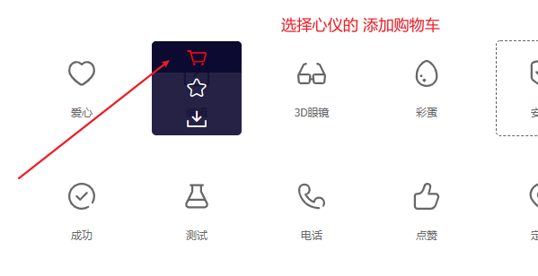

3.点击下载

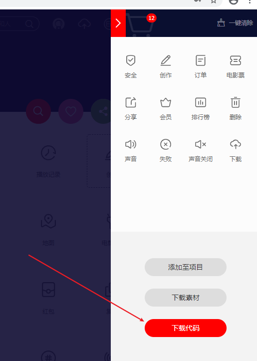

4.引入.css文件

```
<link rel="stylesheet" href="alifont/iconfont.css">
```

5.引入类名

```css
    <!--  需要先引入 .css文件-->
    <link rel="stylesheet" href="alifont/iconfont.css">
</head>
<body>
<!-- 语法 :  1需要有基础类

     iconfont  : 引入font-family  相当于引入了对应的字体文件
     icon-xxx  :对应的具体的 图标的名字
     -->
 <div class="iconfont  icon-dingdan"></div>
<div class="iconfont icon-anquan"></div>
```

##### 颜色

1. 单词: yellow  red...     不会写的

2. #xxxxxx   6位16进制的数字 （0-9abcdef） 

    #xxx       ex: #112233   =>简化为  #123

3、rgb(red,green,blue); 每个取值范围是0-255 

​		三原色 对应的值

​	ex: rgb(0,0,0);

4、rgba(red,green,blue,a) 

​      a: 透明色; 取值范围是0-1   0表示完全透明

```html
 <style>
        p{
            /*写法1*/
            color:#6c6c6c;
            /*写法2*/
            /*background: rgb(222,222,222);*/
            /* 写法3a: 0-1取值的透明度*/
            background: rgba(222,222,222,0.3);
        }
        p:hover{
            color: rgba(222,222,222,0.3);
        }
    </style>
</head>
<body>
 <p>Lorem ipsum dolor sit amet, consectetur adipisicing elit. Animi, autem culpa dolorum ea enim eveniet ex iste iusto magnam neque quaerat quasi quisquam repudiandae, suscipit tempora temporibus voluptates? Autem, vero?</p>
```

##### 背景（重要）

​    1    背景颜色     background-color :  #cccccc;

​    2、背景图片     background-image:  url("xxx");	

​    3、 设置背景平铺(默认)

​	 background-repeat:

​		 no-repeat: 不平铺；     用的最多

​		repeat-x :  水平平铺;

​		repeat-y :   垂直平铺;

​    4、设置定位

​	background-position:    x   y;

​	     x , y分别表示 水平和垂直方向  

​	    写法1  : 可以直接写具体值

​	    写法2 :  可以直接给关键词   left  center  right ...

​    **5.background-size :  x  y;（css3新增属性 不能够 简写的）**

​		x: 宽度  y :高度    都可以给具体值或者%

​	       写法2:  关键词  比如 cover 覆盖

```css
 <style>
        div{
            width: 300px;
            height: 300px;
            border: 1px solid #ccc;
            /*背景颜色e*/
            /*background-color: #AA2A0A;*/
            /*背景图  默认会平铺满所有的空间*/
            background-image: url("img/vim.png");
            /*设置是否平铺     不平铺    */
            background-repeat:no-repeat ;
            /*位置的摆放    写法: 可以给关键词 ex: left,center right
            也可以直接给    具体的值*/
            background-position: center 50px ;

            /*设置背景图的大小:  1.直接给具体值  2.常见的关键词ex: cover 覆盖*/
            background-size: 50px 100px;
        }
    </style>
</head>
<body>
 <div></div>
```

#####    注意:

​		background 可以简写！！！

```
  /* 有简写 且没有顺序之分: */
            background: url("img/vim.png") 15px center no-repeat  ;
            /*需要额外写 不能简写 */
            background-size: 15px;
```

6、背景定位

   background-attachment:  fixed;  

​		固定住背景图片的位置，这样就不会随着页面的滚动而滚动了

```html
 <style>
        div{
            height: 500px;
            width: 100%;
        }
        .bg{
            background: no-repeat ;
            /* 背景定位: 不会随着网页的内容的滚动二滚动 直接定死在指定位置的*/
            background-attachment: fixed;
        }
        .bg1{
            background-image:url("img/01.jpg") ;
        }
        .bg2{
            background-image:url("img/02.jpg") ;
        }
        .bg3{
            background-image:url("img/03.jpg") ;
        }
    </style>
</head>
<body>
<div><h1>模块11111111111</h1></div>
<div class="bg bg1"></div>
<div><h1>模块22222222222</h1></div>
<div class="bg bg2"></div>
<div><h1>模块33333333333</h1></div>
<div class="bg bg3"></div>
<div><h1>模块44444444444</h1></div>
```

### day06

####    1.线性渐变

​	 按照一个方向去发生颜色的变化

​     语法:	

​	background-image:linear-gradient(角度,颜色1 停止位置1,颜色2 停止位置2,....);

​	角度: angle  取值是  0-360度  或者是  to+方向

​	颜色: color

​	停止位置:stop  对应颜色停止的渐变

ex: 表示的是 0-200px是纯红  200-400是红黄 渐变,400-500黄绿渐变 500之后是蓝色

```css
background-image: linear-gradient(to right,red 200px,yellow 400px,blue 500px );
```

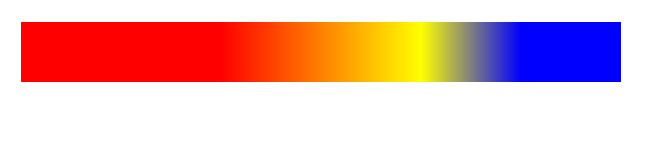

#### 2.径向渐变

​	background-image: radial-gradient(半径 at x y,color stop,color1 stop1,..);

​	   半径: 渐变圆的半径

​	    x y : 圆心的坐标  x y 

​	    color: 渐变的颜色

​	     stop:  停止的渐变距离  	

```css
 background-image: radial-gradient(100px at center center,red 0px ,yellow 30px , blue 60px ,black 100px);
```

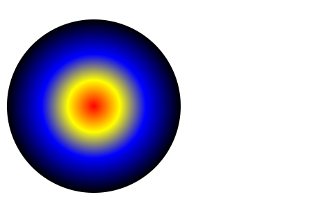

#### 文本

​       文本颜色 :        color

​	**水平排列         text-align :  right  left  center ;**

​	文本的修饰     text-decoration:none;  去掉下划线

​	文本阴影         text-shadow: 水平偏移   垂直偏移  颜色 ,支持多个

​		ex:  text-shadow:1px 1px red, 2px 2px yellow;

​        强制一行显示:      white-space:nowrap;

​	多出一行以...显示 text-overflow:ellipsis;

​	首字母大写            text-transform:capitalize；

​        字母的间隔            letter-spacing: 5px;
​        单词的间隔  不支持中文      word-spacing: 5px;

​	**行高:  line-height: 值如果和当前元素的高度一致 则文本是居中的**

```html
 <style>
        div{
            /*颜色*/
            /*color: #1318cc;*/
            /*水平排列属性  right  left  center*/
            text-align: center;
            /*文本的修饰 下划线  一般是去掉 none;*/
            /*text-decoration: underline;*/
            /*文本阴影   水平偏移 垂直偏移 颜色  支持多个*/
            text-shadow:1px 1px red, 2px 2px yellow;
        }
        p.box{
            border:1px solid #ccc;
            width: 158px;
            /*1.强制不换行  (默认自动换行)*/
            white-space: nowrap;
            /*2.溢出隐藏*/
            overflow: hidden;
            /*3.多出的内容以...形式*/
            text-overflow: ellipsis;
        }
        h3{
            /*首字母能大写*/
            text-transform: capitalize;
            /*首行缩进*/
            text-indent: 30px;
            /* 字母的间隔*/
           /*letter-spacing: 5px;*/
            /*单词的间隔  不支持中文*/
            word-spacing: 5px;
        }
        h4{
            /* 文本从右往左实现*/
        direction: rtl;
        }
    </style>
</head>
<body>
 <div>Lorem ipsum dolor sit amet, consectetur </div>
  <p class="box"><a href="">震惊这个男人半夜居然</a></p>
<h3>lorem ipsum dolor sit amet,测试中文间隔 consectetur adipisicing elit. Accusantium cumque distinctio doloribus placeat praesentium quae quo voluptate? Accusamus assumenda at consequuntur eaque exercitationem, laboriosam magnam molestiae possimus quia veritatis vero.</h3>
<h4>隔壁老徐的隔壁不是隔壁老王</h4>
 <a href="">阿达阿达是</a>
```

####  总结

​    默认情况  布局结构

​	从上往下，从左到右，块级元素默认是独占一行，行内元素共享一行

​	块级元素:  div h1-h6 p   ul  li   table hr ..  header footer....

​		可以 独占一行   设置宽高   上下的外边距

​	行内元素:   i u  s  b   span  a   img(特殊的行内元素) 

​		  共享一行  不能设置宽高   上下的外边距是无效的

​         行内块元素:    input    button  select 

​		  即共享一行又可以设置宽高 

​         table:  table元素

​	实际需求中， 往往需要一些元素 可以自定义宽高 又共享一行去实现页面布局。

​       解决

#### 1、浮动定位

​	特点:

​		1、脱离原有的平面，飘在空中，不再占据页面原有的空间

​		2、原有平面的位置空出来之后，下面一行自动的上移

​		3、宽高自动变为自适应		

​		4、浮动最终会停靠在 要么是左边 要么是右边  没有中间

​		5、浮动只能在当前一行浮动，不会跑到别的行去

​      语法:

​	float:  

​		left; 左浮动

​		right;右浮动

​		none;不浮动

```html
<style>
        /*
          1、脱离原有的平面，飘在空中，不再占据页面原有的空间
​		  2、原有平面的位置空出来之后，下面一行自动的上移
​		  3、宽高自动变为自适应		
​		  4、浮动最终会停靠在 要么是左边 要么是右边  没有中间
​		  5、浮动只能在当前一行浮动，不会跑到别的行去
        
        */
        div{
            width: 100px; height: 100px;
        }
        .d1{
            background-color: #a71d5d;
            /*左浮动*/
            float: left;
        }
        .d2{
            background-color: #a7bbfc;
            /*右浮动*/
            float: right;
        }
    </style>
</head>
<body>
<!--文本是不会被压住的 -->
<div class="d1"></div>
<div class="d2"></div>
```

##### 问题:

​	浮动可以解决 2个div一行显示，但是浮动也会对下一行造成影响

##### 解决:

​	清除浮动(谁不想被影响，那就给谁加)

​        clear:  left/right/both;  

​			both 不管是左浮动还是右浮动，统统清除掉。

##### **清除浮动的4种方法**

1. 添加新标签法(隔墙法)

   在浮动的最后一个元素后面添加一个块级元素

   缺点:改变页面的结构

   ```css
   <div style="clear="both"  "></div>
   ```

2. 给父元素添加overflow属性

3. after伪元素清除浮动(隔墙法的升级版)

   给父元素添加属性

   ```css
   .clearfix:after{
    content:"";
    display:block;
    height:0;
    clear:both;
    visibility:hidden;
   }
   .clearfix{ /* IE6、7专有 */
       *zoom:1;
   }
   ```

4. 双伪元素

   ```css
   .clear:before,.clear:after{
       content:"";
       display:table;
   }
   .clear:after{
       clear:both;
   }
   .clearfix{
       *zoom:1;
   }
   ```

   

##### 补充:  

​	1.浮动的元素 如果一行显示不下 自动换行

​	2 如果文本是不会被浮动压住

块级元素浮动特点:

​	宽不再100% 而是自适应

对行内元素浮动特点:

​	 可以修改宽高并且可以设置上下外边距了

```css
<style>
        /*
          1.一行显示不下  自动换行
        */
        div{
            width: 300px; height: 100px;
            float: left;
        }
        .d1{
            background-color: antiquewhite;
        }
        .d2{
            background-color: aqua;
    
        }
        .d3{
            background-color: #a71d5d;
         
        }
        .d4{
            background-color:#aab2c8;
          
        }
        .d5{
            background-color: #00ff00;
           
        }
        a{
            width: 300px;
            height: 100px;
            background-color: #0077aa;
            margin: 100px 0;
            /*默认无法修改宽高 无法设置上下间距*/
            /*添加浮动*/
            float: left;
        }
    </style>
</head>
<body>
<div class="d1"></div>
<div class="d2"></div>
<div class="d3"></div>
<div class="d4"></div>
<div class="d5"></div>
<!--测试 行内元素 浮动特点-->
<a href="">百度一下</a>
```

##### 浮动对图片的影响

  实现图文混排 去掉代码空格所影响的缝隙	

### day07

#### 浮动针对父子元素的问题

​	原因: 如果父元素没有高度，靠子元素撑起的  子元素浮动 父元素就会坍塌

```html
 <style>
        /*  如果父元素没有高度，靠子元素撑起的  子元素浮动 父元素就会坍塌
           解决:
        */
        div.parent{
            background-color: #AA2A0A;
            border:1px solid #aaa;
            /*1.给你加高度  弊端:必须要知道子元素的高度 还要计算*/
            /*height: 100px;*/
            /*2. 父元素可以跟着一起浮动  弊端 影响别人 宽高自适应*/
            /*float: left;*/
            /*3. 添加overflow:auto/hidden;*/
            /*overflow: auto;*/
            
        }
        div.son{
            height: 100px;
            width: 100px;
            background-color: #a7bbfc;
            
            /*添加浮动*/
            float: left;
        }
    </style>
</head>
<body>
<div class="parent">
    <div class="son"></div>
    <!--4. 添加一个空的子元素 设置clear:both  弊端: 多了一个空的子元素 -->
    <div style="clear:both;"></div>
</div>
```

第五种: 待续  通过**内容生成**实现

#### 显示方式

​    自定义元素的类型

   语法: 

​	 display:   

​		   block ;  块级元素 ；     独占一行可以设置上下外边距和宽高

​		   inline;  行内元素	 共享一行 不能设置宽高和上下外边距

​		   inline-blcok;  行内块   共享一行  可以设置上下外边距

​		   table   ; 表格类型   特点:可以设置上下的垂直居中

​		    none;   空  把当前的元素直接从当前的页面中干掉	

##### 用处

​	1.用来结合 js或者hover动态的显示或者删除元素

​	     display:  none/block;

​	2.实现垂直居中

​      	 1.通过添加一个行高:line-height 能够居中 但是高度是定死的，得确定父元素高度

​		2、如果想要动态的都是垂直居中(父元素的高度未知) 可以通过下面的方式实现 垂直居中

​			1 父元素设置为:  display: table;

​			2 子元素 : display: table-cell;  vertical-align: middle;

​		3、行内元素和行内块元素垂直居中

​			vartical-aling:middle;

```html
<style >
        .parent{
            width: 300px;height: 300px;
            background-color: #a7bbfc;
            /* 原理   表格中的 td是可以设置垂直居中*/
            /*1.设置 div的类型为table*/
            display: table;
            text-align: center;
        }
        .son{
            width: 100px;height: 100px;
            background-color: aqua;
            /*2. 子元素设置 为 table-cell*/
            display: table-cell;
            /*3.添加 垂直属性*/
            vertical-align: middle;
            /*line-height: 300px;*/
        }
        .parent:hover{
            height: 500px;
        }
    </style>
</head>
<body>
  <div class="parent">
      <div class="son">
          <!--可以添加任何的内容-->
          hello
      </div>
  </div>
```

##### 隐藏的方式

​	1、display:none;   完全删除元素 不在页面中了

​	2、visibility: hidden;   隐藏 但是 会占据页面空间

​	3、**opactiy**   :0-1取值   1是完全显示  0是完全透明

```html
<style>
        /* */
        a{
            display: inline-block;
            width: 200px;
            height: 100px;
            background-color: #a7bbfc;
        }
        a:hover{
            /*1.直接干掉  不会占据页面空间*/
            /*display: none;*/
            /*2  隐藏 但是 会占据页面空间*/
            /*visibility: hidden;*/

            /*3  可以隐藏 也可以设置为半透明 0-1*/
            opacity: 0.3;
        }
    </style>
</head>
<body>
<!-- -->
<a href="">我要隐藏</a>
<span href="">测试文本</span>
```

##### 图片的垂直处理

​	 vertical-align: middle;   设置图片和文本的排列方式

​	cursor:pointer;   设置鼠标的表现形式

```html
 <style>
        body{
            cursor: url("img/dbj.png"),auto;
        }
        p img{
            /* 图片 也是可以使用 vertical-align属性的  表格也可以  */
            vertical-align: middle;
        }
        div img{
            opacity: 0.8;
            /*设置鼠标的样式 */
            /*小手*/
            /*cursor:pointer ;*/
            cursor: url("img/dbj.png"),auto;
        }
    </style>
</head>
<body>
<p>
    这是我
    
    嘚瑟的样子
</p>
<div>
    
</div>
```

#### 定位布局	   

#####     1、相对定位

​	   特点:  相对于自己的原有的位置发生的 位置上的变化

​	   语法: position :relative; 

​			值和方向是反的记

​		     left:   左  给正值   元素会右移

​		     right: 右                 左移

​		      top:上			下移

​		       bottom:下			上移

​	    值: 支持负数

​	  注意:  	相对定位 **也会脱离原有的平面** 但是 **还是会保留原有的位置**

​	  用处:  

​			1.自己位置的微调、

​			2  给子元素做参考 用(后面再说)

```html
<style>
        div.box{
            width: 200px;
            height: 200px;
            background-color: aqua;
            /*相对定位*/
            position: relative;
            /*如果left是100 实际位置则是右移了 */
            /*left:100px;*/
            top: 50px;
        }

    </style>
</head>
<body>
<div class="box"></div>
<h1>测试文本</h1>
```

##### 2、绝对定位

​	特点:  

​		1、也会脱离原有的平面  并且不会占据原有空间。

​				(**下一行都人自动上移 和浮动很像  没有属性可以清除**)

​				和浮动有区别  每一个元素定位都是对应一个平面(图层)

​		2、参考问题

​			 参考的是 上一个(父子级)已经实现了定位的元素(不限制什么定位)	

​			 如果都没有  则参考整个body为定点(左上角 00 的位置)

​	语法:

​	   position:absolute;

​		 left:              距离左边的边框的距离

​		 right:            距离右边的边框的距离    

​		 top:	       距离上边的边框的距离	

​		 bottom:	距离下边的边框的距离	

```html
<style>
        /* */
        div{
            width: 200px;
            height: 200px;
        }
        .d1{

            background-color: aqua;

            position: absolute;
            left: 50px;
            top:50px;
        }
        .d2{
            background-color: #aab2c8;
            position: absolute;
            left: 80px;
            top:80px;
        }
        .d3{
            background-color: antiquewhite;

        }
        /* 结果分析:
           1. d3跑最上面=》  d3没有定位 其他都定位了 脱离原有的平面 最底层就是剩下d3
           2. d2压着d3的     每个元素绝对定位 都有独立的平面  不在一个平面
        */
    </style>
</head>
<body>
<!-- -->
<div class="d1">d1</div>
<div class="d2">d2</div>
<div class="d3">d3</div>

```

##### 父子级定位测试

​	套路:  定位的 水平垂直居中显示

```html
 <style>
        div{
            width: 500px;
            height: 500px;
            background-color: aqua;
            margin:50px;
            /*2、 添加定位属性 目的用来 作为参考的*/
            position: relative;
        }
        div img{
            /*1、 如果父元素 没有定位属性  则 直接参考body*/
            /*2  如果父元素添加了定位属性 则参考的是父元素了*/
            position: absolute;


            /*3、套路 水平垂直居中  还需要通过margin 顶回去*/
            left:50%;
            top:50%;
            /* 给的是 图片的宽高的一半 */
            margin-left:-90px ;
            margin-top:-88.5px;

            /*剪切 图片的大小*/
            /*按照正方形切 上 右    下   左
               上下 表示的是 高    1 3
               左右表示的  宽      4 2
            */
            clip: rect(4px 149px 113px 57px);
        }
    </style>
</head>
<body>
 <div>
     
 </div>
```

##### 父子级定位特征

​	1、后来者居上  ： 同一级别的元素 默认情况会压着前面的元素

​	 通过一个属性解决 屏幕层次排列的问题

##### 	z-index

​		 这个属性是一个没有单位的值，值越大 级别越高 越在上面

​         2、无效  子元素永远在父元素身上 无法改变的

##### 绝对定位对行内元素

​	 绝对定位 会改变行内元素 display:block

```
<style>
        a{
             /* 相对定位 对行内元素 无影响*/
            /*position: relative;*/

            /* 绝对定位 会改变display:block  */
            position: absolute;
            /*测试*/
            width: 100px;
            height: 50px;
            background-color: aqua;
        }
    </style>
</head>
<body>
<a href="">hellow</a>
```

##### 套路

​	实现满屏的遮罩层

```html
 <style>
        div{
            /* 满屏的遮罩层  有问题的  */
            position: absolute;
            left:0;
            top:0;
            right:0;
            bottom:0;
            background-color:#000;
            opacity: 0.3;
        }
    </style>
</head>
<body>
 <div>

 </div>
 <!-- a 是无法被点击到的 -->
 <a href="http://www.baidu.com">百度</a>
```

### day08		

####   固定定位

​	特点:

​		也会脱离原有的平面 不占据页面空间，但是他的参考对象是页面的左上角.

​	 	行内元素 也会变为块级元素。

​        语法:

​	position:fixed;

​	  top/bottom/left/right

```html
<style>
        body{
            height: 2000px;
        }
        #top{
            position: fixed;
            right:100px;
            bottom:100px;
        }
    </style>
</head>
<body>
<h1>网页的头部</h1>
<a href="" id="top"></a>
```

##### 满屏遮罩层的优化(

```
<style>
        body{
            height: 2000px;
        }
        div{
            /* 满屏的遮罩层  absolute 只能显示当前屏幕高的 遮罩*/
            /*position: absolute;*/
            position: fixed;
            left:0;
            top:0;
            right:0;
            bottom:0;
            background-color:#000;
            opacity: 0.3;
        }
    </style>
</head>
<body>
<!--  点击遮罩层 则 删除掉当前的遮罩层-->
 <div  onclick="this.style.display='none';">

 </div>
 <!-- a 是无法被点击到的 -->
 <a href="http://www.baidu.com">百度</a>
```

##### 网易云返回顶部效果

```html
<style>
        body{
            height: 2000px;
        }
        #ding{
            position: fixed;
            right:100px;
            bottom:100px;
            /*  旋转     deg角度的意思*/
            transform: rotate(28deg);
            transition: all linear 0.6s;

            /*默认隐藏*/
            display: none;
        }
        #ding:hover{
            /*  旋转     deg角度的意思*/
            transform: rotate(748deg);
        }
    </style>
</head>
<body>
<h1>网页的头部</h1>
<a href="" id="ding"></a>

<script>
    //看不懂每关系 后面都会讲
    window.onload=function () {
        window.onscroll=function () {
            // 获取滚动条的高度
            var top = document.documentElement.scrollTop || document.body.scrollTop;
            console.log(top);
            // 判断高度 大于10就显示 否则就隐藏
            top>10?ding.style.display="block":ding.style.display="none";

             // 点击a实现功能   慢慢的往上走
            ding.onclick=function (e) {
                e.preventDefault();
                //
                var timer=setInterval(function () {
                    // console.log("执行了");
                    top-=10;
                    document.documentElement.scrollTop=top;
                    if(top<=0){
                        clearInterval(timer);
                    }
                },1)
            }

        }
    }
</script>
```

### day09 (css3)

#### 	高级选择器

​	1、兄弟选择器

```html
 <style>
        /*兄弟选择器 + 表示的当前元素的下一个兄弟*/
        .parent .wu+div{
            color:red;
        }
        .parent .wu+div+div{
            color:yellow;
        }
        /*通用兄弟  ~ 找当前元素下的所有的兄弟 */
        .parent .wu~div{
            background-color: aqua;
        }
    </style>
</head>
<body>
<div class="parent">
    <div>老大张飞</div>
    <div class="wu">老二张无极</div>
    <div>老三张三</div>
    <div>老四张三</div>
    <div>老五 隔壁老张</div>
</div>
```

#### 属性选择器

​	和属性有关的 (支持自定义的属性)

​		1、 [class='box1']   全等属性  找一个属性名是class并且值是box1 的所有的元素

​		2、 [data-xu]           属性为data-xu的 所有的元素

​		3、[class**^**='box']     匹配 页面中以  box开头的类名的  所有的元素

​		4、 [class**$**='x1']     匹配 页面中以 x1 结尾的类名的  所有的元素

​		5、[class*****='x']        只要类名中有x字母 就能匹配到

```html
 <style>
        /*属性完全相等 找一个属性名是class并且值是box1 的元素
          要求严格 不能出现空格
        */
       /* [class='box1']{
            color:red;
        }*/
        /*支持 自定义属性*/
        [data-xu='xu']{
            color:red;
        }
        /* 寻找  属性为data-xu的 所有的元素*/
        [data-xu]{
            border:1px solid #ccc;
        }
        /*以xx开头   匹配 页面中以  box开头的类名的  所有的元素*/
        [class^='box']{
            margin:10px;
        }
        /*以xxx结尾  匹配 页面中以 x1 结尾的类名的  所有的元素*/
        [class$='x1']{
            border-radius: 20px;
        }
        /*只要存在一个就可以  只要类名中有x字母 就能匹配到*/
        [class*='x']{
           padding: 20px;
        }
    </style>
</head>
<body>
<div class="parent">
    <!-- 自定义属性-->
    <div data-xu="xu" class="box1" >老大张飞</div>
    <div data-xu="xu"  class="box2">老二张无极</div>
    <div data-xu="xu" class="box3">老三张三</div>
    <div data-xu="=gebi" class="">老五 隔壁老张</div>
</div>
```

#### 伪类选择器

​	:hover :link  :active :visited  :focus

​	:target 触发锚点的时候 对应的元素的样式

```css
  <style>
        [id^='d']{
            border:1px solid #ccc;
            height: 500px;
        }
        /*锚点触发的时候的样式*/
        div:target{
            background-color: aqua;
        }
    </style>
</head>
<body>

<!--跳转-->
<a href="#d1">跳转到模块1</a>
<a href="#d2">跳转到模块2</a>
<a href="#d3">跳转到模块3</a>
<!--1.定义-->
<div id="d1">模块1</div>
<div id="d2">模块2</div>
<div id="d3">模块3</div>
```

#### 结构伪类

​	:first-child   	第一个孩子

​	:last-child  	 最后一个孩子

​	**:nth-child(3)	第3个孩子**

​	:nth-child(2n)       支持数学表达式   常见效果隔行变色

​	:empty   		匹配空元素
​	

p:nth-of-type(1)       	 找的是 当前元素下的 第一个p元素   按照元素的类型找

p:nth-child(1)		      找的是  第一个元素 并且是p  否则匹配不到	

```html
  <style>
        /*结构伪类 1、 第一个孩子*/
        .parent div:first-child{
            color:red;
        }
        /*最后一个孩子*/
        .parent div:last-child{
            color:yellow;
        }
        /*第 n个 孩子   支持数学表达式*/
        .parent div:nth-child(4){
            color:blue;
        }
        .parent div:nth-child(2n){
            background-color: #a71d5d;
        }
        .parent div:nth-child(2n-1){
            background-color: aqua;
        }
        /*找 空的元素*/
        .parent div:empty{
            border:10px solid #000;
        }
    </style>
</head>
<body>
<div class="parent">
    <h1>我是新来的</h1>
    <div>老大张飞</div>
    <div class="wu">老二张无极</div>
    <div>老三张三</div>
    <div>老四张三</div>
    <div>老五 隔壁老张</div>
    <div></div>
</div>
```

#### 其他状态伪类

​	:disabled      匹配元素禁用时

​	:checked	匹配元素被选中时

```html
 <style>
        /*  修改状态伪类  */
        input:disabled{
            background-color: red;
        }
        /* 选中 时的样式 设置*/
        input:checked +label{
            color:red;
        }
    </style>
</head>
<body>
<input type="button" value="注册" disabled>
<input type="checkbox"  id="chk" checked> <label for="chk">同意</label>
```

#### 否定伪类

​	：not(xxx)  表示匹配除了xxx 之外的元素

​	 支持多重否定

```html
 <style>
        /* 否定伪类   :not   理解为  除了 */
        /*     查找ul下  除了第一个li的所有的 li*/
        ul li:not(:first-child){
            color:red;
        }
        /*可以支持 多重否定*/
        /*   除了 第一个和 最后一个li  其他人都添加背景*/
        ul li:not(:first-child):not(:last-child){
            background-color: aqua;
        }

        /* 第一行 第一列*/
        table  tr:not(:first-child)  td:not(:first-child){
            background-color: red;
        }
    </style>
</head>
<body>
 <ul>
     <li>1</li>
     <li>2</li>
     <li>3</li>
     <li>4</li>
     <li>5</li>
     <li>6</li>
 </ul>
<table border="1" width="600px" height="400px">
    <tr>
        <td>编号</td>
        <td>单价</td>
        <td>数量</td>
        <td>小计</td>
    </tr>
    <tr>
        <td>1</td>
        <td>11</td>
        <td>11</td>
        <td>1111</td>
    </tr>
    <tr>
        <td>2</td>
        <td>11</td>
        <td>11</td>
        <td>1111</td>
    </tr>
    <tr>
        <td>3</td>
        <td>11</td>
        <td>11</td>
        <td>1111</td>
    </tr>
    <tr>
        <td>4</td>
        <td>11</td>
        <td>11</td>
        <td>1111</td>
    </tr>
</table>
```

#### 伪元素

```html
 <style>
        /*   用户选取 内容时*/
        p::selection{
            color:#fff;
            background-color: #000;
        }
        /*第一行*/
        p::first-line{
            font-weight: bold;
        }
        /*首字母*/
        p::first-letter{
            font-size: 30px;
        }
    </style>
</head>
<body>
<p>
    Lorem ipsum dolor sit amet, consectetur adipisicing elit. Autem consequuntur corporis culpa cumque dolor ducimus ex inventore maiores nemo neque possimus praesentium qui quia repellendus sapiente ullam, vel, voluptas voluptate.
    Lorem ipsum dolor sit amet, consectetur adipisicing elit. Accusamus doloremque et incidunt nesciunt possimus? Ab eligendi error ipsa, molestiae, non nostrum officiis optio praesentium quas reiciendis repellendus saepe temporibus tenetur.
</p>
```

#### 内容生成(重点)

​	相当于生成了 元素，但是又不会再**html结构**中显示。

​	:before{

​		content:"内容"

​	}

​	：after{

​		content:"内容"

​	

}

```html
<style>
        /* :before 表示在当前元素之前生成的内容*/
        div:nth-child(2n-1):before{
            /*必须有 content 属性*/
            content: "猥琐男";
            color:yellow;
            background-color: green;
        }
        div:nth-child(2n):before{
            content: "小姐姐";
            color:pink;
            background-color: #000;
        }
        /*:after 当前元素 之后 生成的内容*/
        h1:after{
            content: "__隔壁老徐的人生格言";
            margin-top: 50px;
            position: relative;
            top: 50px;
        }
    </style>
</head>
<body>
<div>晚上约吗？</div>
<div>gun</div>
<div>??</div>
<div>听不懂?</div>
<div>啥意思</div>
<h1>踏实一点 不要着急，你想要的 岁月都会给你</h1>
```

##### 功能

​	1、:before  解决因为父元素没有边框 导致的外边距溢出问题

```html
    .parent{
            width: 500px;
            height: 500px;
            background-color: aqua;
            /* 父元素 没有边框造成的*/
            /*overflow: auto;*/
            /*改为用内边距 */
        }
        .son{
            width: 100px;
            height: 100px;
            background-color: #a71d5d;
            /**/
            margin-top: 50px;
        }
        /*通过内容生成 解决外边距溢出问题*/
        .parent:before{
            content: "";
            display: table;
        }
    </style>
</head>
<body>
<div class="parent">
    <!--<table></table>-->
    <div class="son"></div>
</div>
```

​	2、 :after     解决因为父元素没有给高度 因为子元素浮动导致的高度塌陷问题

```html
<style>
        .parent{
            width: 500px;
            background-color: aqua;
            /*添加高度*/
            /*overflow: auto;*/
        }
        .son{
            width: 100px;
            height: 100px;
            background-color: #a71d5d;
            /*子元素浮动*/
            float: left;
        }
        /*通过内容生成  解决 浮动对父元素的高度影响*/
        .parent:after{
            content: "";
            display: block;
            clear: both;
        }
    </style>
</head>
<body>
<div class="parent">
    <div class="son"></div>
    <!--<div style="clear: both"></div>-->
</div>
```

常见页面编程思维:

​	同一个平面中内容 不要用**绝对定位**

​	一般不再同一个平面的内容 才会用绝对/固定定位

##### calc函数

```css
width:calc(100%-30px);  /*比父盒子小30px*/
```


### day11


#### css转换

​	作用: 用来处理元素的 大小 角度 位置等操作

​        分类: 2D/3D

​	属性:

​	transform: 不同的函数对应的功能不一样

##### 	1、translate(x,y)  :  

​		平移    x为水平方向  y为垂直方向  正值移动方向为右下

​	      translateX();      单独的水平方向的移动

​	      translateY();       单独的垂直方向的移动

​		（还有个z轴）

​        特点:   移动不会影响别人(不在一个平面)，并且原有的位置是 保留的。

​	

​	套路:  优化 水平垂直的 写法  通过位移实现 避免计算

```html
 <style>
        .parent{
            width: 400px;
            height: 400px;
            background-color: aqua;
            position: relative;
        }
        .son{
            /*width: 100px;
            height: 100px;*/
            padding: 50px;
            background-color: #a71d5d;
            position: absolute;
            top:50%;
            left: 50%;
            /* 需要准确的知道 当前盒子的宽高*/
            /*margin-left: -50px;
            margin-top: -50px;*/
            /*改进: 通过 位移 解决 计算问题*/
            transform: translate(-50%,-50%);
        }
    </style>
</head>
<body>
  <div class="parent">
      <div class="son"></div>
  </div>
```

##### 	2、scale(x,y)    

​		缩放     x为宽度   y为高度

​		scaleX()     只修改宽

​		scaleY()     只修改高

​	套路:

```html
<style>
       .d1{
            /* scale修改的是宽高  行内元素默认不能修改*/
            /* 应用: 比如  缩小 字体 默认浏览器pc端的字体最小是12px*/
            transform: scale(0.5);
        }
    </style>
</head>
<body>
<span>R</span>
<div class="d1">R</div>
```

#####  	3、rotate(ndeg)   

​       旋转  n指的是角度    可以给负值   默认是顺时针旋转

```
<style>
        div{
        /* 右边 */
            width: 100px;
            height: 100px;
            border-right:10px solid #a71d5d;
            border-top:10px solid #a71d5d;
            margin:100px;
            transform: rotate(45deg);
        }
    </style>
</head>
<body>
 <div>

 </div>
```

#####        4.skew(ndeg,mdeg)

​	 倾斜    n  m 表示2个角度

```
transform: skew(0deg,90deg);
```

   注意:    同时写多个  直接空格写  但是又先后顺序之分。

```
/*测试 同时变化多个值  右移同时放大、旋转、倾斜*/
/* 可以同时操作 但是 有先后顺序*/
transform:skew(20deg,20deg) rotate(200deg) scale(2) translateX(200px)  ;
```

#####  5、 修改轴心

```
/*可以给具体的值，也可以给关键词 left,top..*/
transform-origin: 200px 0;
```

##### 6、分析XYZ 轴

​	如下案例得出结论

​	    x轴:从左到右的水平轴

​	    y轴:从上往下的垂直轴	

​	    z轴: 从电脑桌面到人眼的距离轴

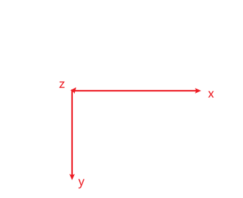

```html
<style>
        .parent{
            width: 400px;
            height: 400px;
            background-color: aqua;
            position: relative;
        }
        .son{
            width: 100px;
            height: 100px;
            background-color: #a71d5d;
            position: absolute;
            top:50%;
            left: 50%;
            /* 需要准确的知道 当前盒子的宽高*/
            margin-left: -50px;
            margin-top: -50px;
            /*改进: 通过 位移 解决 计算问题*/
            /*transform: translate(-50%,-50%);*/
             transition: all linear 3s;
        }
        .son:hover{
            /*x轴测试: 烤全羊 爆米花  从左到右的水平轴*/
            /*transform: rotateX(360deg);*/
            /*旋转木马、旋转门    从上往下的垂直轴*/
            /*transform: rotateY(360deg);*/
            /* 从电脑到人眼之间的距离 是z轴  摩天轮 风车  */
            transform: rotateZ(360deg);

        }
    </style>
</head>
<body>
  <div class="parent">
      <div class="son">我要转起来</div>
  </div>
```

#### 3D效果

​	1、需要添加一个视距：用来模拟人眼到盒子之间的距离

```
	perspective: 1000px;
```

​	2、对应3d效果需要给父元素添加一个属性

```
transform-style: preserve-3d;
```

​	3、测试3d效果

```html
<style>
        /*以旋转为例 测试 3D效果*/
        .parent{
            width: 400px;
            height: 400px;
            /*background-color: aqua;*/
            position: relative;

            /*添加视距  一般给的都是父元素或者是body 通过手动的调节视距 去模拟测试对应的效果 */
            perspective: 1000px;

            /*添加声明 子元素具备了3D效果  必须要加上
                如果不加把上面的bgc 打开 发现不一样的地方
            */
            transform-style: preserve-3d;
        }
        .son{
            width: 100px;
            height: 100px;
            background-color: #a71d5d;
            position: absolute;
            top:50%;
            left: 50%;
            /* 需要准确的知道 当前盒子的宽高*/
            margin-left: -50px;
            margin-top: -50px;
             transition: all linear 0.3s;

            /*  分别对应 x y  z轴   旋转的角度
                如果是0 则表示当前对应的轴不参与旋转
            */
            /*transform: rotate3d(1,1,1,45deg);*/
        /*  测试 修改第三个值 z轴 通过 手动他调节 加大值 结果是越来越大*/
            transform: translate3d(10px,10px,10px);

        }
        .son:hover{

        }
    </style>
</head>
<body>
  <div class="parent">
      <div class="son">我要转起来</div>
  </div>
```

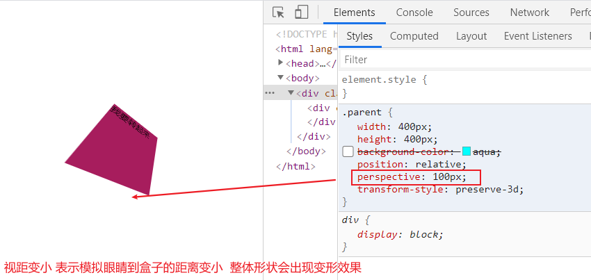

#### 过渡效果

​	默认属性的变化都是一瞬间，为了让人眼识别，额外让元素的变化慢慢的呈现出来。

​	transition: 

​		transition-property:过渡的属性  可以给具体值  可以给all 表示所有的过渡属性变化 ;

​		transition-duration: 2s;  过渡的时长

​		transition-timing-function: linear;  过渡的执行过程函数    还有其他值

​		transition-delay: 1s;   	延迟执行的时间  一般不给

```html
 <style>
        /* */
        body{
            padding: 100px;
        }
        div{
            width: 200px;
            height: 200px;
            background-color: aqua;

            /* 过渡的属性  可以给具体值  可以给all 表示所有的过渡属性变化*/
            /*transition-property: all;*/
            /* 过渡的时长*/
            /*transition-duration: 2s;*/
            /*过渡的执行过程函数  自己试试*/
            /*transition-timing-function: linear;*/
            /* 延迟执行的时间  一般不给*/
            /*transition-delay: 1s;*/
            /*简写*/
            transition: all 2s linear ;
        }
        div:hover{
            border-radius: 50%;
            background-color: #a71d5d;
            transform: translateX(500px);
        }
    </style>
</head>
<body>
<!-- -->
<div></div>
```

#### 动画

 让元素按照指定的方式时间一直执行

步骤1  首先需要定义一个动画（菜谱）

```
/*步骤1 定义一个动画 让程序按照指定的步骤去执行*/
@keyframes xu  {
    /*定义步骤*/
    /*初始的时候的状态*/
    0%{
        background-color: aquamarine;
    }
    /*中间可以再细分*/
    50%{
        background-color: #a71d5d;
        transform: translateX(400px) rotate(7200deg) scale(0.5);

    }
    100%{
        background-color: #000;
        transform: translateX(0px) rotate(-7200deg) scale(2);
    }

}
```

步骤2  去执行定义的动画

通过 animation属性执行

​	animation-name: xu;        执行的动画的名称

​	animation-duration: 5s;    执行时间

​	animation-timing-function: linear;   执行的函数

​	animation-delay: 2s;		执行延迟

​	animation-iteration-count: infinite;  执行的次数 可以给具体的次数 可以给无限次

​	animation-direction: reverse;  

​	 播放的顺序  reverse 从100%开始执行 alternate-reverse 反复执行

可以简写:

​	animation:  xu 5s linear 2s infinite alternate-reverse;

```html
/*完整案例*/
<style>
        /* */
        div{
            width: 200px;
            height: 200px;
            border-radius: 50%;
            border:1px solid #ccc;
            text-align: center;
            line-height: 200px;
            font-size: 30px;
            cursor: pointer;

            /*transition: all linear 5s;*/

            /*步骤2 */
            /*执行的动画的名称*/
            /*animation-name: xu;*/
            /*执行时间*/
            /*animation-duration: 5s;*/
            /*执行的函数*/
            /*animation-timing-function: linear;*/
            /*执行延迟*/
            /*animation-delay: 2s;*/
            /*执行的次数 可以给具体的次数 可以给无限次*/
            /*animation-iteration-count: infinite;*/

            /*播放的顺序  reverse 从100%开始执行 alternate-reverse 反复执行 */
            /*animation-direction: reverse;*/

            /*简写*/
            animation:  xu 5s linear 2s infinite alternate-reverse;
        }
        /*步骤1 定义一个动画 让程序按照指定的步骤去执行*/
        @keyframes xu  {
            /*定义步骤*/
            /*初始的时候的状态*/
            0%{
                background-color: aquamarine;
            }
            /*中间可以再细分*/
            50%{
                background-color: #a71d5d;
                transform: translateX(400px) rotate(7200deg) scale(0.5);

            }
            100%{
                background-color: #000;
                transform: translateX(0px) rotate(-7200deg) scale(2);
            }

        }
    </style>
</head>
<body>
<!-- -->

<div>转</div>
```

简写

如果一动画只有 开始和结束2个过程

```css
 /*如果只要2个过程 from-to实现*/
        @keyframes xu {
            from{
                transform: rotate(0deg);
            }
            to{
                transform: rotate(360deg);
            }
        }
```

暂停动画

animation-play-state: paused;

### day12

#### 移动端视口

​	

```html
<meta name="viewport"
          content="width=device-width,initial-scale=1.0,maximum-scale=1,minimum-scale=1,user-scalable=no">
    <!--
      移动端必须加视口 viewport
         width: 宽度 控制对应视口的大小的值 可以是具体的值比如300 也可以
            device-width： 宽度为设备的宽度(单位100%)
            initial-scale :定义初始缩放值
            maximum-scale : 允许放大的比例
            minimum-scale : 允许缩小的比例
            user-scalable=no :禁止用户手动缩放网页

    -->
    <style>
        div{
            width: 50%;
            border:1px solid #aaa;
            height: 200px;
        }
    </style>
</head>
<body>
 <div>
     移动端必须加视口
 </div>
```

#### 弹性布局

#####    回顾:  

​	    传统页面布局 :display+float+ position属性 实现页面布局，采用的标准是一盒模型为基本

​	    处理 比如  水平垂直居中就比较麻烦。

​        flex布局 相比于传统布局

​	    1、操作方便 布局简单，尤其是在移动端比较广泛

​	    2、pc端尤其是低版本的浏览器 兼容性比较差的 

##### 语法	     	

​	

```
display:flex  ;// 设置为弹性布局  块级元素
displya:inline-flex ;        行内元素 也可以设置
```

#####  注意

​	: 如果设置了弹性布局则浮动就失效，clear清除浮动  vertical-align:垂直设置的属性无效、

##### 特点: 

​	1.容器  :每一个元素都可以是一个容器(理解为父元素)

​	2.flex项目: 容器中的子元素     (简述为项目/  子元素)	

​       3、默认水平轴为主轴、与主轴垂直相交的位交叉轴

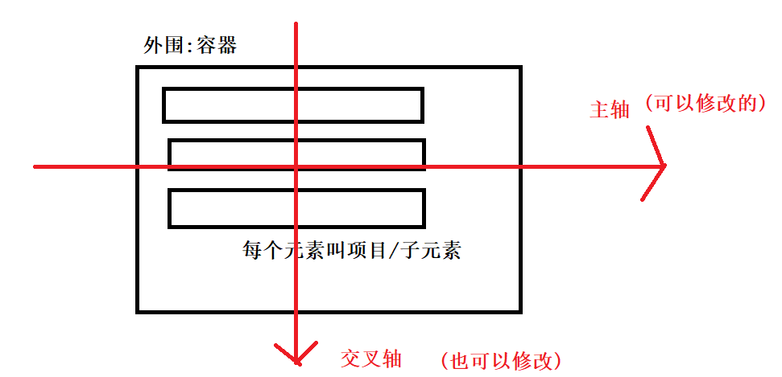

#### 属性 

```
display:flex;
```

 1.容器(父元素)的属性

##### 	设置主轴

```
flex-direction: row  | row-reverse |  column  |  column-reverse;
// 对应的特点分别如下
```

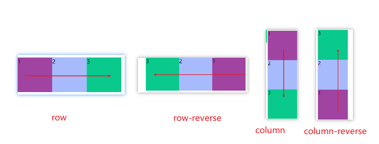

​      row:（默认值）  表示主轴为水平方向    起点在最左边

​      row-reverse:      表示主轴为水平方向    起点在最右边 

​       column    :         表示主轴为垂直方向      起点在最上边

​       column-reverse: 表示主轴为垂直方向    起点在最下边   

```html
<style>
        /* */
        .parent{
            border:1px solid #ccc;
            width: 600px;
            height: 500px;
            /*设置弹性布局*/
            display: flex;
            /* 水平方向的主轴 默认是从左往右 */
            flex-direction: row;
            /* 水平方向的主轴 从右往左 */
            flex-direction: row-reverse;
            /* 垂直方向的主轴 从上往下 */
            flex-direction: column;
            /* 垂直方向的主轴 从下往上 */
            flex-direction: column-reverse;


        }
        .parent div{
            width: 100px;
            height: 100px;
        }
        .son1{
            background-color: #a043a1;
        }
        .son2{
            background-color: #a7bbfc;
        }
        .son3{
            background-color: #0ac98c;
        }
    </style>
</head>
<body>
<!-- -->
<div class="parent">
    <div class="son1"></div>
    <div class="son2"></div>
    <div class="son3"></div>
</div>
```

#####  设置换行

```
flex-wrap：nowrap     |     wrap    wrap-reverse

```

​	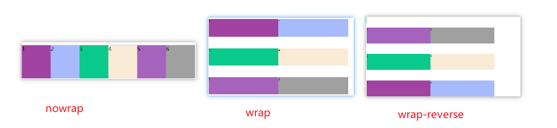

  1、nowrap :(默认)   不换行 会自动缩小

  2、 wrap  :换行

  3、 wrap-reverse   :换行并且 反转

##### 前2简写

```
 flex-flow: 设置主轴   设置换行;
```


##### 主轴对齐方式(重要)

```
justify-content：flex-start  | flex-end  | center  | space-between |space-around | space-evenly
```

1   flex-start 

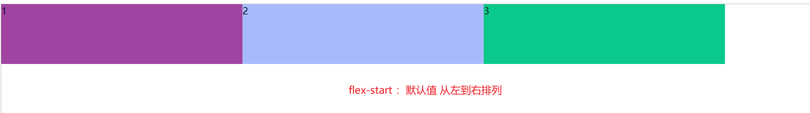

2 flex-end 

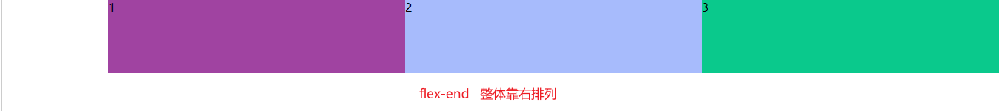

3 **center** 

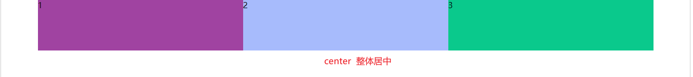

4 **space-between**  

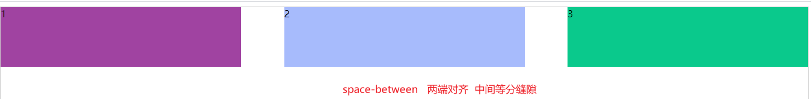

**5 space-around**

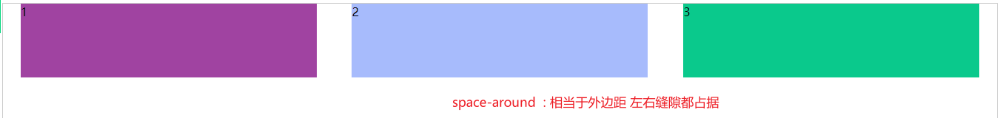

6 space-evenly

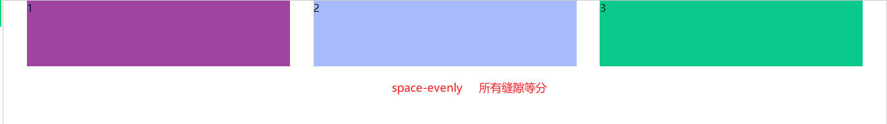

##### 交叉轴的对齐方式

```
align-items ： flex-start  | flex-end      | center
```

1 交叉轴开始端

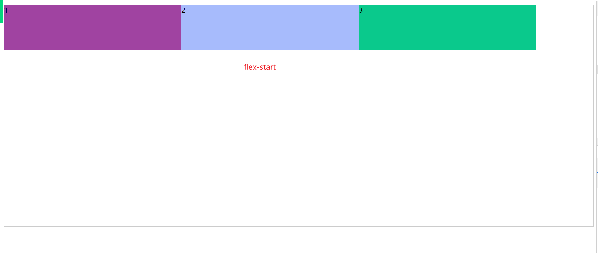

2交叉轴底部

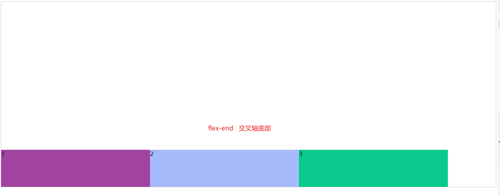

3center

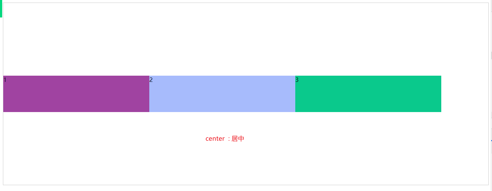

4 normal |  revert | stretch

​	注意: 如果 **子****元素没有设置高度**  则会默认填充满父元素的高度


##### 设置多轴情况下的对齐方式

特点:

​       主轴和交叉轴都存在时   或者理解为 **有多行的情况下** 不同行之间的排列 

​	如果只有一行 只有一个轴  下面的属性是无效的

```
align-content:  flex-start  | flex-end  | center  | space-between |space-around
```

和align-items区别: 

​	align-items 设置的是整体的排列  主要有 上中下 三个值

​	align-content 一行无效  多行之间的排列方式

1 flex-start

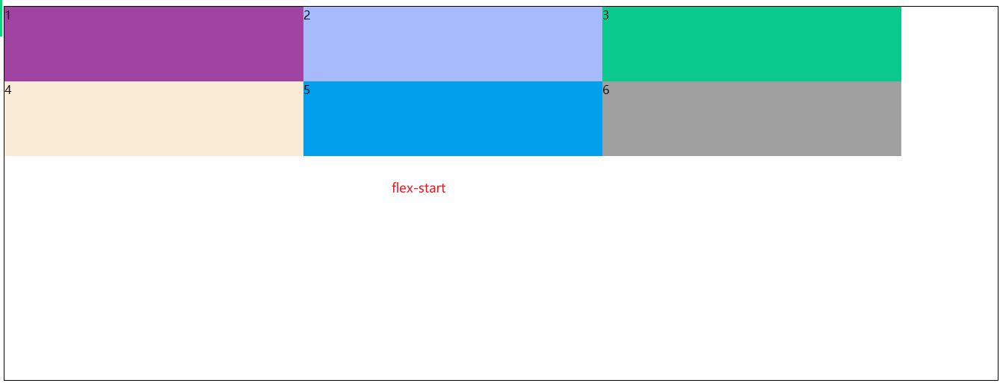

2 flex-end

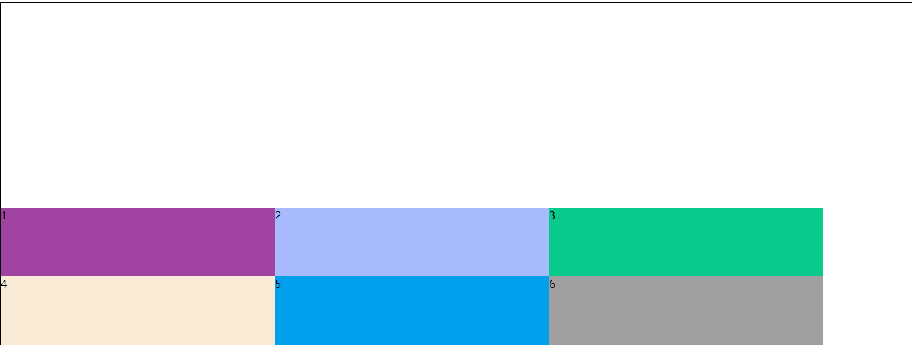

3center

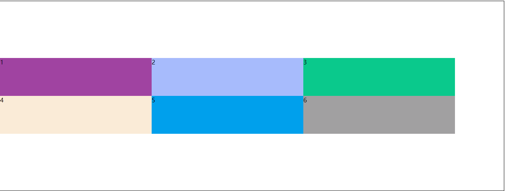

4 space-between

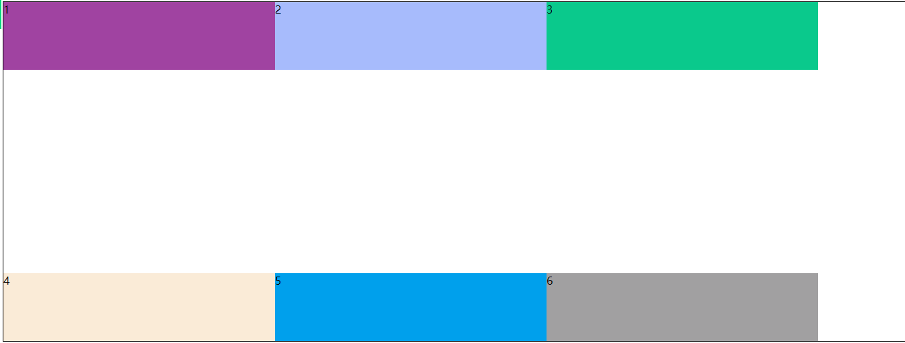

5 space-around  

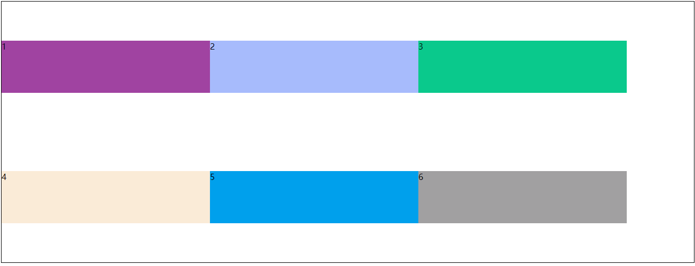

6 space-evenly 

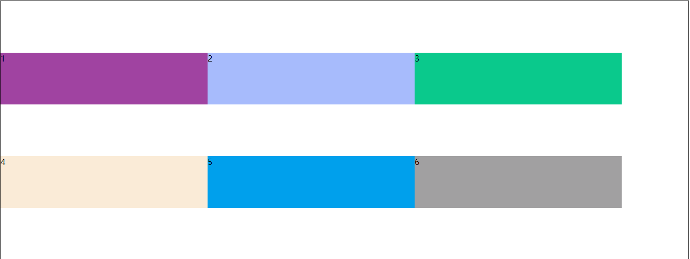


#### 项目(子元素)属性

#####       顺序的排列 

​		 order:   没有单位的值  值越小 越靠前 默认是 0

​	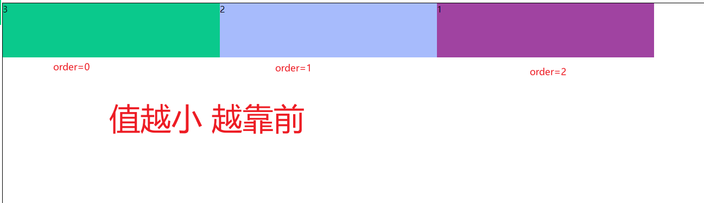

##### 放大比例设置	

 默认也是0    定义子元素的放大比例
 如果子元素设置了宽度 则放大的比例的基数是整个的宽度减去所有子元素的宽度在比例划分
 如果没设置宽度 则按照flex-grow的比例 进行划分

```
 flex-grow: 1;
```

常见写法  :   1:1:1  三个元素等比划分父元素空间

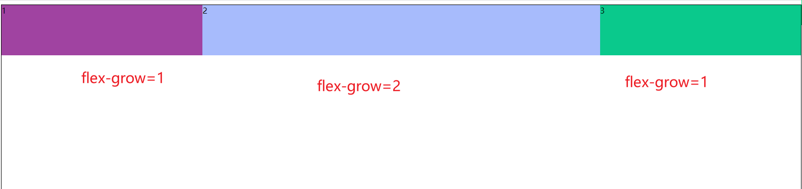


##### 缩小比例设置

​		默认是**缩小的** 缩小值是1    如果空间不足的情况下 对应的缩小比例
  	       0 表示不缩小  
 	        值越大  对应的缩小的比例就越高   不能给负值

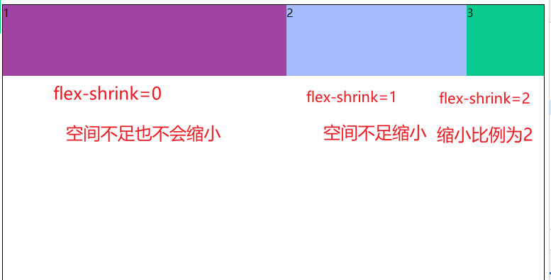


##### 元素的空间设置

​        当前元素有多宽就是多宽相当于自适应宽度
​       或者是 如果已经设置了的元素的宽度

```
flex-basis： auto | 给具体的值;
如果给了具体的值  则设置的width属性就失效
```

##### 简写设置

   元素的放大、缩小，空间设置 三个属性的简写

```
flex：flex-grow放大  flex-shrink 缩小    flex-basis 空间; 
```

常见写法:

​	flex:auto(1 1 auto)  表示 放大 缩小 自动计算空间

​	flex:none(0 0 auto ) 表示  不放大 不缩小 自动计算空间

​	flex:1;    表示直接忽略后面的缩小 和空间计算属性

##### 项目自身的排列设置

```
 align-self: flex-start        |   flex-end      |  center
```

​	可以自己定义自己在交叉轴的对齐方式 可以 在起始端，末尾端、中间

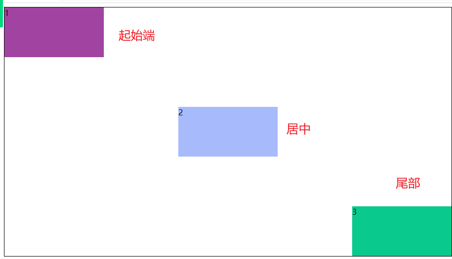

### day13

#### media query（媒体查询css3）

媒体查询(Media Query)是CSS3新语法

- 使用@media查询，可以针对不同的媒体类型定义不同的样式
- @media可以针对不同的屏幕尺寸设置不同的样式
- 当你重置浏览器大小的过程中，页面也会根据浏览器的宽度和高度重新渲染页面
- 目前针对很多苹果手机、安卓手机、平板等设备都用得到多媒体查询

```css
@media mediatype and | not|only (media feature){
    CSS-Code;
}
/*mediatype 媒体类型 关键字and not only   media feature 媒体特性必须有小括号包括*/
```

1. media type查询类型

   将不同的终端设备划分成不同的类型，称为媒体类型

   - all 用于所有设备
   - print 用于打印机和打印预览
   - **scree 用于电脑屏幕、平板电脑、智能手机等**

2. 关键字

   关键字将媒体类型和多个媒体特性连接到一起为媒体查询的条件

   - and：可以将多个媒体特性连接到一起，相当于"且"的意思
   - not：排除某个媒体类型，相当于"非"的意思，可以省略
   - only：指定某个特定的媒体类型，可以省略

3. 媒体特性

   每个媒体特性都具备各自不同的特性，根据不同媒体类型的媒体特性设置不同的展示风格。我们暂且了解三个。注意他们要加小括号包括

   | 值        | 解释说明                           |
   | --------- | ---------------------------------- |
   | width     | 定义输出设备中页面可见区域的宽度   |
   | min-width | 定义输出设备中页面最小可见区域宽度 |
   | max-width | 定义输出设备中页面最大可见区域宽度 |

   

#####      1、响应式网站

​	  一个网页 可以根据不同的屏幕的分辨率（pc  pad  phone端） 从而实现内容和样式的不同。

​	优点:   一个项目即可以匹配 市场上绝大部分的客户端

​		     公司的运营成本和开发维护成本大大的较低，

​		    风格偏简约， 官网，办公系统，不是很复杂的页面会直接使用响应式

​        缺点:  

​		如果页面嵌套复杂程度太大则代码编辑非常的复杂，不利于代码的执行和维护，代码非常的累赘 电商类的项目不适合。

2、需要去添加视口 目的是支持手机端

​	 昨天的笔记

```
<meta name="viewport"
          content="width=device-width,initial-scale=1.0,maximum-scale=1,minimum-scale=1,user-scalable=no">
```

3、单位问题

```
使用相对单位
    % 
    em     : 父元素的字体大小
    rem    :html元素的字体大小作为 比例显示
    
```

4.屏幕的划分(自定义)

​	a、超小屏    手机     小于768

​	b、小屏幕    平板     小于992   

​	c、中屏幕     笔记本 小的台式的屏幕     小于1200

​	d、大屏幕     大的电脑屏幕        大于1200

5、实现方式1

​        通过不同的屏幕 去引入执行不同的css文件 

```html
<meta name="viewport"
          content="width=device-width,initial-scale=1.0,maximum-scale=1,minimum-scale=1,user-scalable=no">
    <!--根据不同的屏幕 去引入不同的css文件-->
    <!--pc-->
    <link rel="stylesheet" href="css/pc.css" media="screen and (min-width:992px)">
    <!--pad-->
    <link rel="stylesheet" href="css/pad.css" media="screen and (min-width:768px) and (max-width:991px) ">
    <!--phone-->
    <link rel="stylesheet" href="css/phone.css" media="screen and (max-width:768px)">
    <style>
        /* */
    </style>
</head>
<body>
<!-- -->
<h1>方式1</h1>
<div class="bgc">Lorem ipsum dolor sit amet, consectetur adipisicing elit. Commodi dignissimos enim exercitationem facere illum iure labore, laudantium omnis pariatur quisquam suscipit voluptatem. Animi dolore et fugiat magnam minima quidem vel. Lorem ipsum dolor sit amet, consectetur adipisicing elit. Adipisci, architecto aspernatur aut autem, consequatur dolorum eligendi error laboriosam molestias nam, nulla quae quia quod repellendus sint tempore veritatis voluptatum. Quae.</div>
```

方式2  在一个css文件中实现

```css
/*通过不同的屏幕的判断 去执行不同的样式*/

/*pc 端*/
@media screen  and (min-width:992px){
   .bgc{
       background-color: red;
       font-size: 5rem;
   }

}
/*pad端*/
@media screen  and (min-width:768px) and (max-width: 991px){
    .bgc{
        background-color: yellow;
        font-size: 2rem;
    }
}
/*phone*/
@media screen  and (max-width:768px){
    .bgc{
        background-color: grey;
        font-size: 1rem;
    }

}
```

####    flexble插件

#####   简介:

​	手机淘宝团队写的简洁高效的移动端适配插件。

​	我们今后就可以不需要再 手动的去写媒体查询。

http://github.com/amfe/lib-flexible

##### 原理:

​	通过js动态的实时的获取当前浏览器页面的宽度， 进行10等分，每一份的宽度即设置为html字体大小。

比如: 如果设计稿是 750px  那我们 1 rem=75px  

##### 问题:

​	有些时候我们不需要太大的字体  可以手动的通过媒体查询去设置最大的字体大小(!important)，避免整体的rem的值变的太大

```
 /*直接用 flexble  有一个问题是会 无限的字体变大 根据屏幕的宽度进行设置的*/
        @media screen and (min-width: 750px){
            html{
                font-size: 75px !important;
            }
        }
```


##### 问题2:

​	单位换算将 px转换为rem  手动换算很麻烦

按照插件

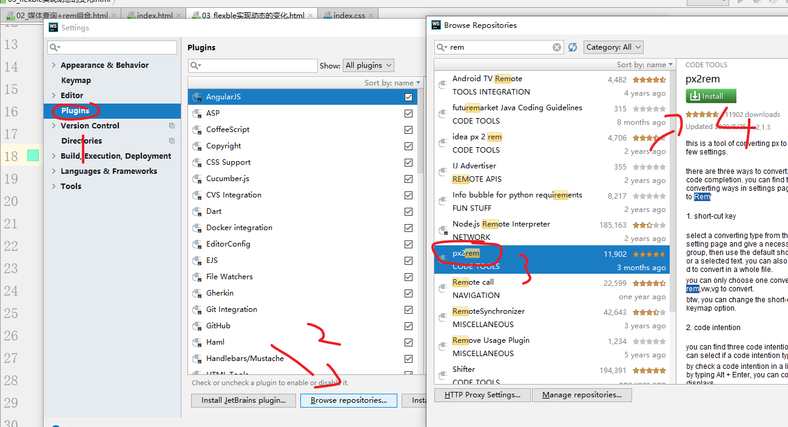

按照成功的查询

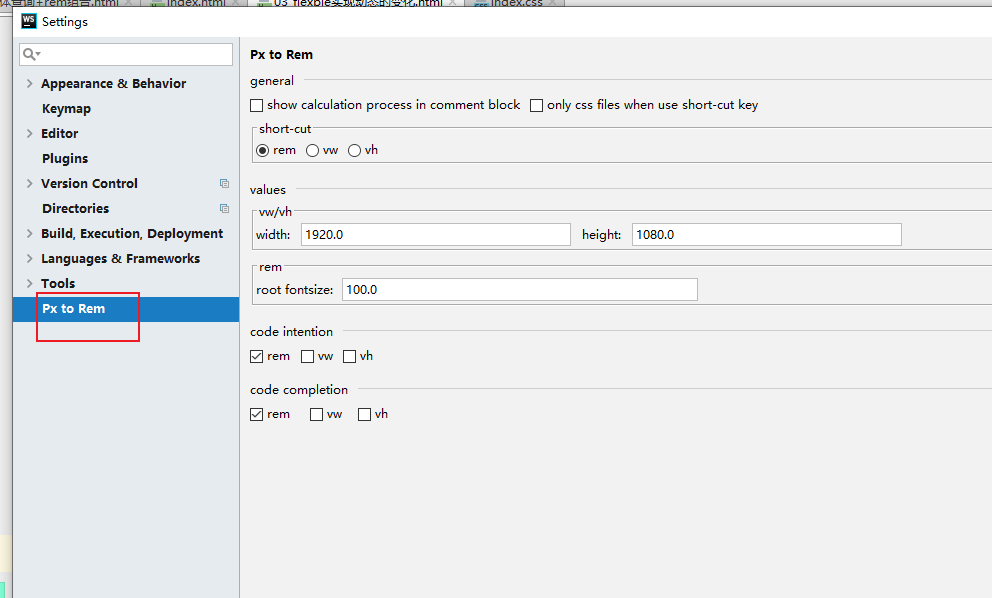

##### 快捷键

```
默认输入px之后  自动提示转为rem
alt+enter:     在当前行自动的进行rem/px之间的转换
ctrl+alt+d 整个页面中的  px->rem
alt+d      当前行  px->rem

```

#### 移动端总结

移动端开发大致可以分为两种：

1. 独立于PC端页面的，单独于一个页面(流式布局也叫百分比布局)
2. 写在PC端页面里的(响应式布局)

##### 移动端一些默认样式

```css
/* 点击高亮我们要清除 设置位 transparent 完全透明 */
* {
    -webkit-tap-highlight-color: transparent;
}
/* 在移动端浏览器默认的外观在IOS上加上这个属性才能给按钮和默认框自定义样式 */
input {
    -webkit-appearance: none;
}
/* 禁用长按页面时弹出菜单 */
img,a {
    -webkit-touch-callout: none;
}

```

#### 2.rem 适配方案

rem + 媒体查询 + less 技术

**1.设计稿常见尺寸宽度**

| 设备       | 常见宽度                                                     |
| ---------- | ------------------------------------------------------------ |
| iphone 4.5 | 640px                                                        |
| iphone 678 | 750px                                                        |
| Android    | 常见320px、360px、375px、384px、400px、414px、500px、720px  **大部分4.7~5寸的安卓设备为720px** |

一般情况下，我们以一套或两套效果图适应大部分的屏幕，放弃极端屏或对其优雅降级，牺牲一些效果

现在基本以750为准

##### 4.3 rem 实际开发适配方案1

2.动态设置html标签font-size大小

1. 假设设计稿是750px
2. 假设我们把整个屏幕划分为15等份(划分标准不一可以是20份也可以是10等份)
3. 每一份作为html字体大小，这里就是50px
4. 那么在320px设备的时候，字体大小为320/15 就是 21.33px
5. 用我们页面元素的大小 除以不同的html 字体大小会发现他们比例还是相同的
6. 比如我们以750为标准设计稿
7. 一个100*100像素的页面元素在750屏幕下，就是100 / 50 转换为rem 是 2rem * 2rem 比例是 1比1
8. 320屏幕下，html字体大小为21.33 则2rem = 42.66 此时宽和高都是42.66 但是 宽和高的比例还是 1比1
9. 但是已经能实现不同屏幕下 页面元素盒子等比例缩放的效果

#### 3.适配方案

rem + flexble

###### 插件：

**rem插件:** 

cssrem：将px自动转换为rem，但是需要配合在设置中修改cssRoot的字体大小，设置为标准尺寸下/份数

**Less插件**：

Easy Less 将less转为css

### 码云

git可以把我们的本地网站提交上传到远程仓库(码云gitee) 里面 类似之前的 ftp

码云 就是远程仓库，类似服务器

1. 码云创建新的仓库。 heimamm

2. 利用git 提交 把本地网站提交到码云 新建的仓库里面

   - 在网站根目录-- Git Bash Here

   - 如果是第一次利用git提交，请配置好全局选项

     ```git
     git config --global user.name "用户名"
     git config --global user.email "你的邮箱地址"
     ```

   - 初始化仓库

     ```
     git init
     ```

   - 把本地文件放到暂存区

     ```
     git add .
     ```

   - 把本地文件放到仓库里面

     ```
     git commit -m "提交黑马面面网站"
     ```

   - 链接远程仓库

     ```
     git remote add origin 你新建的仓库地址
     ```

   - 把本地仓库的文件推送到远程仓库 push

     ```
     git push -u origin master
     ```


### 响应式开发

##### 1.1 响应式开发原理

就是使用媒体查询针对不同宽度的设备进行布局和样式的设置，从而适配不同设备的目的。

| 设备划分                 | 尺寸区间           |
| ------------------------ | ------------------ |
| 超小屏幕（手机）         | < 768px            |
| 小屏设备（平板）         | >=768px ~ <992px   |
| 中等屏幕（桌面显示器）   | >= 992px ~ <1200px |
| 宽屏设备（大桌面显示器） | >=1200px           |

#### 1.2 响应式布局容器

响应式需要一个父级做为布局容器，来配合自己元素来实现变化效果

原理就是在不同屏幕下，通过媒体查询来改变这个布局容器的大小，来改变里面子元素的排列方式和大小，从而实现不同屏幕下，看到不同的页面布局的样式变化。

**平时我们 响应式尺寸划分**

- 超小屏幕（手机 小于768px）：设置宽度为100%
- 小屏幕（平板，大于等于768px)︰设置宽度为750px
- 中等屏幕（桌面显示器,大于等于992px):宽度设置为970px
- 大屏幕(大桌面显示器，大于等于1200px) :宽度设置为1170px

### Bootstrap 栅格系统

1. #### 栅格系统简介

   栅格系统英文为“grid systems”,也有人翻译为“网格系统”，它是指将页面布局划分为等宽的列，然后通过列数的定义来模块化页面布局。

   Bootstrap提供了一套响应式、移动设备优先的流式栅格系统，随着屏幕或视口( viewport )尺寸的增加，系统会自动分为最多12列。

   Bootstrap里面container宽度是固定的，但是不同屏幕下, container的宽度不同，我们再把container划分为12等份

   

2. 栅格选项参数

   栅格系统用于通过一系列的行( row )与列( column )的组合来创建页面布局，你的内容就可以放入这些创建好的布局中。

   

   - 行( row)必须放到container布局容器里面

   - 我们实现列的平均划分需要给列添加类前缀

   - xs-extra small :超小; sm-small : 小 ; md-medium :中等; lg-large :大;

   - 列( column )大于12，多余的“列( column)”所在的元素将被作为一个整体另起一行排列

   - 每一列默认有左右15像素的padding

   - 可以同时为一列指定多个设备的类名，以便划分不同份数例如class="col-md-4 col-sm-6

3. 列嵌套

   栅格系统内置的栅格系统将内容再次嵌套。简单理解就是一个列内再分成若干份小列。我们可以通过添加一个新的.row元素和一系列.col-sm-*元素到已经存在的.col-sm-*元素内。

   

   我们列嵌套最好加1个列row 这样可以取消父元素的padding值 而且高度自动和父级一样高

   ```html
   <!-- 列嵌套 -->
   <div class="col-sm-4">
       <div class="row">
       	<div class="col-sm-6">小列</div>
           <div class="col-sm-6">小列</div>
       </div>
   </div>
       
   ```

4. 列偏移

   使用.col-md-offset-*类可以将列向右侧偏移。这些类实际是通过使用*选择器为当前元素增加了左侧的边距( margin ) 。

   

   ```html
   <!--列偏移-->
   <div class="row">
   	<div class="col-lg-4">
           1
       </div>
       <div class="col-lg-4 col-lg-offset-4">
           2
       </div>
   </div>
   ```

5. 列排序

   通过使用.col-md-push-*和.col-md-pull-*类就可以很容易的改变列( column )的顺序。

   

   ```html
   <!--列排序-->
   <div class="row">
       <div class="col-lg-4 col-lg-push-8">
           左侧
       </div>
       <div class="col-lg-8 col-lg-push-4">
           左侧
       </div>
   </div>
   ```

6. 响应式工具

   为了加快对移动设备友好的页面开发工作，利用媒体查询功能，并使用这些工具类可以方便的针对不同设备展示或隐藏页面内容。

   | 类名       | 超小屏 | 小屏 | 中屏 | 大屏 |
   | ---------- | ------ | ---- | ---- | ---- |
   | .hidden-xs | 隐藏   | 可见 | 可见 | 可见 |
   | .hidden-sm | 可见   | 隐藏 | 可见 | 可见 |
   | .hidden-md | 可见   | 可见 | 隐藏 | 可见 |
   | .hidden-lg | 可见   | 可见 | 可见 | 隐藏 |

   与之相反的，是visible-xs visible-sm visible-md visible-lg是显示某个页面内容

