#### .1.学习方法

​    1.上课的时候 :  听(全神贯注) 敲笔记案例

​    2.晚自习:  

​		1.回顾笔记  + 案例   (不是看 是敲 )  

​                    看视频:  完全看不懂的情况下  才去看  否则 没有必要盯着视频看

​                2.写当天的作业

​                           1.看着笔记写: 很好些

​                           2.不看笔记写 : 能够做到  不看笔记写出作业 

​                           ！！！合格

​                           3.网上素材那么多  写其他的内容 目的加大自己的动手经验

​    20分钟-》      2小时

​      1              ：        6    

​          3. 一小段时间去总结: 文字/语言的形式       总结和规划能力的重要性。

​          4. 不能 懒    差不多                       态度。

web:

   第一阶段： html+Css -》静态页面    最基础最容易的环节   没有人是学不会的。

b/s : web->浏览器   -> 打开浏览器就可以用的

c/s :  -> 客户端  :     需要下载

#### 2浏览器:  

​    浏览器的内核:        

  1.chrome   谷歌       基于webkit->blink内核

  2.firefox     火狐     Gecko   (壁虎) 

  3.IE               微软      Trident (三叉戟)  IE11

  4.safair       苹果        webkit

 5.opear        欧朋       已经放弃了   跟着谷歌了

ex:   QQ   搜狗   2345   百度...   浏览器都是在别人的内核基础上进行二次包装的 核心都是人家的。

查看浏览器的内核

```html
http://mybrowse.osfipin.com/
```

因为浏览器内核不同 解析页面的时候 内容显示是不一样的。有可能导致 同样的一个样式内容会在不同的浏览器中显示不同的内容

#### 3.W3c 万维网组织  ->定义标准

 网页划分为3大模块

​    1.结构:     整个页面的框架 (毛坯)      html

​    2.表现:     体现页面的样式(硬装修)                 css

​    3.行为:      页面具有交互效果能够动起来       javascript


#### 4.HTML5基础 

​    全称:(hyper  text  markup  language)   超文本标记语言 

​    特点:  html来说  不是一门编程  应该是算一门 标记语言

   历史:

①HTML 1.0：在1993年6月作为互联网工程工作小组(IETF)工作草案发布。 [5] 

②HTML 2.0：1995年1 1月作为RFC 1866发布，于2000年6月发布之后被宣布已经过时。 [5] 

③HTML 3.2：1997年1月14日，W3C推荐标准。 [5] 

④HTML 4.0：1997年12月18日，W3C推荐标准。 [5] 

⑤HTML 4.01（微小改进）：1999年12月24日，W3C推荐标准。 [5] 

⑥HTML 5：08年提出定标是在14年    最主流的标准

#### 5.基本的结构语法(需要记住)

```html
<!doctype html >        定义文档类型为 html标记语言类型  
<html>                  用于包裹页面的所有的内容  不得超出
    <head>              用于定义头部信息  :编码格式  引入的文件 网页的标题...       
    	<meta charset="UTF-8">   ：定义整个文档的编码格式为utf-8  :支持中文
        <title>标题</title>	    定义标题: 在网页的左上角小图显示
    </head>              
    <body>
        所以的显示的结构 都需要写在页面的body中
    </body>
</html>
```

6.语法特征:

​      1.通过 <> 左右尖括号来实现包裹标记/标签

​      2.分类:   

​		1.单身狗 :  只有一个人   单标记        

```html
<xxx>           单标记不需要加 /
```

​               2.成对的    双标记

```html
<xxx>          </xxx>     必须加 /   :结束符
 开始标记        结束标记
 注意:以后写属性 只能在开始标记中书写
```

元素:   标记+内容

ex:   <title>页面的标题</title>

常见的存在特征的一些标记(不同的标记对应不同的功能)

1.标题:     用于醒目     

  h1-h6  6个 特征是逐步的字体变小  

  特征:    加粗      独占一行

```html
<h1>我是加粗的</h1>
```

2. 文本标记  

   特征: 上下有一个垂直空白的效果 (外间距)   也是独占一行

   ```html
   <p> 用于包裹文本用的</p>
   ```

3.常见的默认字体样式标签

   特点:  都是共享享一行

​      i  u  s  b  

```html
<i>我是斜体</i>
<u>我是下划线</u>
<s>我是删除线</s>
<b>我也是加粗</b>
b的加粗和  h系列的加粗   
b是和别人共享一行
```

4.其他

```html
<!-- 下标的用法-->
<p>
    H<sub>2</sub>O  和 O<sub>2</sub>是人类不可缺少的生命之源
</p>
<!--上标的用法-->
<p>
    5<sup>2</sup>=25
</p>
```

注意:  

​	如果文本中出现多个空格默认只会按照一个空格解析

```
<!--浏览器解析Html页面默认的情况-->
<p>
    1.如果文本中出现多个空格默认只会按照一个空格解析
    测试: 空        格
</p>
```

5.转移字符: 

```html
如果文本中想要显示标签语法 则需要使用转义字符
ex:  空格  
<p>
    2.如果文本中想要显示标签语法 则需要使用转义字符
    ex:    空&nbsp;&nbsp;&nbsp;&nbsp;&nbsp;&nbsp;&nbsp;&nbsp;格 <br>
    ex:   &lt;br&gt;标记的功能是用于换行 <br>
    ex:   &check;
</p>
```

6.没有特征的标记  ***

  特点:  没有特点    可以实现定制   自定义样式

   div     如果想要一整行  可以使用div

   span  如果想要和别人共享一行  则使用span

```html
<div>我是毛坯 没有任何的样式特征</div>
<span>我是毛坯 没有任何的样式特征</span>
```

7. 预格式化的文本 

   特征:  页面加载解析 会按照pre标记里的编辑格式来进行解读

   ```html
   <pre>
         今天天气 好
   
   
         热
   
   </pre
   ```

8. ​    其他

   ```html
   <br>  换行
   <hr>   分隔线
   ```

      

分类:(后续进一步的归纳)

​	html中标记可以分为2类

1.独占一行            可以改宽高

​      h1-h6  p                   div  pre

2.共享一行    不允许改宽高

​      i  u  s b  sub  sup    span   img(特殊)

注释:  将一段代码隐藏起来  不要让浏览器去解读  便于编辑者自己读

​     语法:   

```html
<!-- 注释的内容-->
```

#### 属性

   定义: 用于表述一个标记的总称

   语法:  只能写在开始标记中 需要用  空格隔开

​                属性和值之间用 = 相连接   值需要用""引起来

ex:  

```html
<div 属性1=”值1“ 属性2=”值2“ ...></div>
```

​    常见默认每一个标记具备的属性

1. title   :  标题      鼠标移入时  提示的文本信息
2. id       :   元素的一个编号       具备特征是唯一性   相当于人的身份证号码
3. class :   类名      在css阶段 配合元素的选择器使用  后面再聊
4. style  :  html中元素的样式属性   可以修改元素的宽高背景字体等。

​       注意:  style中的写法  因为样式属性太多了 外围已经用了=链接

```
<div style="属性:值;属性2:值2;..."></div>
```

```html
  <style>
        /* 用来测试 class 属性的应用*/
        .c1{
            /*设置具备.d1的所有的类的元素的高度为200px*/
           height: 200px;
        }
    </style>
</head>
<body>
<!-- 自带的一些属性特征-->
<!--    属性1:值1;属性2:值2;
           color:  设置元素中文本的字体颜色
           background:设置元素中背景
   -->
<div title="隔壁老徐经典名句" class="c1" id="d1"
    style="color:red;background: antiquewhite;">
    以前没钱吃泡面，现在没钱吃泡面
</div>
<script>
    //js的测试  测试  id选择器的使用
    //  弹出框 显示div中id叫d1的元素的内容
    alert(d1.innerHTML)
</script>
```

   5.align:     用于元素中的文本的水平排列方式 

​     值:   left: 默认值

​	     center:  居中

​	     right:   居右

```html
<div align="center">我是span 我也要居中</div>
```

   注意:  这个属性只能是独占一行的元素才可以使用。

#### 图像

  将图片放入页面中。

   1.常见的格式

​        .png     支持透明色  常见于 背景图中      

​	.gif        支持动画图像

​	.jpeg/jpg      常见的图像

​	.webp	  在相同的压缩比的情况下  文件空间占比更小  

语法:

​      

  src: 图像的路径

   height:图像的高度

  width:图像的宽度

  alt: 如果图像没有引入成功的提示文本

```html
<!-- img 引入不同格式的 图像-->

```

特点:

```html
   自带 宽高属性  如果只修改一个值 另一个值会等比缩放
   在html元素中  是可以不加单位  默认自动转为px
  
```

路径问题:  ***

​     在 后面的文件引入 通用的

```html
<!--1 绝对路径 : 从文件夹的最高级目录下的所有文件夹路径结构
       仅仅了解
-->
<!---->

<!--2: 相对路径  从页面出发 去找图片-->
<!--2.1 网页和图像在同一个文件夹中  直接引入名字就可以-->

<!--2.2  图像在网页的子文件夹中    先进子文件夹再引入图像的名称-->

<!--2.3  图像在网页的上一级文件夹中  则先返回上一级文件夹再引入图像的名称
        ../
-->

```

#### 超链接  

   功能:  通过用户的点击 实现页面的跳转 

   语法:   

```
<a>文本</a>
```

   属性:

​     1.href : 用于加载 需要跳转的路径

```html
<a href="http://baidu.com">度娘</a>
```

​    2.target属性 :  实现跳转的方式

​		_self    在当前页面跳转 默认

​		_blank  新的标签页跳转

```html
<!-- target属性   -->
<!--  在当前页面打开   默认值-->
<a href="http://baidu.com" target="_self">度娘</a>
<!--在新的标签页打开   -->
<a href="http://baidu.com" target="_blank">度娘</a>
```

 功能:  

​      1.实现页面跳转

​      2.实现下载      无需做特殊处理    

​		需要注意的是 href里面对应的需要是压缩文件(rar/zip/...)

```html
<!--实现下载-->
<a href="npy.zip">下载你懂的！</a>
<!--同样遵循 相对路径原则-->
<a href="../day01.zip">下载day01课件</a>
```

​     3.返回页面的顶部

```html
<a href="#">返回页面顶部</a>
```

​    4. 执行js的语句  

```html
<!-- 执行js的语句   alert()弹出框的方法 单引号和双引号的结合-->
<a href="javascript:alert('傻帽，让你点你就点？')">点我</a>
*******
<a href="javascript:history.back()">后退</a>  浏览器的后退页面按钮  
<a href="javascript:history.forward()">前进</a>  浏览器的前进页面的按钮
<a href="javascript:go(-1)">点我</a>   -1后退按钮
<a href="javascript:go(0)">点我</a>   刷新页面
<a href="javascript:go(1)">点我</a>   1前进按钮
```

​    5.实现锚点

​      功能: 点击当前的超链接 跳转的指定的页面的模块

​     步骤1:  定义锚点(做一个标记 实现配对)

​           方式1: 通过a 的 name属性的值 作为记号

​	   方式2:  通过任意标记的id属性的值作为记号

​      步骤2:  通过a的href引入刚才做的记号 前面需要加#

```html
<!--步骤2  属性跳转 a的href属性-->
<a href="#red">跳转到红色</a>
<a href="#blue">跳转到蓝色</a>
<a href="#black">跳转到黑色</a>
<a href="#green">跳转到绿色</a>
<a href="#yellow">跳转到黄色</a>
<!--实现跨页面锚点跳转-->
<a href="02_超链接.html#img">美女</a>

<!-- 图像可以嵌套在a链接 实现 点击图片实现跳转
     超链接也是 共享一行元素 不能实现水平居中
     可以通过给父元素添加 align 属性
-->
<div  style="height: 500px;background: white" align="center">
    <a href="http://www.baidu.com ">
        
    </a>
</div>

<!--步骤1 定义一个锚点 用于配对-->
<!--方式1  a的name属性-->
  <a href="" name="red">红色</a>
<!--2方式   任意 标记的 id的值-->
<div id="blue" style="height: 500px;background: blue">蓝色</div>
<div id="black" style="height: 500px;background: black">黑色</div>
<div id="green" style="height: 500px;background: green">绿色</div>
<div id="yellow" style="height: 500px;background: yellow">黄色</div>
<div  style="height: 500px;background: white"></div>
<a href="#">返回</a>
```

#### 表格

   由一个个单元格(格子)组成的内容

语法:

​    table       最外围的包裹

​    thead    表格的头部  

​		 th:具备加粗的效果

​    tbody    表格的主体

​    tr             行

​    td             列   

属性:

  table:     默认是没有边框的 

​      border: 值 可以不给单位    

​     width: 表格的宽度

​     height:高度

​     align:center 水平居中     说明也是独占一行的元素

​     bgcolor:  背景的颜色

​     cellspacing: 外边距     边框和边框之间的距离 一般都给0

​     cellpadding: 内容和边框的距离

tr:  一行的属性设置

​	height: 高度	    

​         bgcolor: 背景颜色

​        align:  水平排列     left  center  right

​        valign: 垂直排列    top   middle  bottom (上 中 下)

td:格子的属性

   width:  挤压别人的空间  同一列中的其他格子也会跟着一起变

​		  如果同一列中 其他格子也设置了宽度 则以最宽的那个为主导

   height: 也会挤压别人  如果超出部分 则整体的表格高度会变高

   bgcolor: 背景颜色	

```html
<!--表格的写法  table>tr*3>td*4-->
 <!-- 表格的属性 独占一行的-->
 <table border="1" width="400px" height="300px" align="center"
   bgcolor="#faebd7"  cellspacing="0" cellpadding="10">
    <thead >
    <!--  th 具备加粗的效果-->
    <tr height="100" bgcolor="red" align="center" valign="top">
        <th>编号</th>
        <th>姓名</th>
        <th>年龄</th>
        <th>专业</th>
    </tr>
    </thead>
     <tbody>
     <tr>
         <td valign="bottom" bgcolor="yellow" width="200" height="300"  >01</td>
         <td>老徐</td>
         <td>18</td>
         <td>计算机</td>
     </tr>
     <tr>
         <td width="150">02</td>
         <td>老张</td>
         <td>20</td>
         <td>计算机</td>
     </tr>
     </tbody>
 </table>
```

   不规则表格 属性

​    rowspan    ：  多行直接的表格进行合并

​    colspan       :   多列之间的表格进行合并 

   注意: 合并了n格 则需要删除n-1个格子

```html
<!-- 不规则的表格-->
<table width="600" height="400px" border="1" cellspacing="0" align="center">
    <tr>
        <td>编号</td>
        <td>单价</td>
        <td>数量</td>
        <td>小计</td>
    </tr>
    <tr>
        <!--跨了2行 则需要删除1个格子-->
        <td rowspan="2">01</td>
        <td>99</td>
        <td>1</td>
        <td>99</td>
    </tr>
    <tr>
        <!--<td>02</td>-->
        <td>89</td>
        <td>1</td>
        <td>89</td>
    </tr>
    <tr>
        <!--跨了 4列 需要删除3个格子-->
        <td colspan="4">总计</td>
        <!--<td></td>-->
        <!--<td></td>-->
        <!--<td></td>-->
    </tr>
</table>
```

#### 小图标

​    和图标的类型无关  和link标签里面的  rel有关

```html
<head>
    <meta charset="UTF-8">
    <title>字体小图标</title>
    <!--<link rel="icon" href="wyy.ico">-->
    <link rel="icon" href="taobao.png">
    <!--实现自动跳转到 淘宝             等待时间   跳转的页面-->
    <meta http-equiv="refresh" content="1,http://www.taobao.com">
</head>
<body>
<!--在head中引入小图标-->
</body>
```

#### 列表 

   (css阶段用的非常多)

 分类:  

​	1.有序列表

​           ol>li

​	2.无序列表

 	  ul>li

```html
<!--  有序列表  默认是数组类型的序列号
       type  用来修改 序列号
         start   起始的序列号
 -->
 <ol type="I" start="6">
     <li>01北京昨日新增本地确诊病例31例</li>
     <li>02男童在确诊患者被子上玩感染</li>
     <li>03北京中高考时间目前不调整</li>
     <li>04冒名上大学顶替者手写说明曝光</li>
 </ol>
<!--无序列表  标识符 默认是小圆点
   type:  circle空心圆 ; 自行调试
      绝大多数 都是设置为none  不需要标识
    -->
   <ul type="none">
       <li>01北京昨日新增本地确诊病例31例</li>
       <li>02男童在确诊患者被子上玩感染</li>
       <li>03北京中高考时间目前不调整</li>
       <li>04冒名上大学顶替者手写说明曝光</li>
   </ul>
```

#### 语义化标签

​    还是一个标签 也没有特殊的用法 

​    为了读取代码是 见名知意

```css
<!--页面的头部-->
  <div id="header"></div>

<!--语义化标签从 没有实质性的功能  增加代码的可读性
     h5 提倡使用 语义化的标签 用于代替 div
     不要整个页面全是div  能不用则不用
-->
<header>页面的头部</header>
<footer>页面的尾部</footer>
<aside>页面的侧边</aside>
<nav>页面的导航</nav>
<section>页面的主体内容</section>
```

iframe标签

   引入其他页面的公共网页资源 

   简化页面的编写  提高页面的重用性

```html
<!--通过 iframe标记引入其他页面的资源
     默认是一个300*150的标签  独占一行
 -->
<iframe src="09_header.html" frameborder="0" width="100%"
height="50px"></iframe>
<section>主体内容</section>
```

音乐播放

```js

<audio src="hei.mp3" id="music" >
    您的当前浏览器版本过低 不支持该控件
</audio>
<script>
    // 点击 图片 执行一个方法
    hei.onclick=function () {
        // 判断 如果音乐是暂停的
        if (music.paused){
            //则 让它播放
            music.play()
        } else {
            // 让它暂停
            music.pause();
        }
    }
```

#### 表单 （重点）

   用于连接 用户和产品服务器端的数据

   通过用户的输入的内容 传输到 服务器端  面向用户的一个模块 也是一个产品必备的模块

 语法:

```
<form>
    n个表单的子元素
</form>
```

 属性:   

1.action   服务器提交的地址  如果没有给值 则提交给当前页面

2.method     提交的方式

​	  	1.get  :  在地址栏明文提交   可以看到数据  并且 有条件限制 大小是kb级别

​				向服务器索要数据   

​                  2.post:   不会再地址栏做任何的显示   提交的数据的大小是没有限制的 

​                                  向服务器端发送数据使用

   具体的表单的子元素

##### input   

​	属性:  

​               type   根据值的不同 生成不同功能的子元素

​               name:  提交的时候 服务器端的依据 如果没有加name属性 则服务器端不会接收

​		value:  用户输入的内容

​                placeholder: 提示文本

​		maxlength:  最大的长度 限制

​                readonly   只读		不能修改  可以提交给服务器

​       	 disabled: 禁用        	  不能修改   也不能提交给服务器

  type:  有哪些不同的值

​       text  :  普通的文本输入框

​	password:   密码框

​        radio       :单选框

​        checkbox  :复选框

label标签  作用: 点击文本如同点击控件效果

  语法:

  2种方式

```html
  <label >
              用户姓名: <input type="text" >
   </label>

通过 label的for属性 执行对应想要链接的控件的id属性
<input id="n" type="radio" name="rdo">
          <label for="n">男</label>
```

​      sumbit  :  提交功能

​      reset:      重置

​      button:  普通按钮   进行js

​      image   ： 引入图像 实现提交

```html
 <h1>用户注册页面</h1>
  <!--   action:提交的服务器端的地址-->
  <form action="http://www.baidu.com" method="post">
      <!--普通的文本  text-->
      <p>
          <label >
              用户姓名: <input id="txt" name="txt" type="text" value="隔壁老徐" placeholder="用户姓名" maxlength="8" >
          </label>
      </p>
      <!--密文  password-->
      <p>用户密码: <input type="password" name="pwd"></p>
      <!-- 一组单选 或者 多选 name属性必须加  且必须一致-->
      <p>用户性别:
          <input id="n" type="radio" name="rdo" value="1">
          <label for="n">男</label>
          <input id="w" type="radio" name="rdo" value="2">
          <label for="w">女</label>
          <input id="qt" type="radio" name="rdo" value="3">
          <label for="qt">其他</label>
      </p>
      <p>
          用户喜好:
          <input type="checkbox" name="chk" value="eat">吃
          <input type="checkbox" name="chk" value="drink">喝
          <input type="checkbox" name="chk" value="play">玩
          <input type="checkbox" name="chk" value="music">乐
      </p>
      <!--提交按钮-->
      <input type="submit">
      <!--重置  初始化-->
      <input type="reset">
      <!-- 普通按钮 没有效果 结合js自定义-->
      <input type="button" value="0" onclick="this.value++">
      <!--引入 图像进行提交-->
      <input type="image" src="bd.ico">
  </form>
```

### day03

​    接着学表单

​     input 

​     type= file     文件上传

​     hidden         隐藏的内容 用户是看不到的  直接提交给服务器

#####  下拉选择框

```html
<!--multiple  可以按住ctrl实现多选-->
          <select name="sel" id="" multiple>
              <option value="1">--请选择--</option>
              <option value="2">上海</option>
              <option value="3">东京</option>
              <option value="4">南京</option>
              <option value="5">天津</option>
          </select>
```

##### 文本域

```html
 自我介绍:
 <textarea name="" id="ta" cols="30" rows="10" resize: none;>
 	可以输入多行文本
     //禁止拖拽属性  resize:none
</textarea>
```

浏览器地址栏也是不支持中文的 需要通过编码和解码的形式传输

```js
encodeURIComponent("我爱你")  //编码
"%E6%88%91%E7%88%B1%E4%BD%A0"
decodeURIComponent("%E6%88%91%E7%88%B1%E4%BD%A0")
"我爱你"
```

#### html中编写样式弊端

​    1.代码的重用性和维护性都非常的差

#### css(*Cascading Style Sheets*)   层叠样式表

  用处: 解决html写样式的弊端 

​	    实现内容和样式的分离  从而大大的提高了开发的效率

  语法:  

​         1.可以直接写在元素中    和html一样 

​          2.在head中 新建一个  style标签 将样式写在里面

```
    <style>
        /*  注释的写法     样式是写在{}中*/
       选择器{
          color:red;
        }
    </style>
    选择器: 用于选取页面中的元素
```

​       3. 新建一个.css文件 引入.css样式表文件

```
 <link rel="stylesheet" href="out.css"> //遵循相对路径原则
```

  特点:

​     1.优先级:  在同一个元素中 面对多种样式表中的样式匹配问题

​         最高:   !important   

​	 高:      内联样式	 在元素里面

​         中等:   内部样式表和外部样式表 

​                      遵循就近原则     谁近要谁

​          低:       继承过来的样式

​    2.继承特征

​		如果子元素没有样式  可以继承父元素的样式 (不是所有的属性都可以继承)

​    3.层叠性:  一个元素是可以同时设置多个属性的 只要不冲突

   注释:    

```css
   /* 注释的内容  */
   快捷键: ctrl+/   单行注释
          ctrl+shift+/  多行注释
```

####    选择器:

​         精确匹配页面中的元素-> 找人

```html
 <style>
        /*通用选择器:  匹配页面中的所有的元素*/
        *{
            /*  字体的大小*/
            font-size: 40px;
        }
        /*元素选择器:  匹配页面中指定的所有的元素*/
        div{
            color:red;
        }
        /*3 id选择器 :  匹配页面中指定的id值的元素 */
        #sp{
            color:yellow;
        }
        /*4类选择器:   匹配页面中指定的class值的所有的元素*/
        .bgc{
            background: #2e58ff;
        }
        .col{
            color:pink;
        }
        /*首先我是一个p元素 然后我具备bgc一类 分类 */
        p.bgc{
            /* 一个像素的变化*/
            border:1px solid red;
        }
    </style>
</head>
<body>
<div >窗前明月光</div>
<!--多类选择器的写法  一个元素支持多个类的划分  -->
<p class="bgc col">疑是地上霜</p>
<h1>举头望明月</h1>
<h3 class="bgc">低头思故乡</h3>
<h4 class="bgc">锄禾日当午</h4>
<div>离离原上草</div>
<span id="sp">我不是一个坏人</span>
</body>
```

选择器的优先级 

​    权重值决定；  值越大  则优先级越高

​    ！important             1000   

​     #id                            100

​    .类名                            10

​     元素选择器                  1

​     通用选择器"*"              0

​      继承的样式                  无

##### 群组选择器:

​     可以同时匹配多个选择器

  

```css
 <style>
        /* 给div 和#sp的所有元素添加字体颜色*/
      /*  div{
            color:red;
        }
        #sp{
            color:red;
        }*/
        /*直接 通过群组选择器实现   用逗号隔开*/
        div,#sp{
            color:red;
        }

    </style>
```

##### 后代和子代选择器

```html
 <style>
        /*后代选择器 : 当前选择器下的 指定的所有的选择器后代*/
        .li p{
            background: red;
        }
        /*子代选择器:  只是下一层级的选择器  只找儿子一辈 */
        .li>p{
            /*背景的属性不带继承性*/
            background: #5258ff;
            /* color属性 具有继承性 */
            color:yellow;
        }
    </style>
</head>
<body>
  <div class="li">
      李渊
       <div>李元霸</div>
       <p>
      李世民
      <!--此时 他的颜色 不是因为选择器 而是因为继承了李世民的字体颜色-->
      <p>李治</p>
  </p>
       <div>李建成</div>
       <div>李建龙</div>
       <p>李公主</p>
  </div>
```

##### 伪类选择器:

   和鼠标有关的   

```html
<style>
        /*没有点击时的状态*/
        a:link{
            color:red;
        }
        /*鼠标悬停   *****   */
        a:hover{
            color:yellow;
        }
        /*正在点击的状态*/
        a:active{
            color:green;
        }
        /*已经点击访问过*/
        a:visited{
            color:blue;
        }
        /*获取输入框中的焦点的时候*/
        input:focus{
            /*去掉边框*/
            border:none;
            /*去掉轮廓*/
            outline: none;
        }
    </style>
</head>
<body>
<a href="http://www.baidu.com">你懂的</a>
<input type="text">
```

#### 溢出属性

​    如果大盒子装进小盒子装不下 才会溢出

   语法：overflow  

​    值    :  auto/hidden/scroll  

```
		  /*溢出 解决 多出的内容进行隐藏 */
            /* 溢出的内容 直接隐藏 不要显示*/
            /*overflow: hidden;*/
            /* 如果有溢出 则会出现滚轮 如果没有溢出则不会有滚轮*/
            /*overflow: auto;*/
            /*不管有没有溢出  都会有滚轮*/
            /*overflow: scroll;*/
```

   css3中 进行了拆分

​       overflow-x  : 水平方向上的溢出处理

​       overflow-y  :  垂直方向上的溢出处理

```html
 <style>
        div{
            width: 100px;
            height: 200px;
            background: red;
            /*溢出 解决 多出的内容进行隐藏 */
            /* 溢出的内容 直接隐藏 不要显示*/
            /*overflow: hidden;*/
            /* 如果有溢出 则会出现滚轮 如果没有溢出则不会有滚轮*/
            /*overflow: auto;*/
            /*不管有没有溢出  都会有滚轮*/
            /*overflow: scroll;*/

            overflow-x: auto;
            overflow-y: hidden;
            /*强制让文本一行显示*/
            white-space: nowrap;
        }
    </style>
</head>
<body>
  <div>
      Lorem ipsum dolor sit amet, consectetur adipisicing elit. Ad aspernatur dicta eius explicabo fuga fugit, incidunt, ipsam mollitia nemo officiis optio perferendis quo sapiente tempora tempore tenetur ullam voluptatem voluptates.
  </div>
```

#### 边框的属性

  1.语法:

   border:  size  style color;

​     size:边框的大小

​     style: 边框的样式    dotted:圆点  dashed长虚线

​     color: 边框的颜色  

```css
   border:10px solid #5258ff;
```

   2.边框的特征

​    1.三角的实现

```css
  .d1{
            width: 100px;
            height: 100px;
            /*     大小  样式   颜色*/
            border:10px solid #5258ff;
            /*可以进行拆分*/
            border-left-style:dashed;
            border-top-color: red;
        }
        /*边框的本质  实现小三角*/
        .d2{
            width: 0;
            height: 0;
            /*border:200px solid #fff;*/
            /*                   透明色*/
            border:200px solid transparent;
            border-bottom-color: red;
        }
       
```

2. border-radius: 边框的角度 

    ex:  注意  需要先写上下 在写左右

   ```css
    /*角度的应用  实现一个圆  border-radius*/
           .d3{
               width: 200px;
               height: 200px;
               border:1px solid #000;
               /* 边框的角度*/
               /*border-radius: 10px;*/
               /* 圆的写法*/
               border-radius: 50%;
           }
           /*边框的角度 依然可以拆分*/
           .d4{
               width: 200px;
               height: 100px;
               border:1px solid #000;
               /*改变 左上角的弧度  先上下再左右 */
               border-top-left-radius: 104px;
               border-bottom-right-radius: 100px;}
   ```

3. outline: 边框之外的内容  轮廓

   ​           和边框一样有三个属性值  size  style color;

     一般给input  设置轮廓为none   

   ```css
    input{
               width: 250px;
               height: 40px;
               border-radius: 30px;
               background: #BDCEFC;
               border: none;
               /*轮廓  在边框之外 和边框一样具备三个属性值*/
               /*outline: 1px solid red;*/
               outline: none;
           }
   ```

4.边框的阴影

​       box-shadow: 水平位移  垂直位移  模糊大小    阴影的延伸(可加)    颜色   内阴影(可加)

​          默认是黑色

```css
<style>
        input{
            width: 250px;
            height: 40px;
            border-radius: 30px;
            background: #BDCEFC;
            border: none;
            /*轮廓  在边框之外 和边框一样具备三个属性值*/
            /*outline: 1px solid red;*/
            outline: none;
            /*       水平位移  垂直位移  模糊大小    颜色  */
            box-shadow:   0px      0px       10px      red;
        }
        /* 说明  阴影不占页面空间*/
        div{
            background: yellow;
        }
    </style>
</head>
<body>
<input  type="button" value="注册">
<div>我是测试文本 </div>
```

#### 外边距margin

​     定义: 边框和边框之间的距离 

​     用处: 将元素之间的排列 隔开位置

​     语法:

​       可以简写 为 1,2,3,4个值  

```css
/* 一个值 表示的是 上下左右 4个方向的边距 */
/*margin: 50px;*/
/*     上下  左右*/
/*margin:50px 60px;*/
/*    上    左右   下*/
/*margin:50px 60px 70px;*/
/*     上   右   下   左*/
/*margin:50px 60px 70px 80px;*/
```

​      也可以进行拆分 

   ex:   margin-left:  距离变量的左外边距

 特点:  

​       两个元素之间的外边距  取最大值。

##### 套路: 元素设置了宽高  希望水平居中 则可以给属性

​         margin: 0 auto;    

##### 问题: 外边距 溢出问题

  如果父元素没有边框 设置子元素的上下外边距 会直接作用到父元素身上

   最优的解决办法: 待续

```html
   <style>
        *{
            margin: 0;
            padding: 0;
        }
        .parent{
            width: 500px;
            height: 500px;
            background: red;
            /*如果父元素没有边框 设置子元素的上下外边距 会直接作用到父元素身上*/
            /*1  加边框  弊端: 白多了一条边框*/
            /*border:1px solid transparent;*/

            /*2 使用内边距代替外边距撑开  :问题 元素会变大 */
            /*padding-top: 50px;*/

            /*4.添加 overflow: 属性  值可以是auto hidden*/
            overflow: hidden;
        }
        .son{
            width: 100px;
            height: 100px;
            background: aqua;
            /*上边距 50px*/
            margin-top:50px ;
        }
    </style>
</head>
<body>
 <div class="parent">
     <!--3给父元素下添加第一个子元素 必须是table   弊端: 多了一个空的子元素-->
     <!--<table></table>-->
     <div class="son"></div>
 </div>
```


####  内边距padding

​     元素中的内容和边框之间的距离

​     作用: 撑开元素的空白的大小     改变元素的大小

​     语法:  和外边距语法一致

​     padding: 值1

​                       值1  值2

​		       值1   值2   值3

​		       值1  值2   值3  值4

#####   盒模型: 

​      一个元素在页面中的占据空间大小

​      width+border+padding+margin +盒模型中的内容

**box-sizing:  设置计算盒子的大小方式**   css3属性

1.content-box: 默认值

​    总宽度=(width+border+padding+margin)

2   **border-box:**      

​       总宽度=设置的总宽度width(width+padding+border)+margin

```html
 <style>
        *{
            margin: 0;
            padding: 0;
        }
        .parent{
            width: 500px;
            height: 500px;
            background: red;
            margin: 50px;
            /*默认情况 加了50内边距  整体变大了*/
           padding-top:50px ;

            /*通过设置盒子的计算方式为固定方式*/
            box-sizing: border-box；
            border:5px solid #0ab5f3;
        }
        .son{
            width: 100px;
            height: 100px;
            background: aqua;
            /*上边距 50px*/
            margin-top:50px ;
        }
    </style>
</head>
<body>
 <div class="parent">
     <div class="son"></div>
 </div>
```

##### **注意:**

  行内元素测试的内外边距特征

```html
  <style>
        div{
            width: 100px;
            height:100px;
            border:1px solid #0ab5f3;
        }
        a{
            background-color: #9a6e3a;

            /* 行内元素 默认是没有办法设置外边距*/
            margin: 20px;
            /*行内元素给内边距  影响别人 给别人压住*/
            padding: 20px;
        }
    </style>
</head>
<body>
 <div>测试元素</div>
 <a href="">行内元素</a>
```

#### 单位

   px  像素   

​    %  百分比

​     em       一个父元素的字体大小的单位长度

​     rem     一个根元素(html)字体的 单位长度

   不确定单位长度

​      min-width:    最小宽度

​      max-width:   最大宽度

​      min-height:   最小高度

​       max-height:  最大高度

```html
 <style>
        /*rem :html 一个单位的字体*/
        html{
            font-size: 50px;
        }
        .parent{
            font-size: 30px;
            /*不确定的宽高*/
            min-width: 1000px;
            background: aqua;
        }
        .son{
            /* 一个单位的html字体大小*/
            /*font-size: 1rem;*/
            /*父元素的1倍字体大小*/
            font-size: 1em;
        }
    </style>
</head>
<body>
  <div class="parent">
      <div class="son">我很大</div>
  </div>
```

#### 字体

  	字体大小:   font-size

​          字体加粗: font-weight

​	  字体样式: font-style: italic;  斜体

​          font-variant: all-petite-caps;   小写转大写

```html
 <style>
        div{
            /*字体的大小*/
            font-size: 32px;
            /*字体加粗*/
            font-weight: bold;
            /*可以设置斜体*/
            font-style: italic;
            /*设置字体的样式  支持中文*/
            font-family: "楷体";

        }
        p{
            /*大小写转换*/
            font-variant: all-petite-caps;
        }
    </style>
</head>
<body>
<h1>我的字体是又大又粗</h1>
 <div>隔壁老徐旁边没有隔壁老王</div>
<p>hello world</p>
```

#####    引入自定义的字体

​       可以不加引号

```html
 <style>
        /*引入外界的字体样式*/
        @font-face  {
            /*取名*/
            font-family: "xu";
            /*引入地址  可以不加引号*/
            src: url(方正品尚黑简体.TTF);

        }
        div{
            font-family: xu;
            font-size: 22px;
        }
    </style>
</head>
<body>
 <div>我是自定义字体样式</div>
```

####   3.引入阿里矢量图标

​     1.进入官网

```
https://www.iconfont.cn/
```

​    2.选择想要的图标 添加到购物车


 3.下载

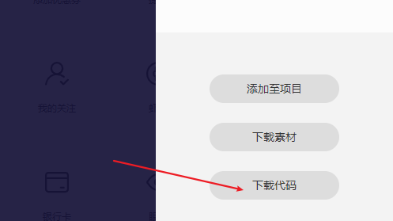

4.使用   参照demo.html类名

```html
<link rel="stylesheet" href="css/iconfont.css">
    <style>
        /*优先级更高 所有可以直接修改这个类*/
       /* .iconfont{
            font-size: 2rem;
        }*/
        .iconfont:hover{
            color:#FF6700;
        }
        .my{
            font-size: 2rem;
        }
    </style>
</head>
<body>
<!--  阿里矢量图库   必须添加 iconfont 这个类 否则无效-->
 <div class= "iconfont icon-aixin my"></div>
<div class="iconfont icon-WIFI"></div>
<p class=" iconfont icon-anquan"></p>
```

#### 颜色:

       1. 颜色单词:  red  green  blue ....
       2. #xxxxxx    6位16进制的数字表示 

​           0123456789abcdef  

3. rgb(red,green,blue)  每个值取值范围是0-255 
4. rgba(red,green,blue,a:透明度)  

​           a:  0-1    0完全透明

```html
    <style>
        div{
            /*    6位16进制的数字*/
            /*color:#112233;*/
            /*color: #123;*/
            /*color: rgb(0,255,0);*/
            color: rgba(0,255,0,0.1);
        }
    </style>
</head>
<body>
  <div>我是什么颜色</div>
```


#### 背景

1. background-color: 值是颜色值

2. background-image: url("图像的地址src")

3. background-repeat: no-repeat ;  不平铺

4. background-position:1px center ;  背景图定位

   注意:   可以给关键字 left center  right   可以给具体的npx
               默认情况 正值是往右 负值往左     垂直方向居中

   套路: 如果是大图  位置一定是负值  如果是小图一定是正值

5. background-size: 10px;    不要简写

注意: 背景图片的大小修改       一般给的是 单独的背景图
           cover:整体覆盖铺满
            cation: 只会铺满一个方向
            可以给具体的值  如果只给一个值 则表示水平和垂直方向

```html
<style>
    /*单独的一张背景图的使用*/
        .d1{
            border:none;
            font-size: 12px;
            width: 60px;
            height: 30px;
            /*背景的图片  默认会铺满所有的空间*/
            background-image: url("img/vb.jpg");
            /*设置背景的平铺    不平铺*/
            background-repeat: no-repeat ;
            /*背景图位置的调整
               可以给关键字 left center  right   可以给具体的npx
               默认情况 正值是往右 负值往左     垂直方向居中
            */
            background-position:1px center ;
            /*背景图片的大小修改       一般给的是 单独的背景图
               cover:整体覆盖铺满
                cation: 只会铺满一个方向
                可以给具体的值  如果只给一个值 则表示水平和垂直方向
            */
            background-size: 10px;
        }
    </style>
</head>
<body>
 <input class="d1" type="button" value="微博">
```

##### 简写    简写没有顺序之分

```css
 /*实现背景图的简写  size不能简写   简写没有顺序之分*/
     background:#dfdfdf url("img/ico_search.png") no-repeat 5px center ;
```

多张小图的大背景图使用**步骤**

   1.量取想要的小图标的宽高

   2.引入背景图

   3.调整小图标到最左上角的水平和垂直位置（默认引入的位置是左上角）

```css
 <style>
        .ren{
            /* 1.量宽高*/
            width:26px;
            height: 15px;
            /*2.引入背景图*/
            background-image: url("img/00.png");
            background-repeat: no-repeat;
            /* 3.调整小图标到最左上角的水平和垂直位置*/
            background-position: -53px 0;
        }
        /*鼠标移入 修改背景图的位置*/
        .ren:hover{
            /*                         只需要修改 y轴的值*/
            background-position: -53px -20px;
        }
    </style>
</head>
<body>
  <div  class="ren"></div>
```

6.  background-attachment: fixed;   固定背景图的位置

   ```html
   <style>
           div{
               width: 100%;
               min-height: 580px;
               background-repeat: no-repeat ;
               background-size: cover;
               /*固定背景图的位置*/
               background-attachment: fixed;
           }
           .b1{
               background-image: url("img/01.jpg");
           }
           .b2{
               background-image: url("img/02.jpg");
           }
           .b3{
               background-image: url("img/03.jpg");
           }
       </style>
   </head>
   <body>
   <div>1</div>
   <div class="bg b1"></div>
   <div>2</div>
   <div class="bg b2"></div>
   <div>3</div>
   <div class="bg b3"></div>
   <div>4</div>
   
   </body>
   ```

#### 渐变之线性渐变 （掌握）

   语法 如下:

background-image: linear-gradient(方向,颜色 位置,颜色2 位置);

​     方向:  可以给具体的角度 或者  通过  to+ left/right/top/bottom

​      颜色: 任意的颜色

​     位置:  当前颜色的纯色的位置  

```html
<style>
        /*线性渐变:  朝着一个方向 发生的背景的颜色的变化*/
        div.d1{
            width: 75px;
            height: 40px;
            border-top-right-radius: 25px;
            border-bottom-right-radius: 25px;
            color: #fff;
            font-size: 18px;
            text-align: center;
            line-height: 40px;
            font-weight: bold;
            /*从左往右的渐变的颜色*/
            /* 第一个值 angle 可以给具体值 也可以给关键字  to right*/
            /*background-image: linear-gradient(to right,#FF9000,#FF5000);*/
            background-image: linear-gradient(90deg,#FF9000,#FF5000);
        }
        /*测试值*/
        .d2{
            width: 200px;
            height: 40px;
            /*                  0-50px之间是纯红色 50-100之间是红绿渐变
             100-150是绿蓝渐变 150-200是纯蓝      */
            background-image: linear-gradient(to right,red 50px,green 100px,blue 150px);
        }
    </style>
</head>
<body>
<div class="d1">搜索</div>
<div class="d2"></div>
```

####  渐变之径向渐变(了解)

   background-image: radial-gradient(半径 at圆心坐标x 圆心坐标y ,red,green,blue);

​    如果不给圆心坐标 默认是中点

```html
 <style>
        div{
            width: 300px;
            height: 300px;
            border-radius: 50%;
            /*径向渐变   默认情况 圆心就在中点*/
            /*background-image: radial-gradient(150px,red,green,blue);*/
            /* 改变圆心的坐标*/
            /*background-image: radial-gradient(150px at 100px 80px,red,green,blue);*/
            /* 渐变的原理 和线性的一样  */
            background-image: radial-gradient(150px at 100px 80px,red 50px,green 100px,blue 150px);
        }
    </style>
</head>
<body>
  <div>

  </div>
```

#### 文本样式

1. #####  字体颜色color:    

2. #####  水平排列 text-align:  center  left right

3. #####  文本的修饰   text-decorition:   

    underline  删除线  

    none  不要修饰 

4.文本的阴影

​     text-shadow:  水平位移 垂直位移  模糊大小 颜色;

```css
 /* 文本的阴影   但是还可以进行多个阴影重叠*/
            text-shadow: 2px 2px 1px red, 3px 3px 2px green, 4px 4px 2px blue;
```

5.强制不换行

```
white-space: nowrap;
```

6.多出的文本内容以 ...的形式

```css
    /* 必须溢出隐藏*/
     overflow: hidden;
     text-overflow: ellipsis;
```

7.首字母大写*

```css
/* 首字母大写*/
text-transform: capitalize;
```

8.其他

```css
   /*修改文本的间距  单词之间的间距 中文无效*/
            /*word-spacing: 1px;*/
            /*每个字母之间的间距  支持中文*/
            letter-spacing: 3px;
            /*首行缩进*/
            text-indent: 30px;
  /* 右边开始加载*/
            direction: rtl;
```

##### 9.行高

​      用来设置 垂直方向的 文本的居中

​     line-height:   值和高度值保持一致 

```css
  			background-color: antiquewhite;
            width: 100px;
            height: 100px;
            line-height: 100px;
            text-align: center;
```

10.字体切割背景

```html
<style>
        div{height:780px;
            background: url("img/03.jpg") no-repeat;
            background-size: cover;
            /*字体的颜色是透明色 */
            color:transparent;
            font-size: 200px;
            text-align: center;
            line-height:1500px;
            /*文本填充的颜色是 透明色*/
            /*-webkit-text-fill-color: transparent;*/
            /*文本剪切背景图片  只有在webkit内核中才可以使用*/
            -webkit-background-clip: text;
            transition: all linear 2s;}
        div:hover{line-height: 0px;}
    </style>
</head>
<body>
 <div>
     I LOVE U
 </div>
```

#### 总结

  默认布局结构:    从上往下 从左往右的加在

#####    块级元素：    

​                 独占一行  

  ex:   h1-h6  div   p     pre  

#####    行内元素: 

​                 共享一行     不能设置上下的 外边距 也不能直接设置宽高 

 ex:    i u  s  b  span  sub  sup    img(特殊  可以设置宽高)

#####    行内块元素  :

​         即可以宽高 也可以独占一行

​        input  select

  table: table元素       

弊端:  往往希望 多个块级元素 可以一行显示  便于布局搭建 

#### 1.浮动布局

#####    特点:   

​        浮动之后 会脱离原有的平面，飘到空中  不再占据原有的空间

​        下一行会自动的上移

​	 宽高会变自适应

​	 浮动只能左浮/右浮  只能停靠在父元素的左边或者是右边

​	 浮动只能在当前一行浮动  不会跑到别的行

#####    语法: 

​      float:   

​	left		靠左浮动

​	right	     靠右浮动

​	none; 	  不浮动

#####  解决

​      浮动会对下一行元素造成影响:  下一行自动上移

​       clear:   left/right/both;   both: 不管是左还是右浮动 都清掉

​        当前行添加该属性 则当前行不会受上一行浮动造成的影响

```html
<style>
        div{
            width: 100px;
            height: 100px;
        }
        .d1{
            background-color: #a71d5d;
            /*左浮动*/
            /*此时 .d1不再和d2是同一个平面 宽高变成自适应了*/
            float: left;
        }
        .d2{
            background-color: aqua;
            /*右浮动*/
            float: left;
            /*清除浮动*/
            /*clear: both;*/
        }
        .d3{
            /*如果此时 d1 d2都浮动  则无人可挡 跑到最顶部*/
            background-color: #aeaeae;
            float: left;
        }
    </style>
</head>
<body>
<!--  2个div一行显示-->
<div class="d1"></div>
<div class="d2"></div>
<div class="d3"></div>
```

 注意:

​      1  浮动不会压住文本

​      2 如果一行显示不下 则自动换行

​      3.浮动对行内元素的影响

​            可以修改宽高  可以设置上下的外边距

```css
<style>
        a{
             width: 100px;
            height: 60px;
            background: red;
            color: #fff;
            text-decoration: none;
            line-height: 60px;

            /*默认是没有办法修改 上下的外边距*/
            margin-top: 151px;

            float: left;
            /*控制台 查看 display属性 发现是block*/
            /*说明浮动 直接改变了a的元素的类型*/
        }
    </style>
</head>
<body>
<a href="">行内元素</a>
```

​	4.对块级元素影响

​		  宽高自适应了  不再是100%

​              让多个块级的元素 一行显示

##### 浮动对图片的影响

```css
  <style>
        img{
            /* 清除 默认的 4px的缝隙  */
            float: left;
        }
    </style>
</head>
<body>


</body>
```

   **浮动对父元素的影响**

​        (父元素的高度塌陷问题)

​     解决办法 如下  (待续)

```html
 <style>
        .parent{
            /* 此时的效果 原自 子元素撑起来的*/
            background: red;
            border:1px solid pink;
            
            /*办法1  给父元素 添加高度  很多情况 不知道父元素的具体高度*/
            /*height: 100px;*/
            /*办法2  跟着一块浮动 有高度 变成了自适应  */
            /*float: left;*/
            /*添加overflow:hidden/auto; 都可以  特定场合不能使用 */
            /*overflow: hidden;*/
        }
        .son{
            width: 100px;
            height: 100px;
            background: aqua;
            /*给子元素浮动  父元素则失去高度  */
            float: left;
        }
    </style>
</head>
<body>
<div class="parent">
    <div class="son"></div>
    <!--方法4: 给父元素末尾添加一个子元素 设置清除浮动    多了一个空的子元素-->
    <div style="clear: both"></div>
</div>
```

#### 显示方式

​      随意的更改元素的类型 (行内/块级/行内块/表格)

语法: 

​    display :  

​			1.inline   ;  行内元素

​			2.block ;     块级元素

​			3.inline-block 行内块

​			4.table      表格元素 

​         		5.none;      空 

```html
<style>
        div{
            /*       共享一行 */
            /* 可以改变类型  但是不能用于  布局  */
            display: inline-block;
            border:1px solid #ccc;
        }
        a{

            display: block;
        }
        a:hover{
            /*鼠标移入 隐藏*/
            display: none;
        }
        img{
            display: block;
        }
    </style>
</head>
<body>
  <div>我的div</div>
  <div>我的div</div>
  <a href="">我是行内</a>
  
  
```

#####  套路: 

   动态的让元素垂直居中

```html
 <style>
        .parent{
            width: 100px;
            height: 100px;
            border:1px solid #ccc;

            /*1父元素 充当table*/
            display: table;
            text-align: center;
        }
        .son{
            /*2子元素用于充当  td*/
            display: table-cell;
            /*3 这个属性 只有table中的元素和img 有用*/
            vertical-align: middle;

        }
        .parent:hover{
            height: 500px;
        }
    </style>
</head>
<body>
<div class="parent">
    <span class="son">我要居中</span>
</div>
<!--不用table-->
 <!--<table width="200px" height="200px" border="1">
     <tr>
         <td>居中</td>
     </tr>
 </table>-->
</body>
```

  隐藏的其他属性:

​               opacity: 0;   完全透明   1 表示显示      一般用于半透明的效果

​               visibility: hidden;  隐藏但是占据页面空间

​               display:none  ; 直接不占据空间  

关于图片的垂直属性

```html
  <style>
        img{
            /*图片和  table中 才有用*/
            vertical-align: middle;
        }
    </style>
</head>
<body>
   这是我
   
   嘚瑟的样子
</body>
```

网页中的鼠标的样式效果 默认是箭头

##### **cursor:**

​          pointer；  小手

​	  move    ;移动   不需要记 直接在浏览器中查看值

```css
/*鼠标可以引入图像*/
cursor: url("img/dbj.png"),auto;
```

#### 定位布局

#####     1.相对定位

​        特点:  相对于自己原有的位置 发生的位置上的变化
​                    **相对定位 脱离原有的平面  依然会占据原有的位置**

​        position:relative;    我是定位元素

​            left/right/bottom/top:具体的位移的值

​             左    右       下         上 

​              值可以给负值   

​        用处:  1.元素自身位置的微调 

​		   2.给人当爹用的(后续再说)

```html
 <style>
        .d1{
            width: 200px;
            height: 200px;
            background-color: aqua;
            /* 相对定位 脱离原有的平面  依然会占据原有的位置 */
            position: relative;
            left: -20px;
            top: -30px;
        }
        .d2{
            width: 200px;
            height: 200px;
            background-color: #a71d5d;
        }
    </style>
</head>
<body>
 <div class="d1"></div>
 <div class="d2"></div>
</body>
```

#### 绝对定位 

#####     语法:

 	position:absolute;

​		left/right/bottom/top;

​	        左   右      下     上  四个方向的距离

#####     特点:

​          1.会脱离原有的平面，但是不会占据页面空间(和浮动一样)

​          2.参考上一级已经定位的元素(不限制定位的类型) 作为定位的方向

​            3.  如果上一级元素没有实现定位则 以body作为参考对象(左上角)

#####   注意:  

​        绝对定位的使用情况 : 如果一个模块不是整个页面的同一个平面的模块 才可以使用绝对定位写

​	 如果说当前模块是属于页面的布局结构 则不宜使用绝对定位。

##### 1.父级元素没有定位时的情况

```html
 <style>
        body{
            padding: 50px;
        }
        div{
            width: 200px;
            height: 200px;
            background-color: #a71d5d;
        }
        .d1{
            /*此时的参考对象是 body的左上角(0,0)的位置 */
            position: absolute;
            left:30px;
            top:30px;
        }
        .d2{
            background-color: aqua;
        }
    </style>
</head>
<body>
 <div class="d1">我是绝对定位</div>
 <div class="d2">我是谁？</div>
```

##### 2.父级元素定位参考 

​    **注意:  今后使用绝对定位 别忘了 先找爹(定位参考元素)**

```html
<style>
        body{
            padding: 50px;
        }
      .parent{
          width: 500px;
          height: 500px;
          background-color: #a71d5d;
          /*父元素作为参考对象  用相对定位*/
          /*套路:  给父元素添加一个相对定位的属性  不需要加值*/
          position: relative;
      }
       .son{
           width: 100px;
           height: 100px;
           background-color: aqua;
           /*绝对定位*/
           position: absolute;
           left:50px;
           top:50px;
       }
    </style>
</head>
<body>
 <div class="parent">
     <div class="son"></div>
 </div>
```

**套路:**  

子元素呈现 水平垂直居中的效果

​     和切割属性 无关 

   clip: rect(66px 160px 160px 34px);  具体语法看下面的案例

```html
<style>
        body{
            padding: 50px;
        }
      .parent{
          width: 500px;
          height: 500px;
          background-color: #a71d5d;
          /*父元素作为参考对象  用相对定位*/
          /*套路:  给父元素添加一个相对定位的属性  不需要加值*/
          position: relative;
      }
       img{
           /*水平 垂直居中*/
           position: absolute;
           left:50%;
           top:50%;
           /* 反向的 通过外边距跳转当前元素的宽高的一般*/
           margin-left: -90px;
           margin-top: -88.5px;

           /* 图片的切割属性  : 设计师给的图片 不是自己想要的图片*/
           /*          上    右    下    左        180*177
                     1 3决定的是 图片的高度
                       2 4 决定的是图片的宽度
           */
           /*  表示原图的大小*/
           /*clip: rect(0px 180px 177px 0px);*/
           /*  切割之后的大小   */
           clip: rect(66px 160px 160px 34px);
       }
    </style>
</head>
<body>
 <div class="parent">
     
 </div>
</body>
```

##### 子元素定位之后的特征

1.子元素永远压着父元素

2.兄弟之间 后来者居上:  后面生成的元素 会压着前面的元素    可以调控

​	**z-index:**    调整兄弟之间的顺序之分

​		  一个不带单位的正值的数字   默认值是0

   	      值越大 权重越大 则在最上面   只有添加了绝对定位的属性才有效

应用: 侧边 无缝拼接  下拉菜单 等模块 都会应用到

```html
<style>
        body{
            padding: 50px;
        }
        .parent{
            width: 500px;
            height: 500px;
            background-color: #a71d5d;
            /*父元素作为参考对象  用相对定位*/
            /*套路:  给父元素添加一个相对定位的属性  不需要加值*/
            position: relative;
        }
        .parent >div{
            width: 100px;
            height: 100px;
            position: absolute;
        }
        .box1{
            left:20px;
            background-color: antiquewhite;
        }
        .box2{
            left:40px;
            background-color: aqua;
        }
        .box3{
            left:60px;
            background-color: aquamarine;
        }
        .parent div:hover{
            z-index: 1;
        }
    </style>
</head>
<body>
   <div class="parent">
       <div class="box1"></div>
       <div class="box2"></div>
       <div class="box3"></div>
   </div>
</body>
```

**行内元素绝对定位的特征**

```html
<style>
        a{
            width: 100px;
            height: 100px;
            background-color: aqua;
        /* 可以 修改行内元素的 宽高  加了绝对定位之后 display属性为block*/
        position: absolute;
        }
    </style>
</head>
<body>
<a href="">我还是那个a</a>
```

##### 套路 

​     满屏的遮罩层效果

​	  上下左右 都给0 

```html
 <style>
        body{
            background: url("img/03.jpg") no-repeat;
            background-size: cover;
            max-height: 772px;
        }
        div{
            position: absolute;
            left:0;
            right:0;
            bottom:0;
            top:0;

            background: #000;
            opacity: 0.6;
        }
    </style>
</head>
<body>
 <div>

 </div>
```

=============================================================================

#### 固定定位

​     特点: 参考对象永远是 body的左上角(0,0) 

​              也会脱离原有的平面 不占据页面的空间

​    语法:  position:fixed; 

​            left/right/bottom/top;

```html
  <style>
        body{
            height: 3000px;
        }
        a{
            /*固定定位*/
            position: fixed;
            /*距离右边的浏览器窗口 100*/
            right:100px;
            /*距离底部50*/
            bottom:50px;
        }
    </style>
</head>
<body>
<h1>页面的顶部</h1>
<a href=""></a>
```

#### 选择器的延伸

#####    1.兄弟有关

​        相邻 兄弟: 当前选择器的下一个元素   +

​        通用兄弟 :当前选择器 下的所有的元素  ~

```html
 <style>
        /*  相邻 兄弟: 当前选择器的下一个元素*/
        .wang+li{
            color:red;
        }
        .wang+li+li{
          color:yellow;
        }
        /*通用兄弟 :当前选择器 下的所有的元素*/
        .wang ~ li{
            margin: 10px 0;
            border:1px solid red;
        }
        
    </style>
</head>
<body>
<ul>
    <li>隔壁老徐</li>
    <li class="wang">隔壁老王</li>
    <li>隔壁老张</li>
    <li>隔壁老沈</li>
    <li>隔壁老蔡</li>
</ul>
```

##### 属性选择器:

​    用来匹配和属性有关的元素 class只是举例说明

​      [class]  :               匹配页面中具有class名的属性的元素(可以匹配其他属性名)

​      [class='bgc']        匹配指定的属性同时值是bgc.所有的元素（值必须一致 多一个空格都不行）

​      [class^='box']      找class属性值以box开头的所有的元素

​      [class$='tt']          以tt  结尾的 类名的 所有的元素

​      [class*="d"]         class属性值中 具有d字母的所有的元素  

​     支持 自定义属性  [data-xu]   

​    注意: 一般习惯上自定义属性 前缀以 data-xxx

```html
 <style>
        /* 属性选择器  : 元素的属性和值有关的 */
        /*  找页面中所有 具备title属性的元素*/
       [title]{
           color:red;
       }
        /* 指定属性 和值 的所有的元素*/
        [class='tt']{
            background-color:yellow;
        }
        /*找class属性值以box开头的所有的元素*/
        [class^='box']{
            border:1px solid aqua;
        }
        /*以tt  结尾的 类名的 所有的元素*/
        [class$='tt']{
            font-size: 30px;
        }
        /* class属性值中 具有d字母的所有的元素*/
        [class*="d"]{
            background-color: aquamarine;
        }
        /* 支持 自定义属性 */
        [data-xu]{
           font-weight: bold;
        }
    </style>
</head>
<body>
<ul class="box">
    <li  title="颜值小伙" id="d1" data-xu="自定义的属性">隔壁老徐</li>
    <li class="box_wang box_fixed" title="专做不地道的事情">隔壁老王</li>
    <li title="一个中年大叔油腻男" class="box_tt">隔壁老张</li>
    <li class="box_tt">隔壁老沈</li>
    <li class="fixed_tt">隔壁老蔡</li>
</ul>
```

##### 伪类选择器

​      :hover :link  :focus :active :visited 

​       目标伪类 

​        :target{}  

​        在点击出发执行锚点时 查找对应的锚点的跳转的元素

```html
 <style>
        /*css样式*/
        [id]{
            height: 500px;
            border:1px solid darkred;
        }
       /* #red{
            background-color: red;
        }
        #yellow{
            background-color: yellow;
        }
        #blue{
            background-color: blue;
        }
        #green{
            background-color: green;
        }*/
        /*跳转对应指定的锚点时 的样式*/
        [id]:target{
            background-color: red;
        }
    </style>
    <link rel="stylesheet" href="">
</head>
<body>
<!--html-->
<!--跳转-->
<a href="#red">111</a>
<a href="#yellow">222</a>
<a href="#blue">333</a>
<a href="#green">444</a>
<!--定义锚地-->
   <div id="red">111</div>
   <div id="yellow">222</div>
   <div id="blue">333</div>
   <div id="green">444</div>

<div id="white"></div>
```

##### 结构伪类:

​     和元素的结构有关  :是对当前元素在结构中的解释说明

ex:  ul  li:first-child{}   指的是 li当中的第一个

​    :first-child  当前元素是第一个子元素

​    :last-child   当前元素是最后一个子元素

​    li:nth-child(n)   当前元素中的第n个元素

​        支持数学表达式  ：  常见效果如  隔行变色效果

​    :nth-last-child(n):  倒数第几个元素

​    ：nth-of-type(n) : 匹配的是指定类型的元素

​         ex:  div:nth-of-type(1) :  匹配的是div并且是第一个子元素

​      ：empty            ：匹配的是空的子元素

```html
 <style>
        /*css样式*/
        /* 结构之 第一个子元素*/
        .jie li:first-child{
            color:red;
        }
        /*最后子元素*/
        .jie li:last-child{
            color:yellowgreen;
        }
        /*找任意一个子元素*/
        .jie li:nth-child(2){
            color:pink;
        }
        /*支持数学表达式 隔行变色*/
        .jie li:nth-child(2n){
            background-color: #ccc;
        }
        /*奇数列*/
        .jie li:nth-child(2n-1){
            background-color: antiquewhite;
        }
        /* 倒数第n个元素*/
        .jie li:nth-last-child(2){
            color:blue;
        }
        /*  上面的nth-child() 匹配结构 和元素类型无关*/
        /*  指定类型的元素 */
        .box p:nth-of-type(1){
            color:red;
        }
        /* 当前p并且是第一个子元素 很明显不符合 找不到 这里样式无效的*/
        .box p:nth-child(2){
            background: #0B9CE6;
        }
        /* 匹配空的子元素*/
        .jie li:empty{
            border:1px solid #a71d5d;
        }
    </style>
    <link rel="stylesheet" href="">
</head>
<body>
<!--html-->

<div>
    <h1>意向的对象
       <ul class="jie">
           <li>神仙姐姐: 刘亦菲</li>
           <li>知心姐姐: 阿凤</li>
           <li>小姐姐  : 杨超越 </li>
           <li>老姐姐  : 金星 </li>
           <li>什么姐姐: 谢娜</li>
            <li></li>
       </ul>
    </h1>
</div>
<div class="box">
    <h1>我是老大：刘备</h1>
    <p>我是个p</p>
     <h2>我是张飞</h2>
</div>
```

  状态类
     :disabled     禁止

​     :checked      被勾选

```html
 <style>
        /*css样式*/
        /*当前元素 禁止时的样式*/
        input:disabled{
            background: #000;
        }
        /*   和空格无关 */
        input:checked{
            border-color: red;
        }
        input:checked + label{
            color:red;
        }
    </style>
    <link rel="stylesheet" href="">
</head>
<body>
<!--html-->
<div>
    <input type="text " disabled>
    <input type="checkbox" id="chk" ><label for="chk">同意</label>
</div>
```

##### 否定伪类  

   :not()  :除了指定的元素之外的其他的所有元素

```css
 /*         除了(xxx)  除了第一个孩子*/
        .jie li:not(:first-child){
            background: red;
        }
        /*除了 第一个和最后一个孩子   可以持续否定*/
        .jie li:not(:first-child):not(:last-child){
            color:yellow;
        }
        /*除了第一行 第一列之外 其他人变红背景*/
        table tr:not(:first-child) td:not(:first-child){
            background-color: red;
        }
```


##### 伪元素伪类（了解）

​     匹配用户操作文本有关  ::双冒号的语法  也可以单

   ::first-line  		 首行

   ::first-letter                首字母

   ::selection                  用户选取的内容

```html
 <style>
        /*首行*/
        div::first-line{
            font-weight: bold;
        }
        /*首字母*/
        div:first-letter{
            font-size: 22px;
        }
        /*用户选择的文本样式*/
        div::selection{
            background: #a71d5d;
            color:yellowgreen;
        }
    </style>
    <link rel="stylesheet" href="">
</head>
<body>
<!--html-->
<div>
  Lorem ipsum dolor sit amet, consectetur adipisicing elit. Animi dolores et impedit repellat, repudiandae totam veritatis! Aliquid dolor dolorum ipsa, ipsum molestiae non nostrum officia quibusdam repellendus repudiandae velit voluptas?
</div>
```

#### 内容生成(重要)

​     相当于在元素中生成一个元素  但是不占据页面空间

​       :before{   在当前元素下 生成一个内容   在最开头生成

​           content:"内容"   //内容可以为空                        

​     }

   :after{    在当前元素下 生成一个内容   在最末尾生成

​          content:"内容"  //可以为空              

 }

```html
 <style>
        /*内容生成 的 语法 说明
           相当于在div下 一前一后 生成了2个元素  可以自定义元素的所有的样式
            想怎么改怎么改
        */
        div:before{
            content: "猥琐男";
            color: yellow;
            background: green;
        }
        p:before{
            content: "小姐姐";
            color:pink;
            background: #a71d5d;
        }
        h1:after{
            content: "__隔壁老徐的经典语录";
            color: #a71d5d;
            display: block;
            margin-left: 700px;
            font-size: 20px;
        }
    </style>
    <link rel="stylesheet" href="">
</head>
<body>
<!--html-->
<div>晚上 约吗?</div>
<p> gun</p>
<div>什么意思?</div>
<p>你懂的</p>
<div>ok</div>
<p>一会电话沟通</p>

<h1>踏实一点、不要着急、你想要的岁月都会给你。</h1>
<h3>Lorem ipsum dolor sit amet, consectetur adipisicing elit. Animi architecto fugiat unde veritatis! Aperiam assumenda, at exercitationem facilis omnis perferendis reprehenderit soluta temporibus totam vitae! A cum hic recusandae reiciendis?</h3>
```

##### 应用

​    1.外边距溢出问题 (今后但凡遇到此问题就用此方法解决)

     // 核心代码    直接给对应的元素添加类
     .clear:before{
            content: "";
            display: table;
        }
```html
  <style>
        /*css样式*/
        .parent{
            width: 400px;
            height: 400px;
            background-color: aqua;
        }
        .son{
            width: 100px;
            height: 100px;
            background-color: #a71d5d;
            /*给子元素添加上外边距*/
            margin-top: 50px;
        }
        /* 套路:   通过内容生成 解决外边距溢出*/
        .parent:before{
            content: "";
            display: table;
        }
  
    </style>
    <link rel="stylesheet" href="">
</head>
<body>
<!--html-->
<div class="parent">
    <!--<table></table>-->
    <div  class="son"></div>
</div>
```

子元素浮动父元素高度塌陷问题

```css
/*核心代码   项目优先使用 */
        .clear:after{
            content: "";
            clear: both;
            display: block;
        }
```

```html
<style>
        /* 默认父元素的高度是因为子元素撑起来的 子元素浮动 父元素失去高度*/
        .parent{
            background-color: aqua;
        }
        .son{
            width: 100px;
            height: 100px;
            background-color: #a71d5d;
            float: left;
        }
        /* 套路:   通过内容生成 解决*/
        /*相当于在.clear的末尾生成了一个子元素 */
        .clear:after{
            content: "";
            clear: both;
            display: block;
        }

    </style>
    <link rel="stylesheet" href="">
</head>
<body>

<div class="parent clear">
    <div  class="son"></div>
</div>
```

 注意:  

​    内容生成的元素 正常是匹配不到的 **所设定的默认属性需要重新定义**

​    如果想鼠标悬停给内容生成元素修改样式

```css
 div:hover:before{
            background-color: yellow;
        }
```

=============================================================================

#### css3转换效果

   1.应用:  处理页面中元素的  大小 角度 位移 形状等特征

   2.分类:  2D /3D

   3.语法：2d

​          transform:  函数;  函数的不同 对应的功能也不同

#####      **1.位移    translate(x,y)**  

   特点:  原有的位置会保留

```css
  /*转换之位移  一个值 x轴 正值往右边移动  */
            /*transform: translate(50px);*/
            /*  x  y 同时变化 正值 右下 */
            /*transform: translate(50px,-50px);*/
            /*可以直接 给一个值*/
            transform: translateX(50px);
        
```

#####    套路更优

​       :水平垂直居中  位移结合定位实现

```html
 <style>
        /*css样式*/
        div.parent{
            width: 500px;
            height: 500px;
            background-color: aqua;
            position: relative;
        }
        div.son{
            width: 85px;
            height: 65px;
            background-color: #A34AA4;
            position: absolute;
            left:50%;
            top: 50%;
            /*百分比的参考对象是  自身*/
            transform: translate(-50%,-50%);
        }
    </style>
    <link rel="stylesheet" href="">
</head>
<body>
<!--html-->
<div class="parent">
  <div class="son"></div>
</div>
```

  **缩放** 

：transform: scale()

​             可以给一个或者是2个参数

​          一个值: 宽高等比例缩放

​          2个值 分别对应的是  宽  和 高

```Css
  div:nth-child(2):hover{
         /*缩放 一个正值 宽高都变大*/
            /*transform: scale(2); */
            /* 反向的放大*/
            /*transform: scale(-2);*/
            /* 0-1 则是缩小*/
            /*transform: scale(0.5);*/
            /*            宽度  高度*/
            transform: scale(1,2);
        }
```

 应用: 默认pc字体大小最小仅支持12px 如果想要更小可以通过设置缩放实现

```css
     div{
            /*最小支持的字体大小是12px*/
            font-size: 12px;
            width: 27px;
            background: red;
            color: #fff;
            border-radius: 5px;
            /*通过缩放实现  字体的缩小*/
            transform: scale(0.5);
        }
```

#####    旋转

​       transform: rotate(角度);

​       只有一个值 就是角度支持负数  逆时针转 默认是按照Z轴转的

```css
 div:nth-child(2):hover{
            /*  只有一个值 就是角度*/
         /*transform: rotate(450deg);*/
            /*  支持负数  逆时针转 默认是按照Z轴转的*/
         transform: rotate(-450deg);
        }
```

#####  倾斜

  *transform: skew(45deg)

```
 div:nth-child(2):hover{
        /*倾斜*/
            /*  一个值水平方向的倾斜  可以取负值*/
            /*transform: skew(45deg);*/
            /*水平和垂直都变  可以取负值*/
            transform: skew(5deg,5deg);
        }
```

说明:  可以同时操作多个函数  函数有先后之分  需要注意顺序

```
div:nth-child(2):hover{
            /* 可以同时操作多个函数  函数有先后之分*/
            transform: rotate(360deg) translate(300px) scale(2) ;
        }
```

##### 轴点 : 

​       旋转的轴 默认是在元素的中心

​       transform-origin： x  y;  可以给关键词 也可以直接给具体的值

```
  /*修改轴点: 旋转的轴 默认是在元素的中心*/
            /*transform-origin: 0 0;*/
            transform-origin: left top;
        }
```

##### x,y,z轴的方向问题

​    x轴: 从左往右 的水平轴 （ 烤羊腿 爆米花）

​    y轴: 从上往下的 垂直轴（旋转木马 旋转门）

​     z:   电脑到人眼的 点线 （电风扇、摩天轮） 

```html
<style>
        /*css样式*/
        .parent{
            height: 500px;
            width: 500px;
            border:1px solid red;
        }
        .son{
            height: 100px;
            width: 100px;
            border:1px solid #AA58AB;
            margin:200px;
            transition: all linear 3s;
            background-color: aqua;
        }
        /*以旋转为例 观察 x  y  z 之间的特点*/
        .son:hover{
            /* X轴的旋转 :  烤羊腿 爆米花*/
            /*transform: rotateX(720deg);*/
            /*y轴的旋转 旋转木马 旋转门*/
            /*transform: rotateY(720deg);*/
            /*Z轴的旋转 电风扇 摩天轮 */
            transform: rotateZ(720deg);
        }
    </style>
    <link rel="stylesheet" href="">
</head>
<body>
<!--html-->
<div class="parent">
   <div class="son">转</div>
</div>
```

####  3D

  以 旋转rotate3d()为例

```
/*3D属性*/
/*                   x,y,z  角度
   x,y,z 取值0 则表示 当前轴不参与旋转 
         除了0之外 则表示 当前轴参与旋转  
*/
transform: rotate3d(1,0,0,60deg);
```

#####   1.视距  :

 模拟眼睛到电脑元素之间的 距离

   一般给父元素 或者是 body添加

```css
 /*视距   3D效果下 需要添加的属性  在控制台手动的调节 查看效果
               距离太小  形状是会变形
            */
            perspective: 1000px;
```

  2.设置3D属性

```css
/*给父元素添加3D属性   具备了3D的特征*/
transform-style: preserve-3d;
```

#### 过渡属性

​    默认计算机反应太快 人的眼球跟不上   通过过渡属性 放慢程序的执行过程 让人眼感受过程

  transition: 过渡的属性  时间   过渡的函数     延迟

​     过渡属性:  支持过渡的属性/  all 表示所有    （display不支持过渡属性）

​     时间:  具体的时间

​    过渡函数:  linear 线性的     ease-in-out:先慢后快 ....

​    延迟: 具体的时间 

 具体语法看下面的案例

```css
    /*css样式*/
        div{
            width: 100px;
            height: 100px;
            background-color: red;

            /*过渡的属性函数  支持多个属性过渡*/
            transition-property: transform ,width;
            /*过渡的时间函数*/
            transition-duration: 3s;
            /*g过渡的 执行过程函数   linear:线性的*/
            transition-timing-function: ease-in-out;
            /*延迟 给具体时间*/
            transition-delay: 1s;

            /*     简写       过渡属性 时间   过程函数   延迟 */
            transition: all  3s linear ;
        }
        div:hover{
            /*            过渡属性 时间   过程函数   延迟 */
            /*一旦鼠标移走  立马回复原装*/
            /*transition: transform 3s linear 2s;*/

            transform: rotate(360deg);
            width: 600px;
        }
    </style>
    <link rel="stylesheet" href="">
</head>
<body>
<!--html-->
<div>

</div>
```

#### 动画

   定义: 让元素按照指定的方式  持续的发生变化

   步骤 1定义一个动画

​             语法:     @keyframes xu {

​			0%{}

​			...

​			50%{}

​			...

​			100%	

​          }

   步骤2  引入执行

   animation: 动画名称  执行时间    执行过程函数   延迟  执行次数   执行的顺序;                                                                             

```html
<style>
        /*css样式*/
        div{
            width: 100px;
            height: 100px;
            background-color:red;
            border-radius: 50%;
            text-align: center;
            line-height: 100px;
            color: #fff;
            /*执行的属性*/
            /*动画的名称*/
            animation-name: xu;
            /*动画的时间*/
            animation-duration: 10s;
            /*执行的函数  线性*/
            animation-timing-function: linear;
            /* 延迟执行*/
            animation-delay: 1s;
            /*动画执行的次数 可以给具体的次数 infinite 无限次*/
            animation-iteration-count: infinite;
            /*执行的顺序   reverse:反着执行*/
            animation-direction: normal;

            /*简写  有没有顺序之分?*/
            animation: xu 10s linear infinite;
        }
        /*1定义动画 名字*/
        @keyframes xu {
            /*状态 可以细分到n个状态*/
            0%{

            }
            /*50%*/
            50%{
                /*属性值 自定义*/
                transform: translate(500px) scale(2) rotate(360deg);
                background-color: green;
            }
            100%{
                transform: translate(0) scale(0.5) rotate(-360deg);
                background-color:blue;
            }
        }
    </style>
    <link rel="stylesheet" href="">
</head>
<body>
<!--html-->
<div>
 GO
</div>
```

​       注意:动画想要实现 animation必须添加 

​                动画名字和动画时间  默认是按照 先快后慢 并且只执行一次

​        如果动画只有2个过程 可以使用 from to语法

```css
@keyframes rot { 		
		from{
                transform:scale(2) rotateX(55deg) rotateZ(0deg);
            }
            to{
                transform:scale(2) rotateX(55deg) rotateZ(360deg);
            }
}
```

 

```css
输入移入 可以暂停动画
.parent:hover{
           animation-play-state: paused;
        }
```

=============================================================================

#### flex布局

   传统布局:  依赖属性display属性 修改盒子的占据页面的空间 

​                     float浮动/position定位 实现页面布局

​     绝大多数盒子都是以水平垂直效果:    垂直居中整的很繁琐 不好处理。

  对比:

​	传统布局:  兼容性好   手段比较繁琐 移动端的场合不大方便

​        flex布局:  兼容性略差(iE11一下不友好)  在**移动端**使用的非常多 布局简单

#####  移动端语法之视口

​    作为手机端的一个标识 如果不加 则样式会有问题

​     如果页面是需要支持手机端 则把下面的代码粘贴到 head中

```html
<meta name="viewport" content="width=device-width, initial-scale=1.0, maximum-scale=1.0, user-scalable=0">
```

```
  <!--
        name: viewport
        content：
        width=device-width  宽度=设备的宽度
        initial-scale=1.0  初始的缩放比例 当前首次加载的时候的缩放比例 1.不放大不缩小
        maximum-scale=1.0  允许的最大缩放比例也是1
        user-scalable=0   不允许手动缩放
    -->
```

##### 定义

: flexible box  弹性盒子/弹性布局

​           任意一个元素都可以使用flex布局

##### 概念:  

​      容器    ->理解为父元素                    

​      项目:   -> 理解为子元素

##### **注意:** 

   如果当前容器使用的flex布局则 **浮动 清除浮动**效果失效 

   外边距内边距都会受影响

##### 具体的操作

1. 轴

   容器默认具备2个轴: 

​		默认的水平方向  叫做主轴(x轴)  起始位置默认从左往右 

​                主轴对应轴   的交叉轴 (y轴)        起始位置从上往下

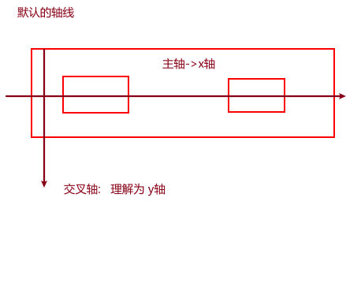

  2.语法:

```css
 .box{  /*容器*/

	 display:flex;  /*定义了当前盒子为 弹性布局*/
     display:inline-flex;   /*行内元素也可以使用*/
}
```

**注意:   如果当前元素设置为flex容器**

```css
     默认主轴x轴 从左往右加载
       子元素中     行内可以设置宽高
                   块级元素  共享一行
					宽高变自适应
```

#####  属性:

#####  1.修改主轴

​     flex-direction:  

​		row:  默认值 主轴x轴    从左到右

​		row-reverse  主轴是x轴 从右往左

 		column         主轴是y轴 默认是从上往下

​		column-reverse   主轴是y轴 默认是从下往上

```css
<style>
        /* 主轴的问题*/
        .box{
            border:1px solid #ccc;
            /*设置为容器*/
            display: flex;
           /*主轴的属性*/
            /*默认值 从左到右*/
            flex-direction: row;
            /*主轴是x轴 从右往左*/
            flex-direction: row-reverse;
            /*主轴是y轴 默认是从上往下*/
            flex-direction: column;
            /*主轴是y轴 默认是从下往上*/
            flex-direction: column-reverse;
        }
        .box div{
            width: 100px;
            height: 100px;
        }
        .box>div:nth-child(1){
            background-color: aqua;
        }
        .box>div:nth-child(2){
            background-color: antiquewhite;
        }
        .box>div:nth-child(3){
            background-color: sienna;
        }
        .box>span:nth-child(4){
            background-color: aquamarine;
            width: 100px;
            height: 100px;
        }
    </style>
</head>
<body>
<div class="box">
    <div>老大</div>
    <div>老二</div>
    <div>老三</div>
    <span>老四</span>
</div>
```

#####  2.换行属性

​     flex-wrap: 

​       nowrap     属性 默认值 显示不下缩小 还是一行显示  项目中的自定义的宽高将失效 自动的缩小

​       wrap        自动换行  不会改变项目的宽高

​       wrap-reverse    换行同时 交叉轴会 反方向排列

```css
 <style>
        /* 主轴的问题*/
        .box{
            border:1px solid #ccc;
            /*设置为容器*/
            display: flex;
          /*测试 如果一行显示不下*/
            /*属性 默认值  显示不下缩小 还是一行显示
             项目中的自定义的宽高将失效 自动的缩小
             */
            /*flex-wrap: nowrap;*/
            /*   属性2  自动换行 */
            /*flex-wrap: wrap;*/
            /*自动换行的同时  多行之间交叉轴的排列反方向*/
            flex-wrap: wrap-reverse;
        }
```

##### 3.主轴和换行的简写属性

​       flex-flow  ：主轴| 换行

```css
 
            /*特点:  
                        主轴        换行 
                        没有顺序之分 为了好记 
            */
            flex-flow:  row-reverse wrap-reverse ;
```

#####  4.(主轴上的对齐方式)(重要)

 justify-content：

​	1.justify-content: flex-start;  默认靠左


​	**2.justify-content: center; 居中**


​	3. justify-content: flex-end; 靠右

 	**4.justify-content: space-around; 等分**


  	**5.justify-content: space-between; 两端对齐**


   	6.justify-content: space-evenly; 空隙等分


```css
<style>
        /* 主轴的问题*/
        .box{
            border:1px solid #ccc;
            /*设置为容器*/
            display: flex;
          /*主轴对齐方式*/
            /*justify-content: flex-start;*/
            /*  项目主轴  居中 (水平居中)*/
        /*justify-content: center;*/
            /*主轴  靠右    相当于 之前写的 右浮动 */
            /*justify-content: flex-end;*/
            /* 主轴   空白多余的  等分*/
            /*justify-content: space-around;*/
            /* 主轴   两端对齐*/
            /*justify-content: space-between;*/
            /*主轴    空隙  等分*/
            justify-content: space-evenly;
        }
        .box div{
            width: 100px;
            height: 100px;
        }
        .box>div:nth-child(1){
            background-color: aqua;
        }
        .box>div:nth-child(2){
            background-color: antiquewhite;
        }
        .box>div:nth-child(3){
            background-color: sienna;
        }
        .box>span{
            background-color: aquamarine;
            width: 100px;
            height: 100px;
        }
    </style>
</head>
<body>
<div class="box">
    <div>老大</div>
    <div>老二</div>
    <div>老三</div>
</div>
```

##### 5.交叉轴上的排列属性

​     align-items：

 	1.align-items:flex-start ; 如果子元素设置了高度 则默认值 上


​	 **2.align-items: center;    居中**

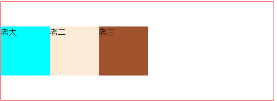

​	3.align-items: flex-end; 底部

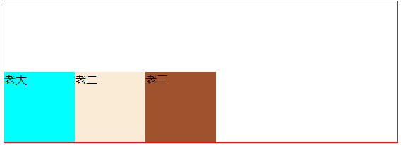

​	4.align-items: stretch;  占满整个高度(前提是子元素没有设置高度)

​             **如果子元素没有设置高度  则默认值就是stretch铺满**

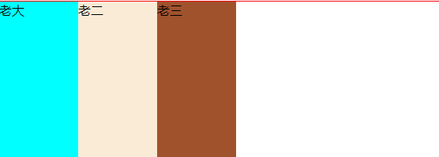

```css
<style>
        /* 主轴的问题*/
        .box{
            border:1px solid #ccc;
            height: 600px;
            /*设置为容器*/
            display: flex;
        /*交叉轴*/
            /*默认值  上面 */
            align-items:flex-start ;
            /*居中*/
            align-items: center;
            /*底部*/
            align-items: flex-end;
            /*如果子元素(项目)没有设置定高  则会撑满整个容器的高度*/
            align-items: stretch;
        }
        .box div{
            width: 100px;
            /*不能设置 高度*/
            /*height: 100px;*/
        }
        .box>div:nth-child(1){
            background-color: aqua;
        }
        .box>div:nth-child(2){
            background-color: antiquewhite;
        }
        .box>div:nth-child(3){
            background-color: sienna;
        }
        .box>span{
            background-color: aquamarine;
            width: 100px;
            height: 100px;
        }
    </style>
</head>
<body>
<div class="box">
    <div>老大</div>
    <div>老二</div>
    <div>老三</div>
</div>
```

##### 6.多条轴的情况下才有效

​    多轴的对齐方式 如果只有一条轴 此属性无效

​    align-content:   值的特点和justify-content 特点一致

  align-content:flex-start ;

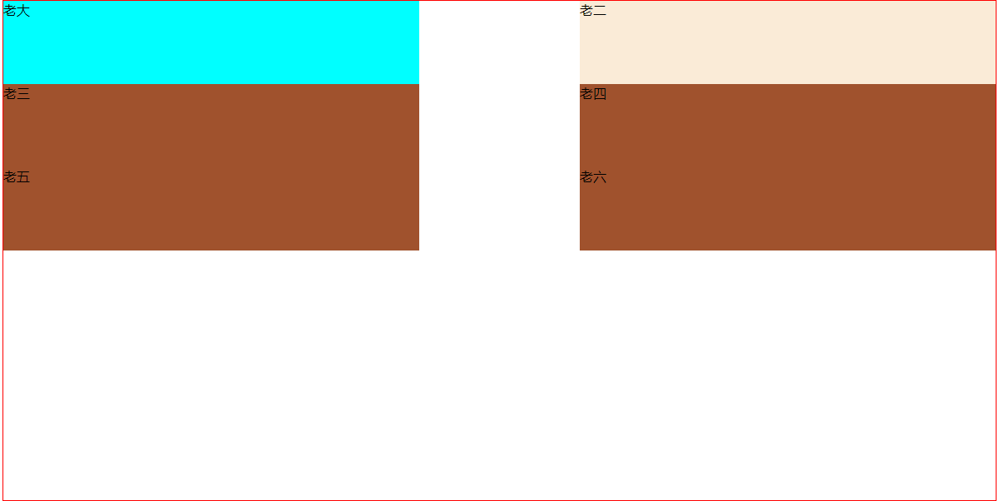

align-content: center;

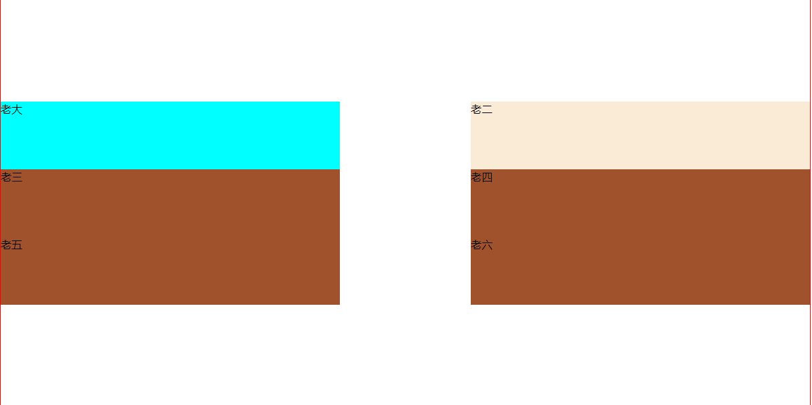

align-content: space-around;

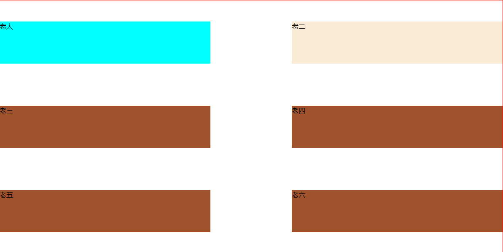

align-content: stretch;

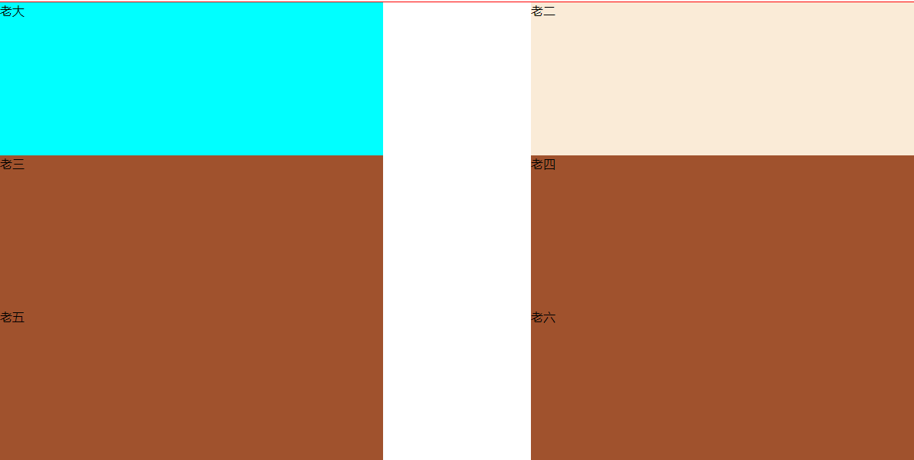

align-content: space-between;

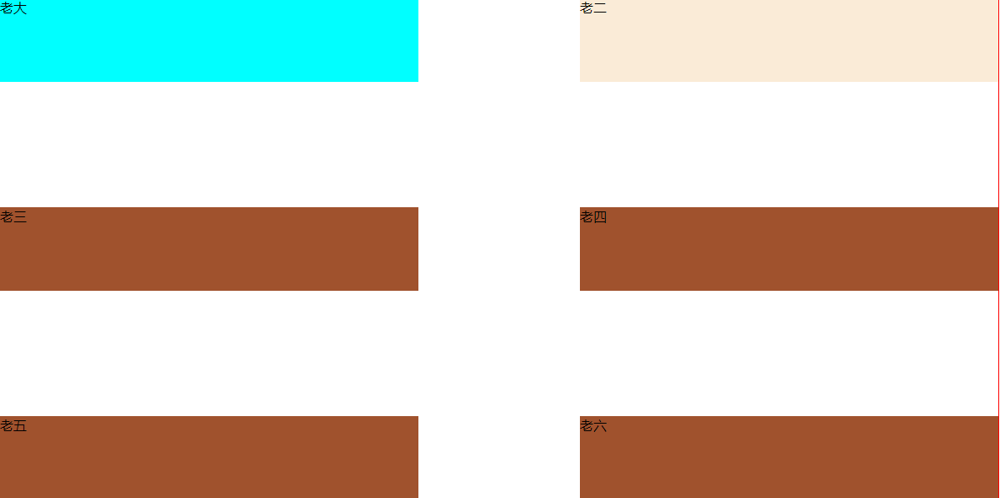

```css
 <style>
        /* 主轴的问题*/
        .box{
            border:1px solid red;
            height: 600px;
            /*设置为容器*/
            display: flex;
            /*换行 主轴还是x轴 换行*/
            flex-flow: row wrap;
            /*水平 主轴*/
            justify-content: space-between;
            /*多轴有交叉轴的情况下 可以定义项目的整体的排列方式
            优先级比align-items级别更高  如果设置此属性失效
            */
            /*值和justify-content的值的显示效果一致 */
            /* 上*/
            /*align-content:flex-start ;*/
            /*整体居中*/
        /*align-content: center;*/
            /* 等分*/
            /*align-content: space-around;*/
            /*子元素没给高度 则沾满父元素高度*/
            /*align-content: stretch;*/
            /*两端对齐*/
            align-content: space-between;
            /* 自行测试*/
        }
        .box div{
            width: 500px;
            height: 100px;
        }
        .box>div:nth-child(1){
            background-color: aqua;
        }
        .box>div:nth-child(2){
            background-color: antiquewhite;
        }
        .box>div:nth-child(3){
            background-color: sienna;
        }
        .box>div:nth-child(4){
            background-color: sienna;
        }
        .box>div:nth-child(5){
            background-color: sienna;
        }
        .box>div:nth-child(6){
            background-color: sienna;
        }
    </style>
</head>
<body>
<div class="box">
    <div>老大</div>
    <div>老二</div>
    <div>老三</div>
    <div>老四</div>
    <div>老五</div>
    <div>老六</div>
</div>
```

#### 属性之项目有关

#####     1.order ： 没有单位的数字

```
			order:控制元素的 排列循序 
            默认值是 0  值越小 越靠前
```

```css
 <style>
        /* 主轴的问题*/
        .box{
            border:1px solid #ccc;
            height: 300px;
            /*设置为容器*/
            display: flex;
        }
        .box div{
            width: 100px;
            /*不能设置 高度*/
            height: 100px;
        }
        /* order:控制元素的 排列循序
           默认值是 0  值越小 越靠前
        */
        .box>div:nth-child(1){
            background-color: aqua;
            order: 2;
        }
        .box>div:nth-child(2){
            background-color: antiquewhite;
            order:1;
        }
        .box>div:nth-child(3){
            background-color: sienna;
            order: 3;
        }
    </style>
</head>
<body>
<div class="box">
    <div>老大</div>
    <div>老二</div>
    <div>老三</div>
</div>
```

#####  2.flex-grow: 

​	定义项目的放大比例 

​       常用效果: 多个项目都给flex-grow:1; 等分空间

​       默认是0 不放大：表示不会因为容器有剩余空间出现放大的情况       

```css
<style>
        /* 主轴的问题*/
        .box{
            border:1px solid #ccc;
            height: 300px;
            /*设置为容器*/
            display: flex;
        }
        .box div{
            width: 100px;
            height: 100px;
        }
        /* 如果容器有剩余空间  项目的处理方式之 放大*/
        .box>div:nth-child(1){
            background-color: aqua;
            /* 默认值是0 1如果其他子元素没有设置该属性或者值为0则
              则 该子元素占满剩余空间
            */
            flex-grow:1;
        }
        .box>div:nth-child(2){
            background-color: antiquewhite;
            /*2： 放大的比例空间是2倍*/
            flex-grow:2;
        }
        .box>div:nth-child(3){
            background-color: sienna;
            flex-grow:1;
        }
    </style>
</head>
<body>
<div class="box">
    <div>老大</div>
    <div>老二</div>
    <div>老三</div>
</div>
```

##### 3.felx-shrink:  缩小属性

 默认值是 1；表示 如果容器宽度不够 则自动缩小

 0:  不会缩小

值越大 则缩小的越快

```css
 <style>
        /* 主轴的问题*/
        .box{
            border:1px solid #ccc;
            height: 300px;
            /*设置为容器*/
            display: flex;
        }
        .box div{
            width: 300px;
            height: 100px;
        }
        /* 如果容器有剩余空间  项目的处理方式之 缩小
         默认: 在屏幕宽度不足时 会自动缩小
        */
        .box>div:nth-child(1){
            background-color: aqua;
            /*1 默认值 自动缩小*/
            flex-shrink: 1;
        }
        .box>div:nth-child(2){
            background-color: antiquewhite;
            /* 0 表示不缩小 */
            flex-shrink: 0;
        }
        .box>div:nth-child(3){
            background-color: sienna;
            /*值越大 则缩小的越快*/
            flex-shrink: 3;
        }
    </style>
</head>
<body>
<div class="box">
    <div>老大</div>
    <div>老二</div>
    <div>老三</div>
</div>
```

##### 4.flex-basis      

 分配剩余空间的计算方式

 auto ：默认值 浏览器会自动计算剩余宽度

具体值;   也可以自定义具体值(ex:500px)则项目会固定大小

```css
<style>
        /* 主轴的问题*/
        .box{
            border:1px solid #ccc;
            height: 300px;
            /*设置为容器*/
            display: flex;
        }
        .box div{
            /*width: 300px;*/
            /*height: 100px;*/
            /*放大*/
            flex-grow: 1;
            /*不缩小*/
            flex-shrink: 0;
        }
        /*计算项目 分配剩余空间的计算方式*/
        .box>div:nth-child(1){
            background-color: aqua;
            /*默认值 根据项目的自身定义 浏览器自动计算*/
            flex-basis: auto;
        }
        .box>div:nth-child(2){
            background-color: antiquewhite;
            /*2.手动调节宽度 调节多款就多宽 显示不下溢出滚动*/
            flex-basis: 500px;
        }
        .box>div:nth-child(3){
            background-color: sienna;
            flex-basis: 500px;
        }
    </style>
</head>
<body>
<div class="box">
    <div>老大</div>
    <div>老二</div>
    <div>老三</div>
</div>
```

##### 5.简写属性(重要)

​     flex: 放大属性flex-grow  缩小属性 flex-shrink   felx-basis计算属性;

​     默认值: 0 1 auto;

​     常见:        flex:auto; 放大 缩小 自动计算  ===flex:1 1 auto;

​		     flex:1;      放大 缩小   不计算    

​                     flex:none; 不放大不缩小 自动计算

```css
<style>
        /* 主轴的问题*/
        .box{
            border:1px solid #ccc;
            height: 300px;
            /*设置为容器*/
            display: flex;
        }
        .box div{
            /*width: 300px;*/
            /*height: 100px;*/
        }
        /* flex: 简写属性*/
        .box>div:nth-child(1){
            background-color: aqua;
            /*默认值 不放大 缩小 自动计算*/
            flex:0 1 auto;
        }
        .box>div:nth-child(2){
            background-color: antiquewhite;
            /*auto值 放大 缩小 自动计算*/
            /*flex:auto;*/
            /*flex:1 1 auto;*/
            /*同上*/
            flex:1;
        }
        .box>div:nth-child(3){
            background-color: sienna;
            /* 不缩小 不放大  自动计算*/
            flex:none;
            /*同下*/
            /*flex:0 0 auto;*/
        }
    </style>
</head>
<body>
<div class="box">
    <div>老大</div>
    <div>老二</div>
    <div>老三</div>
</div>
```

**注意如果** 项目想要按照特定的比例分配空间 不能直接使用flex-grow放大属性 

可以直接使用flex属性即可

ex: 3:1:2分 代码如下

```css
 <style>
        /* 主轴的问题*/
        .box{
            border:1px solid #ccc;
            height: 300px;
            /*设置为容器*/
            display: flex;
        }
        /* 需求:  3  :1  :2 分*/
        .box div{
            /*width: 300px;*/
            /*height: 100px;*/
        }
        /* flex: 简写属性*/
        .box>div:nth-child(1){
            background-color: aqua;
            flex: 3;
        }
        .box>div:nth-child(2){
            background-color: antiquewhite;
            flex: 1;
        }
        .box>div:nth-child(3){
            background-color: sienna;
            flex:2;
        }
    </style>
</head>
<body>
<div class="box">
    <div>老大</div>
    <div>老二</div>
    <div>老三</div>
</div>
```

##### 6.align-self：

  自定义每个	

  如果不写  则继承自父元素(容器)的align-items的属性值

```css
<style>
        /* 主轴的问题*/
        .box{
            border:1px solid #ccc;
            height: 300px;
            /*设置为容器*/
            display: flex;
            /*水平等分*/
            justify-content: space-around;
            /* 所以的项目都是居中 垂直居中*/
            align-items: center;
        }
        .box div{
            width: 300px;
            height: 100px;
        }

        .box>div:nth-child(1){
            background-color: aqua;
        /*自定义每个项目的垂直排列*/
            align-self: flex-start;
        }
        .box>div:nth-child(2){
            background-color: antiquewhite;
            /*不写  安装父元素给的定义*/
        }
        .box>div:nth-child(3){
            background-color: sienna;
            align-self: flex-end;
        }
    </style>
</head>
<body>
<div class="box">
    <div>老大</div>
    <div>老二</div>
    <div>老三</div>
</div>
```


==========================================================================

#### 响应式:

​	定义:就想一个页面同时匹配手机/平板/pc。通过不同的屏幕显示的内容/大小都不一样那么这种页面就叫做响应式的页面

​	优点:  运营/开发成本较低，常见到一些简约类型的网站 官网 办公页面。。。

​        缺点:  页面太繁琐 兼容起来非常累赘，大型电商类

#####    使用规范:

​        1.单位必须使用的是相对单位:

​             1.% 

​             2. em ： 父元素的一个单位字体大小

​    	 3.rem :html根元素的 一个单位的字体大小

#####  实现原理

​    使用css3中媒体查询(media query)

######     1.分屏(可以自定义)

- 超小小屏 :width<500px           小手机屏

   * 超小屏: 500px<width<768px            手机页面
   *  小屏   :   768<width<991px          pad端屏幕
   * 中屏   :    991px<width<1200px   小型笔记本的屏幕
   * 大屏  :   width>1200px                 pc屏

   2.实行媒体查询

​	1.直接根据不同的分辨率创建不同的样式表文件通过媒体查询引入

```html
<head>
    <meta charset="UTF-8">
    <title>Title</title>
    <!--视口-->
    <meta name="viewport" content="width=device-width, initial-scale=1.0, maximum-scale=1.0, user-scalable=0">
    <style>
        /* */
    </style>
    <!--不同的屏幕对应不同的 样式文件-->
    <!--pc  991-->
    <link rel="stylesheet" href="css/pc.css" media="screen and (min-width:991px)">
    <!--pad  768--991之间 -->
    <link rel="stylesheet" href="css/pad.css" media="screen and (min-width:768px) and (max-width:990px)">
    <!--phone <768-->
    <link rel="stylesheet" href="css/phone.css" media="screen and (max-width:767px)">
</head>
<body>
<div>
    测试: 不同的屏幕下样式的不同
</div>
```

 方式2: 可以直接写在一个css文件中 同样的通过媒体查询实现

```css
不同的屏幕下 样式的不同显示
@media screen and (min-width: 991px){}
@media screen  and (min-width:768px) and (max-width: 990px) {}
@media screen and (max-width: 767px){}
```

```css
*{
    box-sizing: border-box;
    padding: 0;
    margin: 0;
}
/*媒体查询*/
/*pc*/
@media screen and (min-width: 991px){
    html{
        font-size: 100px;
    }
    div.header{
        background-color: aqua;
    }
}
/*pad*/
@media screen  and (min-width:768px) and (max-width: 990px) {
    html{
        font-size: 50px;
    }
    div.header{
        background-color: #a71d5d;
    }
}
/*phone*/
@media screen and (max-width: 767px){
    html{
        font-size: 20px;
    }
    div.header{
        background-color: #9a6e3a;
    }
}
/* 采用相对单位*/
.header{
    width: 100%;
    height: 1rem;
    text-align: center;
    line-height: 1rem;
    background-color: aqua;
    font-size: 0.6rem;
}

<div class="header">隔壁老徐</div>
```

注意:   可以采用   媒体查询+rem的页面布局写法

弊端: 只能做少数的预判 并不能实时的调整大小。

#### flexible.js

1. 来源:   手机淘宝团队开发的一个非常轻量高适配开源的小插件 

2. 原理: 默认将整个浏览器的屏幕划分为10等分  每一份对应的宽度跟着屏幕的变化而变化

    一份的宽度就等于当前屏幕下的html的字体大小.

   ex: 手机稿 750px  那么html的字体大小 750/10=75px

   ​         ==1rem（对应的就是根源上html一个单位的字体大小）

   

   使用: 通过script引入flexible.js文件按

   注意:   一般我们会结合媒体查询手动限制屏幕的最大宽度ex:500px(根据实际需求自定义) 

​             对应的html字体大小为50px

```html
<head>
    <meta charset="UTF-8">
    <title>Title</title>
    <!--视口-->
    <meta name="viewport" content="width=device-width, initial-scale=1.0, maximum-scale=1.0, user-scalable=0">

    <script src="flexible.js"></script>
    <style>
        /* 直接使用 相对单位  rem就可以 */
        div.box{
            width: 2rem;
            height: 1rem;
            font-size: 0.5rem;
            background-color: aqua;
        }
        /*假设 最大设置的html字体大小为 50px*/
        @media screen and ( min-width:500px) {
             html{
                 /*手动写死 不让超过 指定大小*/
                 font-size: 50px !important;
             }
        }
    </style>
</head>
<body>
<div class="box">隔壁老徐</div>

<script></script>
</body>
</html>
```

px->rem插件 不需要自己手动计算

1.搜索想要的插件

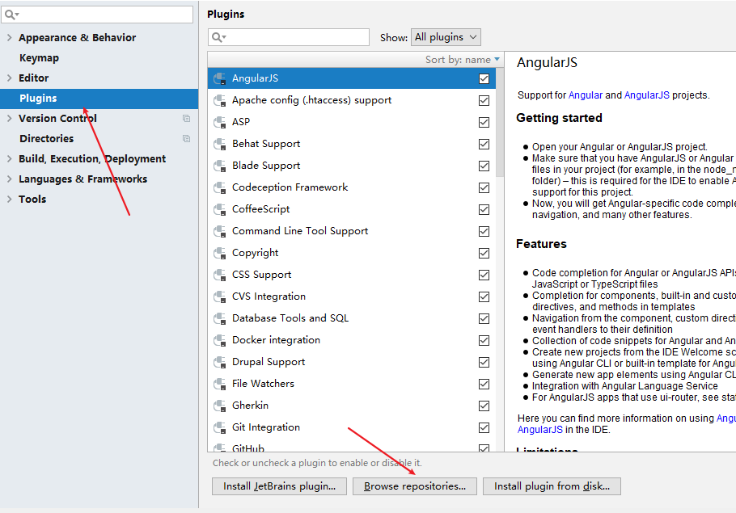

2.搜索安装

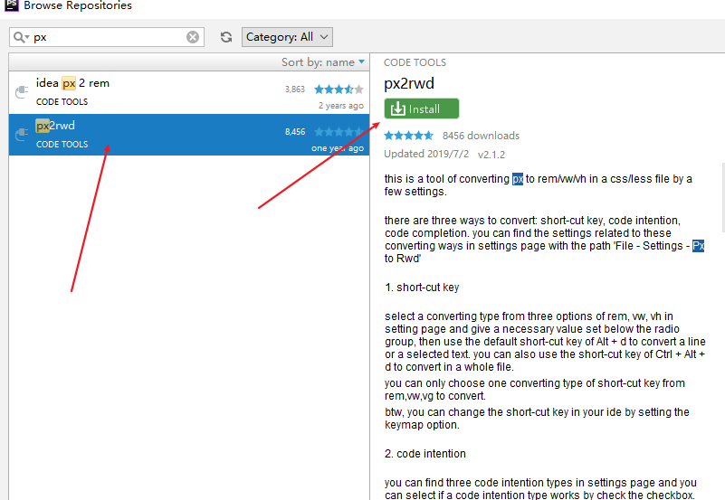

3.使用:

   第一次写则自动弹出


 2.项目重构:二次重写

​        alt+d: 当前行的样式转换

​        ctrl+alt+d:将文件所以的css->rem  (注意:这个快捷键只能在.css/.less文件中使用)

​        alt+enter 提示

3.默认的值 1rem==100px;

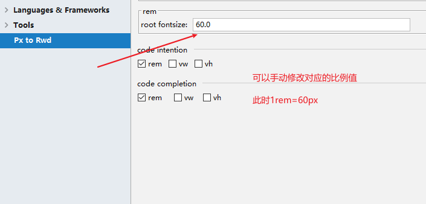

常见的模板网站

<http://www.templatesy.com/>

<https://www.17sucai.com/>

<http://www.cssmoban.com/>

扒网站工具小飞兔使用步骤


